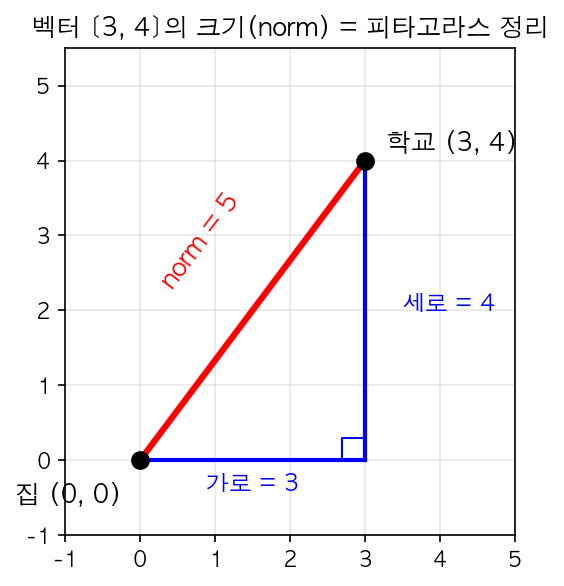

# 벡터와 행렬 (Vectors and Matrices)

## 왜 필요한가?
컴퓨터는 사진, 글, 소리 같은 것을 직접 이해하지 못해요. 전부 **숫자**로 바꿔야 해요. 그런데 숫자 하나로는 부족하고, 숫자 여러 개를 묶어서 다뤄야 하는 경우가 대부분이에요. 벡터와 행렬은 바로 이 **숫자 묶음을 다루는 기본 도구**예요. 딥러닝에서 일어나는 거의 모든 계산이 벡터와 행렬 연산이에요.

---

## 1. 스칼라 (Scalar)
그냥 **숫자 하나**예요. "숫자 하나짜리 데이터"라고 이해하면 돼요.

```
기온 = 36.5
시험 점수 = 85
가격 = 15000
```

딥러닝에서도 스칼라를 써요. 예를 들어 "이 모델이 얼마나 틀렸는지"를 나타내는 숫자 하나(손실값), "한 번에 얼마나 배울지"를 정하는 숫자 하나(학습률) 같은 거예요. 지금은 "아, 딥러닝에서도 숫자 하나짜리 값이 쓰이는구나" 정도만 알면 돼요.

## 2. 벡터 (Vector)
스칼라가 숫자 "하나"였다면, 벡터는 **숫자 여러 개를 한 묶음**으로 만든 거예요.

```
[1, 2, 3]          ← 숫자 3개 → 3차원 벡터
[37.55, 126.97]    ← 숫자 2개 → 2차원 벡터
```

"차원"이라고 하면 뭔가 어렵게 느껴질 수 있는데, 그냥 **숫자가 몇 개인지**예요.

### 순서가 중요해요

벡터에서 각 자리마다 의미가 정해져 있어요. RGB 색상을 보면:

```
[255, 0, 0]   → 빨간색 (빨강=255, 초록=0, 파랑=0)
[0, 255, 0]   → 초록색
[0, 0, 255]   → 파란색
```

같은 숫자 255가 **어디에 있느냐**에 따라 완전히 다른 색이 돼요.

### 벡터의 기본 연산

**덧셈** — 같은 위치끼리 더해요. 단, 길이가 같아야 해요.

$$[1, 2, 3] + [4, 5, 6] = [5, 7, 9]$$

**스칼라 곱** — 숫자 하나를 모든 원소에 곱해요. 벡터를 "2배로 늘린다"고 생각하면 돼요.

$$2 \times [1, 2, 3] = [2, 4, 6]$$

**크기(norm)** — 벡터가 얼마나 "긴지"를 하나의 숫자로 나타내는 거예요. 피타고라스 정리와 같은 원리예요.

예를 들어 지도에서 집이 `(0, 0)`이고 학교가 `(3, 4)`에 있다고 해볼게요. 가로로 3, 세로로 4 떨어져 있을 때, **직선 거리**는 얼마일까요? 직각삼각형의 빗변을 구하는 것과 똑같아요:



$$\|[3, 4]\| = \sqrt{3^2 + 4^2} = \sqrt{9 + 16} = \sqrt{25} = 5$$

3차원도 똑같아요. 드론이 $[1, 2, 2]$만큼 이동했다면 (앞으로 1, 옆으로 2, 위로 2):

$$\|[1, 2, 2]\| = \sqrt{1^2 + 2^2 + 2^2} = \sqrt{1 + 4 + 4} = \sqrt{9} = 3$$

원리는 항상 같아요 — 각 숫자를 제곱해서 다 더하고, 루트를 씌우면 돼요.

### norm은 왜 필요할까?

norm은 **벡터를 숫자 하나로 요약하는 도구**예요. 벡터끼리 비교하거나, 차이가 얼마나 큰지 측정할 때 써요.

예를 들어 모델이 예측한 값과 정답이 있을 때:
$$예측 = [0.9, 0.1, 0.0]$$
$$정답 = [1.0, 0.0, 0.0]$$
$$차이 = [0.1, -0.1, 0.0]$$
$$\|차이\| = \sqrt{0.1^2 + 0.1^2 + 0^2} \approx 0.14$$

"0.14만큼 틀렸다" — 이렇게 숫자 여러 개의 차이를 **숫자 하나로 요약**할 수 있어요.

## 3. 행렬 (Matrix)
벡터가 숫자를 **일렬로** 나열한 거였다면, 행렬은 숫자를 **직사각형으로** 배열한 거예요. 쉽게 말하면 **벡터를 여러 줄 쌓아놓은 것**이에요.

$$M = \begin{bmatrix} 1 & 2 & 3 \\ 4 & 5 & 6 \end{bmatrix}$$

이건 2줄 3칸이니까 $2 \times 3$ 행렬이라고 불러요. 가로 한 줄 = **행(row)**, 세로 한 줄 = **열(column)**이에요.

가장 와닿는 예시는 **흑백 사진**이에요. 각 픽셀의 밝기를 0(검정)~255(흰색) 숫자로 나타내면, 사진 하나가 행렬이 돼요:

$$\begin{bmatrix} 0 & 50 & 200 \\ 100 & 150 & 255 \\ 30 & 80 & 120 \end{bmatrix}$$

이건 $3 \times 3$ 크기의 아주 작은 흑백 사진이에요. 왼쪽 위 픽셀은 거의 검정(0), 오른쪽 가운데 픽셀은 완전 흰색(255)인 거예요.

### 전치 (Transpose)
행과 열을 뒤집는 거예요. 가로였던 게 세로가 되고, 세로였던 게 가로가 돼요. 표를 90도 돌린다고 생각하면 돼요.

$$M = \begin{bmatrix} 1 & 2 & 3 \\ 4 & 5 & 6 \end{bmatrix} \quad \Rightarrow \quad M^T = \begin{bmatrix} 1 & 4 \\ 2 & 5 \\ 3 & 6 \end{bmatrix}$$

$2 \times 3$ 행렬이 전치하면 $3 \times 2$ 가 돼요.

## 4. 텐서 (Tensor)
지금까지 배운 걸 정리하면 이런 흐름이에요:

- **스칼라**: 숫자 **1개** (점)
- **벡터**: 숫자를 **일렬로** (선)
- **행렬**: 숫자를 **직사각형으로** (면)

여기서 한 단계 더 나가면? 숫자를 **직육면체로** 배열하면 3차원이 되겠죠. 이렇게 차원을 계속 늘려나간 걸 통틀어서 **텐서**라고 불러요.

가장 와닿는 예시는 **컬러 사진**이에요. 흑백 사진은 행렬 하나로 충분했는데, 컬러 사진은 **빨강, 초록, 파랑** 3가지 색을 각각 따로 표현해야 해요. 그래서 행렬 3장을 겹쳐 쌓으면 **3차원 텐서**가 돼요.

텐서의 크기는 **shape**이라는 괄호로 표현해요. shape은 각 차원의 크기를 나타내고, **오른쪽에서 왼쪽으로** 읽으면 쉬워요 — 가장 안쪽 데이터부터 바깥으로 감싸는 구조거든요.

| shape | 의미 | 종류 |
|-------|------|------|
| $(5,)$ | 숫자 5개 | 벡터 |
| $(3, 4)$ | 4칸이 3줄 | $3 \times 4$ 행렬 |
| $(2, 3, 4)$ | $3 \times 4$ 행렬이 2개 | 3D 텐서 |
| $(3, 224, 224)$ | $224 \times 224$가 3장(RGB) | 컬러 사진 1장 |
| $(32, 3, 224, 224)$ | 컬러 사진이 32장 | 사진 묶음(batch) |

4D 텐서가 나오면 좀 무섭게 느껴질 수 있는데, 그냥 "사진 32장을 한 묶음으로 만든 것"이에요. 딥러닝에서는 데이터를 한 장씩이 아니라 여러 장을 **묶음(batch)**으로 처리하거든요.

**총 원소 수**는 shape의 각 숫자를 다 곱하면 돼요:
- $(3, 4)$ → $3 \times 4 = 12$개
- $(2, 3, 4)$ → $2 \times 3 \times 4 = 24$개
- $(32, 3, 224, 224)$ → $32 \times 3 \times 224 \times 224 = 4,816,896$개 (사진 32장에 숫자가 약 480만 개!)

### Shape이 왜 중요할까?
딥러닝에서 데이터는 여러 층(layer)을 거치며 shape이 계속 바뀌어요. 어떤 층의 출력 shape과 다음 층이 기대하는 입력 shape이 안 맞으면 에러가 나요. 실제로 딥러닝 디버깅의 대부분이 이 **shape 불일치** 문제예요. 그래서 shape을 읽는 능력이 가장 기본이면서 가장 중요해요.

## 5. 인덱싱 (Indexing)
텐서에 숫자가 잔뜩 들어있을 때, **원하는 부분만 골라서 꺼내는 것**이 인덱싱이에요. 예를 들어 사진 32장이 묶인 텐서에서 "5번째 사진만 보고 싶어", "빨강 채널만 꺼내고 싶어" 같은 상황에서 써요.

중요한 규칙: **0부터 세기 시작**해요.

```
v = [10, 20, 30, 40]
      ↑   ↑   ↑   ↑
     [0] [1] [2] [3]   ← 인덱스

v[0]  = 10          # 첫 번째
v[2]  = 30          # 세 번째
v[-1] = 40          # 뒤에서 첫 번째
v[1:3] = [20, 30]   # 1번부터 2번까지 (3번은 포함 안 됨)
```

행렬에서는 **[행, 열]** 두 개를 지정해요:

$$M = \begin{bmatrix} 1 & 2 & 3 \\ 4 & 5 & 6 \end{bmatrix}$$

```
M[0, 2] = 3            # 0번 행, 2번 열
M[1, :] = [4, 5, 6]    # 1번 행 전체 (':'는 "전부"라는 뜻)
M[:, 0] = [1, 4]       # 0번 열 전체
```

## 6. Reshape
텐서의 **shape을 바꾸는 것**이에요. 안에 들어있는 숫자는 그대로고, **배열하는 모양만 바꾸는** 거예요. 딥러닝에서 데이터를 다음 층에 넣기 전에 shape을 맞춰줘야 할 때 많이 써요.

카드 6장을 여러 모양으로 배열한다고 생각하면 돼요:

**shape $(2, 3)$** — 2줄 3칸:
$$\begin{bmatrix} 1 & 2 & 3 \\ 4 & 5 & 6 \end{bmatrix}$$

**shape $(3, 2)$** — 3줄 2칸:
$$\begin{bmatrix} 1 & 2 \\ 3 & 4 \\ 5 & 6 \end{bmatrix}$$

**shape $(6,)$** — 일렬:
$$[1, 2, 3, 4, 5, 6]$$

카드는 항상 6장인데, 놓는 모양만 달라진 거예요.

**규칙은 딱 하나**: 총 원소 수가 같아야 해요.
- $(2, 3)$ → $2 \times 3 = 6$ ✅
- $(3, 2)$ → $3 \times 2 = 6$ ✅
- $(6,)$ → $6$ ✅
- $(2, 4)$ → $2 \times 4 = 8$ ❌ (6개를 8칸에 넣을 수 없어요)

---

## 핵심 정리
1. **스칼라 → 벡터 → 행렬 → 텐서** 순서로 차원이 늘어나요 (점 → 선 → 면 → 직육면체)
2. 딥러닝의 모든 데이터(사진, 글, 소리 등)는 결국 **텐서**로 표현돼요
3. **Shape**은 텐서의 모양을 알려주는 정보예요 — 오른쪽에서 왼쪽으로 읽으면 쉬워요
4. **Norm**은 벡터의 크기를 숫자 하나로 요약해줘요 — 예측이 얼마나 틀렸는지 측정할 때 써요
5. **인덱싱**으로 텐서에서 원하는 부분만 꺼낼 수 있어요 (0부터 세기 시작!)
6. **Reshape**은 총 원소 수만 같으면 모양을 자유롭게 바꿀 수 있어요

---

## 실습 과제
1. $3 \times 3$ 흑백 이미지를 행렬로 직접 표현해보세요
2. RGB 컬러 이미지($3 \times 3$ 크기)를 3차원 텐서로 표현해보세요
3. $(2, 3, 4)$ shape의 텐서에서 총 원소 수를 계산하고, 가능한 reshape 형태를 3가지 이상 나열해보세요

→ [실습](./exercises/01-vectors-matrices-exercises.md)

