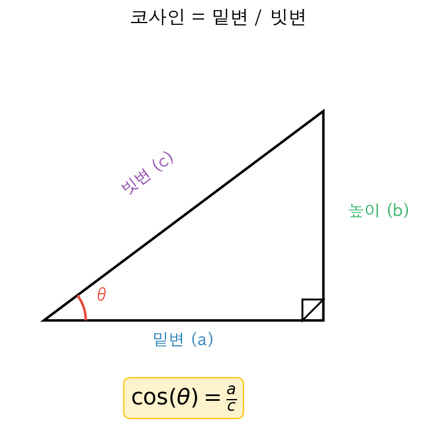
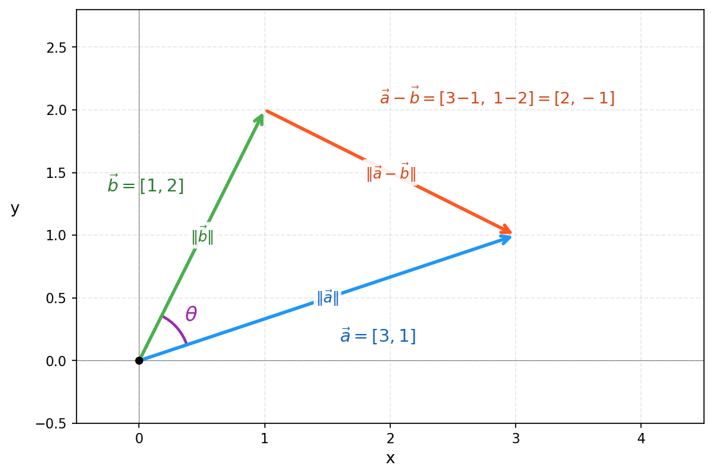
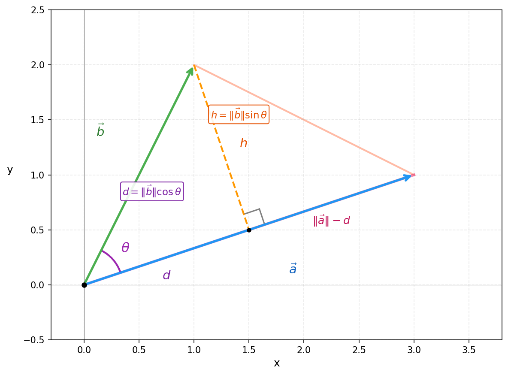

# 행렬 연산 (Matrix Operations)

## 왜 필요한가?
이전 노트에서 데이터를 벡터와 행렬에 담는 법을 배웠어요. 그런데 담기만 하면 소용이 없죠 — **연산**을 해야 해요. 신경망이 하는 일을 한 문장으로 요약하면, **입력 데이터에 행렬 연산을 반복 적용해서 결과를 만들어내는 것**이에요. 그래서 행렬 연산을 이해하면 신경망이 실제로 뭘 하는지 보이기 시작해요.

---

## 1. 내적 (Dot Product)
같은 위치끼리 곱해서 다 더한 값이에요. 결과는 **스칼라**(숫자 하나).

장보기로 생각하면 바로 이해돼요:

```
수량 = [사과 3개, 우유 2개, 빵 1개]
가격 = [1000원,  2500원,  3000원]

총 금액 = 3×1000 + 2×2500 + 1×3000 = 11,000원
```

이게 내적이에요! 수식으로 쓰면:

$$a = [1, 2, 3], \quad b = [4, 5, 6]$$

$$a \cdot b = 1 \times 4 + 2 \times 5 + 3 \times 6 = 4 + 10 + 18 = 32$$

### 내적으로 취향 비교해보기

쇼핑몰에서 비슷한 취향의 손님끼리 묶어서 추천하고 싶어요. 손님 데이터가 벡터로 되어있으니까, 내적으로 비교해볼게요.

```
손님A = [3, 2, 1]    (사과 3, 우유 2, 빵 1)
손님B = [6, 4, 2]    (사과 6, 우유 4, 빵 2)
손님C = [1, 5, 0]    (사과 1, 우유 5, 빵 0)
```

$$A \cdot B = 3 \times 6 + 2 \times 4 + 1 \times 2 = 28$$
$$A \cdot C = 3 \times 1 + 2 \times 5 + 1 \times 0 = 13$$

B가 A와 더 비슷한 걸까요? 잠깐, B를 자세히 보면 A를 정확히 2배 한 거예요. $3:2:1 = 6:4:2$. **취향은 완전히 같고 양만 다른 건데**, 내적은 28 vs 13으로 B가 훨씬 크게 나왔어요.

내적에는 **방향(취향)**과 **크기(양)**가 섞여있는 거예요.

## 2. 코사인 유사도 (Cosine Similarity)

### 크기의 영향 없애보기

양의 영향을 없애려면 어떻게 할까요? 각 벡터를 자기 크기로 나누면 **비율만** 남지 않을까요?

```
손님A: 크기 ≈ 3.74 → [3/3.74, 2/3.74, 1/3.74] = [0.80, 0.53, 0.27]
손님B: 크기 ≈ 7.48 → [6/7.48, 4/7.48, 2/7.48] = [0.80, 0.53, 0.27]
손님C: 크기 ≈ 5.10 → [1/5.10, 5/5.10, 0/5.10] = [0.20, 0.98, 0.00]
```

A와 B가 **완전히 같은 벡터**가 됐어요! 양이 다르든 상관없이 비율(취향)만 남은 거예요. C는 다른 벡터가 됐고요 — 취향이 다르니까요.

크기로 나눈 벡터끼리 내적하면:

```
A와 B → 0.80×0.80 + 0.53×0.53 + 0.27×0.27 = 1.00
A와 C → 0.80×0.20 + 0.53×0.98 + 0.27×0.00 = 0.68
```

A와 B는 1.00, A와 C는 0.68. 이제 양에 상관없이 취향만 비교할 수 있게 됐어요!

### 이 숫자가 뭘 의미할까?

0.68이 "좀 다르다"는 건 알겠는데, 이 숫자 자체가 뭘 의미하는 걸까요? 간단한 2차원 벡터로 더 실험해볼게요.

```
[1, 0]과 [1, 0]   → 같은 방향         → 크기로 나눈 후 내적 = 1
[1, 0]과 [1, 1]   → 비스듬히 (45°)    → 크기로 나눈 후 내적 ≈ 0.71
[1, 0]과 [0, 1]   → 직각 (90°)        → 크기로 나눈 후 내적 = 0
[1, 0]과 [-1, 0]  → 반대 방향 (180°)  → 크기로 나눈 후 내적 = -1
```

각도가 작을수록(비슷할수록) 값이 크고, 각도가 클수록(다를수록) 값이 작아져요.

"각도를 숫자로 바꿔주는 함수"가 있으면 비교하기 편하겠죠? 그게 바로 **코사인(cos)**이에요 — 각도를 넣으면 -1에서 1 사이 숫자가 나와요.



$\cos(0°) = 1$, $\cos(45°) \approx 0.71$, $\cos(90°) = 0$, $\cos(180°) = -1$...

우리가 위에서 계산한 값이랑 정확히 같아요!

### 왜 코사인 값과 같을까?

두 벡터 $\vec{a}$, $\vec{b}$와 그 차이 $\vec{a} - \vec{b}$는 삼각형을 만들어요.



이 삼각형의 세 번째 변 $\|\vec{a} - \vec{b}\|^2$을 **두 가지 방법**으로 구해볼 거예요. 하나에는 $\cos(\theta)$가, 다른 하나에는 내적($\vec{a} \cdot \vec{b}$)이 들어있어요. 같은 값이니까 둘을 연결하면 "내적 = 코사인"이 나와요.

$\vec{a} = [3, 1]$, $\vec{b} = [1, 2]$로 해볼게요.

**방법 1 — 코사인 법칙 (피타고라스의 확장)**

우리 삼각형은 직각이 아니라서 피타고라스 정리를 바로 쓸 수 없어요. 그래서 **높이를 내려서 직각삼각형을 만들어요**.

$\vec{b}$의 끝점에서 $\vec{a}$ 방향으로 수선을 내리면:



수선을 내리면 직각삼각형이 생겨요. 빗변이 $\|\vec{b}\|$이고 끼인각이 $\theta$니까:
- $\cos(\theta) = \frac{d}{\|\vec{b}\|}$ → $d = \|\vec{b}\|\cos\theta$
- $\sin(\theta) = \frac{h}{\|\vec{b}\|}$ → $h = \|\vec{b}\|\sin\theta$

이제 $\vec{b}$ 끝점에서 $\vec{a}$ 끝점까지의 거리($\|\vec{a} - \vec{b}\|$)를 구해볼게요. 가로 거리가 $\|\vec{a}\| - d$이고 세로 거리가 $h$니까, **피타고라스 정리**로:

$$\|a-b\|^2 = (\|a\| - d)^2 + h^2$$

$d$와 $h$를 대입하면:

$$= (\|a\| - \|b\|\cos\theta)^2 + (\|b\|\sin\theta)^2$$

$$= \|a\|^2 - 2\|a\|\|b\|\cos\theta + \|b\|^2\cos^2\theta + \|b\|^2\sin^2\theta$$

$$= \|a\|^2 - 2\|a\|\|b\|\cos\theta + \|b\|^2(\cos^2\theta + \sin^2\theta)$$

$\cos^2\theta + \sin^2\theta = 1$이니까 (피타고라스 항등식):

$$\|a-b\|^2 = \|a\|^2 + \|b\|^2 - 2\|a\|\|b\|\cos\theta$$

이게 **코사인 법칙**이에요. 피타고라스 정리에서 출발해서 높이만 내리면 나오는 거예요.

→ 여기에 $\cos(\theta)$가 들어있어요.

**방법 2 — 좌표로 직접 계산**

$\vec{a} - \vec{b} = [2, -1]$이니까 $\|a-b\|^2 = 2^2 + (-1)^2 = 5$예요. 이걸 일반화해서 전개하면:

$$\|a-b\|^2 = (a_1 - b_1)^2 + (a_2 - b_2)^2$$

$$= (a_1^2 + a_2^2) + (b_1^2 + b_2^2) - 2(a_1 b_1 + a_2 b_2)$$

$$= \|a\|^2 + \|b\|^2 - 2(\vec{a} \cdot \vec{b})$$

→ 여기에 내적($\vec{a} \cdot \vec{b}$)이 나왔어요!

**둘을 연결하면**

같은 $\|a-b\|^2$이니까 두 결과가 같아요. 양쪽에서 $\|a\|^2 + \|b\|^2$을 빼면:

$$\vec{a} \cdot \vec{b} = \|a\|\|b\|\cos(\theta)$$

양변을 $\|a\|\|b\|$로 나누면:

$$\cos(\theta) = \frac{\vec{a} \cdot \vec{b}}{\|a\| \times \|b\|} = \frac{\vec{a}}{\|a\|} \cdot \frac{\vec{b}}{\|b\|}$$

이게 "자기 크기로 나눈 다음 내적 = 코사인"인 이유예요. 그래서 이 방법을 **코사인 유사도(Cosine Similarity)**라고 불러요.

### 정리

내적은 **두 벡터가 얼마나 비슷한지** 재는 도구예요. 다만 크기가 섞여있어서, 순수하게 방향만 비교하려면 자기 크기로 나눈 다음 내적해야 해요. 그 결과가 $\cos(\theta)$와 같기 때문에 **코사인 유사도**라고 불러요.

딥러닝에서는 상황에 따라 둘 다 써요:
- **어텐션**: 내적 그대로 — "이 단어가 저 단어와 얼마나 관련 있는지"를 Query와 Key 벡터의 내적으로 계산해요. 크기가 큰 벡터 = 중요한 벡터라서, 크기 영향이 오히려 유용해요.
- **문장/이미지 검색**: 코사인 유사도 — 순수하게 "방향만" 비교하고 싶을 때 써요.

## 3. 행렬 곱셈 (Matrix Multiplication)
행렬 A의 각 **행**과 행렬 B의 각 **열**의 내적을 계산한다.

$A$ $(2 \times 3)$, $B$ $(3 \times 2)$ → $C = A \times B$ $(2 \times 2)$

```
[1  2  3]     [7  10]        [1×7+2×8+3×9    1×10+2×11+3×12]   [50   68]
[4  5  6]  ×  [8  11]   =    [4×7+5×8+6×9    4×10+5×11+6×12] = [122  167]
              [9  12]
```

### 핵심 규칙
- A의 **열 수** = B의 **행 수** 이어야 곱셈 가능
- $(m \times n) \times (n \times p) = (m \times p)$
- **교환 법칙 성립 안 함**: $A \times B \neq B \times A$ (일반적으로)

### 신경망에서의 행렬 곱셈

```
입력:    x  (1 × 입력차원)     예: (1 × 784)   — MNIST 이미지 1장을 펼친 것
가중치:  W  (입력차원 × 출력차원)  예: (784 × 256)
편향:    b  (1 × 출력차원)       예: (1 × 256)
```

$$y = xW + b$$

→ 하나의 Linear Layer = 행렬 곱셈 + 편향 덧셈

### 배치 처리
실제로는 여러 입력을 한번에 처리한다 (배치).

```
입력:    X  (배치 × 입력차원)    예: (32 × 784)   — 32장의 이미지
가중치:  W  (입력차원 × 출력차원)  예: (784 × 256)
```

$$Y = XW + b$$

→ 배치 크기에 관계없이 같은 가중치 $W$를 사용. 이것이 행렬 곱셈의 효율성.

## 4. 원소별 연산 (Element-wise Operations)
같은 shape의 두 텐서에서 같은 위치끼리 연산.

```
[1, 2, 3] + [4, 5, 6] = [5, 7, 9]      # 원소별 덧셈
[1, 2, 3] * [4, 5, 6] = [4, 10, 18]     # 원소별 곱셈 (Hadamard product)
```

딥러닝에서의 예:
- 활성화 함수 적용: 모든 원소에 ReLU를 적용
- 마스킹: 특정 위치를 0으로 만들기 (dropout, attention mask)

## 5. 행렬 전치 (Transpose) 복습
$(m \times n) \to (n \times m)$. 행과 열을 뒤집는다.

중요한 성질: $(AB)^T = B^T A^T$ — 곱셈의 전치는 순서가 뒤집힌다.

어텐션에서: $\text{Attention} = \text{softmax}\!\left(\dfrac{QK^T}{\sqrt{d}}\right)$ — $K$를 전치해서 $Q$와 내적한다.

## 6. 브로드캐스팅 (Broadcasting)
<!-- TODO: y = xW + b 에서 shape이 다른 b가 어떻게 더해지는지. 딥러닝에서 매우 중요 -->

## 7. 단위행렬 (Identity Matrix)
<!-- TODO: 곱해도 원래 행렬이 그대로 나오는 행렬. 역행렬 이해의 전제 -->

## 8. 행렬의 역 (Inverse) — 개념만
정방 행렬 $A$에 대해, $A \times A^{-1} = I$ (단위행렬)를 만족하는 $A^{-1}$.

딥러닝에서 직접 역행렬을 계산할 일은 거의 없지만, 최적화 이론(뉴턴 방법 등)에서 개념적으로 등장한다.

---

## 핵심 정리
1. **내적** = 같은 위치끼리 곱해서 더한 값. 유사도를 재지만 크기가 섞여있음
2. **코사인 유사도** = 크기로 나눈 내적. 순수한 방향 비교 = $\cos(\theta)$
3. **행렬 곱셈** = 신경망 한 층의 순전파. $(m \times n) \times (n \times p) = (m \times p)$
4. **원소별 연산** = 활성화 함수, 마스킹 등에 사용
5. Shape 호환성 확인이 가장 중요: "안쪽 차원이 같아야 곱셈 가능"

---

## 실습 과제
1. $2 \times 3$ 행렬과 $3 \times 2$ 행렬의 곱을 손으로 계산해보기
2. 2층 신경망의 순전파를 행렬 곱셈으로 표현해보기: 입력$(1 \times 4)$ → 은닉$(1 \times 3)$ → 출력$(1 \times 2)$
3. 내적이 유사도인 이유를 직관적으로 설명해보기 (같은 방향 벡터 vs 직교 벡터)

---
