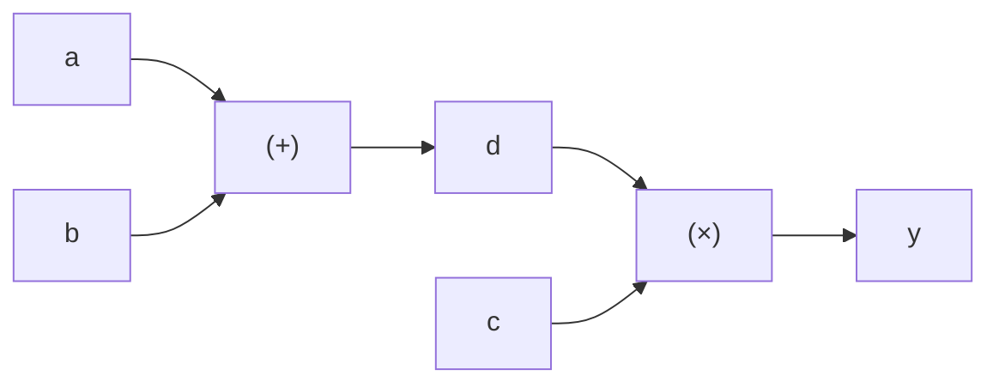

# 체인룰과 그래디언트 (Chain Rule and Gradients)

## 왜 필요한가?
신경망은 여러 함수의 **합성**(composition)이다. 입력 → 선형변환 → 활성화 → 선형변환 → ... → 출력. 이 합성함수의 미분을 구하는 방법이 체인룰이며, 이것이 곧 **역전파(backpropagation)**의 수학적 원리다.

---

## 1. 합성함수 (Composite Function)
함수의 출력이 다른 함수의 입력이 되는 것.

$$h(x) = f(g(x))$$

예: $g(x) = 3x + 1$, $f(u) = u^2$

$$h(x) = f(g(x)) = (3x + 1)^2$$

신경망의 한 층:

$$a = \text{ReLU}(Wx + b)$$

이것은 합성함수.

## 2. 체인룰 (Chain Rule)
합성함수의 미분은 **각 함수의 미분을 곱한 것**.

$$h(x) = f(g(x))$$

$$\frac{dh}{dx} = \frac{df}{dg} \times \frac{dg}{dx}$$

### 예시

$$h(x) = (3x + 1)^2$$

$$\begin{aligned}
g(x) &= 3x + 1 \quad \to \quad \frac{dg}{dx} = 3 \\
f(u) &= u^2 \quad \to \quad \frac{df}{du} = 2u = 2(3x + 1) \\
\frac{dh}{dx} &= 2(3x + 1) \times 3 = 6(3x + 1)
\end{aligned}$$

### 여러 단계의 체인룰
3개 이상의 함수가 합성된 경우에도 동일:

$$h(x) = f(g(k(x)))$$

$$\frac{dh}{dx} = \frac{df}{dg} \times \frac{dg}{dk} \times \frac{dk}{dx}$$

신경망에서: L층 네트워크의 그래디언트는 각 층의 미분을 **연쇄적으로 곱한** 것.

## 3. 계산 그래프 (Computational Graph)
수식을 **노드(연산)**와 **엣지(데이터 흐름)**로 표현한 것.

$y = (a + b) \times c$

순전파 (왼→오): 값을 계산, 역전파 (오→왼): 그래디언트를 전파

역전파 계산:

$$\begin{aligned}
\frac{dy}{dy} &= 1 \quad \text{(자기 자신에 대한 미분)} \\
\frac{dy}{dd} &= c \quad \text{(} y = d \times c \text{이므로)} \\
\frac{dy}{dc} &= d \quad \text{(} y = d \times c \text{이므로)} \\
\frac{dy}{da} &= \frac{dy}{dd} \times \frac{dd}{da} = c \times 1 = c \quad \text{(체인룰!)} \\
\frac{dy}{db} &= \frac{dy}{dd} \times \frac{dd}{db} = c \times 1 = c
\end{aligned}$$

→ PyTorch의 autograd는 이 계산 그래프를 자동으로 구축하고, 역전파를 자동으로 수행한다.

## 4. 그래디언트 디센트 (Gradient Descent)
그래디언트의 **반대 방향**으로 파라미터를 업데이트하여 손실을 줄인다.

$$\theta_{\text{new}} = \theta_{\text{old}} - \eta \cdot \nabla L(\theta)$$

- $\theta$: 파라미터 (가중치)
- $\eta$: 학습률 (learning rate)
- $\nabla L$: 손실의 그래디언트

### 학습률의 효과
- **너무 크면**: 최솟값을 지나쳐서 발산할 수 있음
- **너무 작으면**: 수렴이 매우 느림
- **적절하면**: 점차 최솟값에 수렴

### 직관적 비유
산에서 가장 빠르게 내려가는 방법:
1. 현재 위치에서 가장 가파른 경사를 찾는다 (= 그래디언트)
2. 그 반대 방향으로 한 걸음 내딛는다 (= 파라미터 업데이트)
3. 반복한다

## 5. 그래디언트 소실/폭발 문제 (Vanishing/Exploding Gradients)
체인룰은 미분을 **연쇄적으로 곱한다**. 이 곱이 계속되면:

- 미분값이 모두 < 1이면: 곱할수록 0에 가까워짐 → **소실 (Vanishing)**
- 미분값이 모두 > 1이면: 곱할수록 폭발적으로 커짐 → **폭발 (Exploding)**

이 문제를 해결하기 위해:
- ReLU 활성화 함수 (미분값이 0 또는 1)
- 잔차 연결 (ResNet) — Transformer에서도 사용
- 적절한 가중치 초기화
- 그래디언트 클리핑

---

## 핵심 정리
1. **체인룰**: 합성함수의 미분 = 각 함수 미분의 곱. 역전파의 수학적 원리
2. **계산 그래프**: 순전파로 값 계산, 역전파로 그래디언트 전파
3. **그래디언트 디센트**: $\theta_{\text{new}} = \theta_{\text{old}} - \eta \cdot \nabla L$ 로 손실 최소화
4. **소실/폭발**: 깊은 네트워크에서 체인룰 곱셈의 누적 문제

---

## 실습 과제
1. $f(x) = \sin(x^2)$을 체인룰로 미분해보기
2. 간단한 계산 그래프를 그리고 역전파를 손으로 수행해보기: $y = (2x + 1)^3$
3. 학습률을 $0.001$, $0.1$, $10$으로 설정했을 때 $f(x) = x^2$ 최소화 과정을 비교해보기

---
