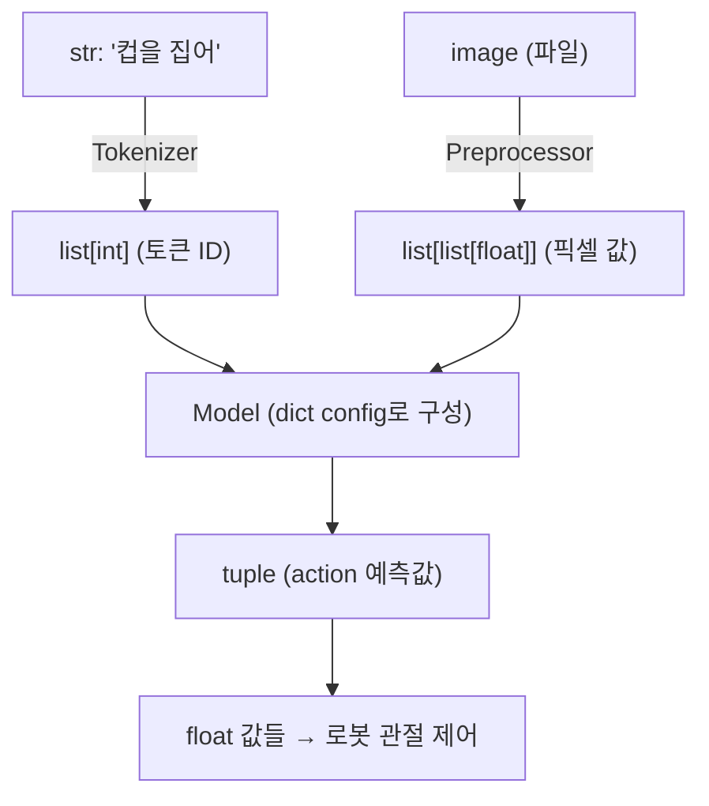

# 기본 문법과 타입 (Python Basics, Syntax, Types)

> **시리즈**: Python Fundamentals 1/5
> **다음 노트**: [제어문과 함수](./02-control-flow-functions.md)

---

## 왜 필요한가 — VLA와의 연결

VLA(Vision-Language-Action) 모델은 이미지, 텍스트, 로봇 동작이라는 **서로 다른 형태의 데이터**를 하나의 파이프라인에서 처리한다. 이 과정에서 Python의 기본 타입들이 모든 곳에 등장한다.

| Python 개념 | VLA에서 쓰이는 곳 |
|---|---|
| `int`, `float` | 이미지 픽셀 값, 로봇 관절 각도, 학습률(learning rate) |
| `str` | 자연어 명령 — *"컵을 집어 올려"* 같은 instruction |
| `bool` | 학습/추론 모드 전환 (`model.train()` vs `model.eval()`) |
| `list` | 이미지 시퀀스, action trajectory(행동 궤적) |
| `dict` | 모델 config, hyperparameter 설정, 학습 로그 |
| `tuple` | 텐서 shape — `(batch, channel, height, width)` |

Python 타입을 정확히 이해하지 못하면 텐서 shape 오류, config 파싱 실패, 데이터 전처리 버그 등 **딥러닝에서 가장 흔한 오류**를 디버깅할 수 없다.

---

## 핵심 개념

### 1. 변수와 할당 (Variables and Assignment)

Python은 **동적 타이핑(dynamic typing)** 언어다. 변수를 선언할 때 타입을 명시하지 않아도 된다.

```
learning_rate = 0.001      # float
model_name = "vla-base"    # str
num_epochs = 100            # int
is_training = True          # bool
```

변수는 **값을 가리키는 이름표(label)** 일 뿐이다. 같은 변수가 다른 타입의 값을 가리킬 수 있지만, 실제 프로젝트에서는 혼란을 일으키므로 피한다.

### 2. 기본 데이터 타입 (Primitive Data Types)

**int (정수)**: 이미지 크기, 배치 사이즈, epoch 수 등 **개수를 세는 값**에 사용.

**float (부동소수점)**: 모델 가중치, 손실 값(loss), 학습률 등 **연속적인 수치**에 사용. 딥러닝의 거의 모든 연산은 float 기반이다.

**str (문자열)**: 자연어 입력, 파일 경로, 모델 이름. VLA에서 language 부분이 곧 string이다.

**bool (불리언)**: `True` / `False`. 조건 분기, 학습 모드 전환, feature flag에 사용.

**None**: "값이 없음"을 명시적으로 표현. 아직 초기화되지 않은 모델 가중치, optional 파라미터의 기본값에 흔히 쓰인다.

### 3. 컬렉션 타입 (Collection Types)

#### list — 순서가 있는 가변(mutable) 시퀀스

```
# 로봇 팔의 6개 관절 각도
joint_angles = [0.1, -0.3, 0.5, 0.0, 1.2, -0.7]

# 학습 중 매 epoch의 loss 기록
losses = [2.45, 1.89, 1.23, 0.97]
```

- 순서(order)가 보장된다 — 인덱스로 접근 가능
- 요소를 추가, 삭제, 변경할 수 있다 (mutable)
- 서로 다른 타입의 요소를 담을 수 있지만, 보통 같은 타입으로 통일

#### dict — key-value 쌍의 매핑

```
# 모델 설정 (config)
config = {
    "model_name": "vla-7b",
    "image_size": 224,
    "num_layers": 32,
    "learning_rate": 1e-4,
    "use_pretrained": True
}
```

- **모든 딥러닝 프로젝트의 config 파일**이 dict 구조다
- key로 빠른 조회 가능 — `config["image_size"]` -> `224`
- JSON, YAML 파일을 읽으면 dict가 된다

#### tuple — 순서가 있는 불변(immutable) 시퀀스

```
# 텐서 shape: (배치, 채널, 높이, 너비)
image_shape = (32, 3, 224, 224)

# 한번 정해지면 변경 불가 -> shape처럼 고정된 구조에 적합
```

- shape, 좌표, 함수의 다중 반환값에 사용
- 불변이므로 dict의 key로 쓸 수 있다

#### set — 중복 없는 비순서 컬렉션

```
# 학습에 사용할 고유한 action 종류
unique_actions = {"pick", "place", "push", "pull"}
```

- 중복 제거, 멤버십 확인(`in` 연산)이 매우 빠름
- 딥러닝에서는 label 집합, vocabulary 구성 등에 활용

### 4. Type Hints (타입 힌트)

Python 3.5+에서 도입된 **선택적 타입 표기**. 실행에는 영향을 주지 않지만 코드 가독성과 IDE 지원을 크게 향상시킨다.

```
def compute_loss(predictions: list[float], targets: list[float]) -> float:
    ...

image_size: int = 224
model_name: str = "vla-base"
config: dict[str, any] = {"lr": 0.001}
```

최신 딥러닝 코드베이스(Hugging Face Transformers, OpenAI 등)는 type hint를 적극 사용한다. 코드를 읽을 때 함수의 입출력 형태를 파악하는 데 필수적이다.

### 5. String Formatting (문자열 포맷팅)

학습 로그를 출력할 때 매 epoch마다 사용한다.

```
# f-string (가장 현대적이고 권장되는 방식)
f"Epoch {epoch}/{total}: loss={loss:.4f}, acc={accuracy:.2%}"

# 출력 예: "Epoch 3/100: loss=0.4523, acc=92.31%"
```

- `:.4f` — 소수점 4자리까지 표시
- `:.2%` — 백분율로 표시, 소수점 2자리
- 딥러닝 학습 루프에서 **매번** 쓰는 패턴

### 6. Slicing (슬라이싱)

시퀀스의 **부분을 추출**하는 문법. 텐서 조작의 기초가 된다.

```
data = [0, 1, 2, 3, 4, 5, 6, 7, 8, 9]

data[2:5]     # [2, 3, 4]       — index 2부터 4까지
data[:3]      # [0, 1, 2]       — 처음부터 2까지
data[-3:]     # [7, 8, 9]       — 뒤에서 3개
data[::2]     # [0, 2, 4, 6, 8] — 2칸 간격으로
data[::-1]    # [9, 8, ..., 0]  — 역순
```

이 문법은 나중에 NumPy 배열과 PyTorch 텐서에서 **동일하게** 사용된다. 이미지의 특정 영역 자르기, 시퀀스의 일부 선택 등에 필수.

### 7. List Comprehension (리스트 컴프리헨션)

반복문을 한 줄로 압축하는 Python 고유 문법.

```
# 기본 형태
squares = [x**2 for x in range(10)]

# 조건 포함 — 짝수만
even_squares = [x**2 for x in range(10) if x % 2 == 0]

# 딥러닝 예시: 파일 경로에서 이미지만 필터링
image_files = [f for f in all_files if f.endswith(".png")]

# dict comprehension
param_counts = {name: p.numel() for name, p in model.named_parameters()}
```

데이터 전처리, 파일 목록 필터링, 모델 파라미터 순회 등에서 매우 자주 등장한다.

---

## 기억할 멘탈 모델



모든 것이 결국 **숫자(int/float)의 리스트**로 변환된다. 하지만 그 과정에서 str, dict, tuple이 모두 역할을 한다.

---

## 연습 주제

아래 주제들을 **코드 없이 먼저 개념적으로 생각**해보고, 그 후 직접 작성해보라.

1. **타입 변환 연습**: `int("224")`, `float("0.001")`, `str(224)`, `bool(0)` — 각각의 결과를 예측하고 왜 그런 결과가 나오는지 설명해보라.

2. **dict 설계**: VLA 모델의 config를 dict로 설계해보라. 어떤 key가 필요할까? (model 크기, 학습률, 이미지 크기, 언어 모델 종류, action 차원 수 등)

3. **슬라이싱 사고 실험**: `shape = (2, 3, 224, 224)`인 텐서가 있다. 이 tuple의 각 원소가 무엇을 의미하는지 생각하고, 슬라이싱으로 `(224, 224)` 부분만 추출하는 방법을 떠올려보라.

4. **List comprehension 변환**: 일반 for 루프로 작성된 "파일 목록에서 `.jpg`와 `.png`만 골라내기" 로직을 list comprehension 한 줄로 바꿔보라.

5. **Type hint 읽기 연습**: 오픈소스 코드에서 함수 시그니처를 읽고, 입력/출력 타입을 파악하는 연습을 해보라. (예: Hugging Face Transformers의 함수들)

---
