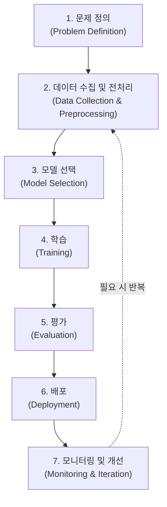
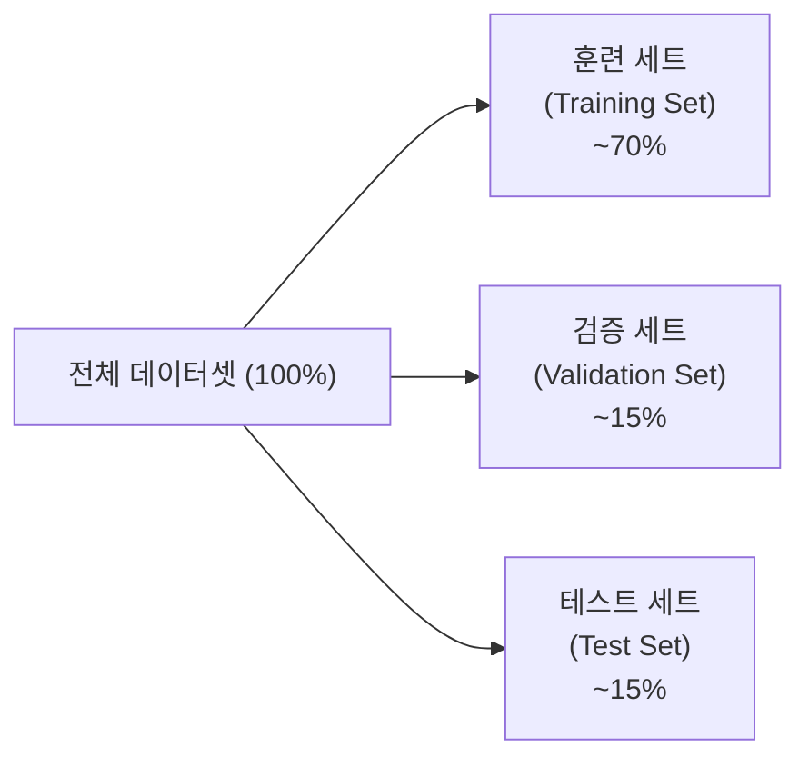

# ML 개요와 워크플로우 (ML Overview and Workflow)

## 왜 알아야 하는가 (Why This Matters for VLA)

VLA(Vision-Language-Action) 모델은 **이미지를 보고**(Vision), **언어를 이해하고**(Language), **행동을 결정하는**(Action) 시스템이다. 이 모델을 이해하려면 먼저 **머신러닝이 무엇이고 어떤 흐름으로 작동하는지** 알아야 한다.

VLA와의 연결 고리:
- VLA의 Vision 파트는 **지도 학습(Supervised Learning)** 으로 이미지를 분류하고 인식하는 것에서 출발한다
- Language 파트는 대량의 텍스트로부터 패턴을 스스로 학습하는 **비지도 학습(Unsupervised Learning)** 의 원리를 사용한다
- Action 파트는 로봇이 환경과 상호작용하며 보상을 최대화하는 **강화 학습(Reinforcement Learning)** 에 기반한다
- 결국 VLA는 세 가지 학습 패러다임이 모두 합쳐진 모델이다

---

## 핵심 개념 (Core Concepts)

### 1. 머신러닝의 세 가지 패러다임 (Three Learning Paradigms)

#### 지도 학습 (Supervised Learning)
- **정의**: 정답(label)이 있는 데이터로부터 입력과 출력의 관계를 학습한다
- **핵심 아이디어**: "이 사진은 고양이야"라고 알려주면, 새로운 사진을 보고 고양이인지 판단할 수 있게 된다
- **예시**: 이메일 스팸 분류, 집값 예측, 의료 영상 진단

```
입력(X)     →  모델  →  예측(Y_hat)
고양이 사진  →  모델  →  "고양이" (정답 Y = "고양이"와 비교하여 학습)
```

#### 비지도 학습 (Unsupervised Learning)
- **정의**: 정답 없이 데이터 자체의 구조와 패턴을 발견한다
- **핵심 아이디어**: 정답을 알려주지 않아도 비슷한 것끼리 모으거나, 데이터의 숨겨진 구조를 찾아낸다
- **예시**: 고객 세분화(clustering), 차원 축소(dimensionality reduction), 언어 모델의 사전 학습

```
데이터들  →  모델  →  발견된 패턴/구조
[뉴스 기사 수만 개]  →  모델  →  [정치, 경제, 스포츠, ...] 자동 그룹화
```

#### 강화 학습 (Reinforcement Learning)
- **정의**: 에이전트(agent)가 환경(environment)과 상호작용하며, 보상(reward)을 최대화하는 행동(action)을 학습한다
- **핵심 아이디어**: 시행착오를 통해 학습한다. 좋은 행동에는 보상을, 나쁜 행동에는 벌점을 받는다
- **예시**: 게임 AI, 로봇 제어, 자율주행

```
에이전트  ←→  환경
   ↓ 행동(action)을 취함
   ↓ 환경이 상태(state)와 보상(reward)을 반환
   ↓ 보상을 최대화하는 방향으로 정책(policy) 개선
```

### 2. 분류와 회귀 (Classification vs. Regression)

| 구분 | 분류 (Classification) | 회귀 (Regression) |
|------|----------------------|-------------------|
| **출력** | 이산적 카테고리 (discrete category) | 연속적 수치 (continuous value) |
| **예시** | 스팸/정상, 개/고양이/새 | 집값, 온도, 주가 |
| **VLA 연결** | Vision: 물체가 "컵"인지 "접시"인지 분류 | Action: 로봇 팔의 각도(연속값)를 예측 |

- **이진 분류 (Binary Classification)**: 두 개의 클래스 중 하나를 선택 (예: 스팸 O/X)
- **다중 분류 (Multi-class Classification)**: 여러 클래스 중 하나를 선택 (예: 숫자 0~9 인식)
- **다중 레이블 분류 (Multi-label Classification)**: 하나의 입력에 여러 레이블 가능 (예: 사진에 "고양이"와 "소파"가 동시에 있음)

### 3. ML 워크플로우 (ML Workflow)

머신러닝 프로젝트는 일직선이 아니라 **반복적인 순환** 과정이다:



**각 단계 요약**:

- **문제 정의**: "무엇을 예측/분류할 것인가?"를 명확히 한다. VLA에서는 "로봇이 어떤 행동을 해야 하는가?"가 문제이다.
- **데이터 수집 및 전처리**: 원시 데이터를 모델이 학습할 수 있는 형태로 변환한다. 결측치 처리, 정규화 등을 포함한다.
- **모델 선택**: 문제에 적합한 알고리즘/아키텍처를 선택한다.
- **학습**: 데이터를 모델에 넣어 파라미터를 조정한다.
- **평가**: 학습되지 않은 데이터로 모델 성능을 측정한다.
- **배포**: 실제 환경에서 모델을 사용한다.

### 4. 데이터 분할 (Train / Validation / Test Split)

모델이 **새로운 데이터에도 잘 동작하는지** 확인하기 위해 데이터를 나눈다:



**왜 나누는가?**
- **시험지 비유**: 훈련 세트는 "교과서", 검증 세트는 "모의고사", 테스트 세트는 "수능"이다
- 교과서(훈련)로 공부하고, 모의고사(검증)로 실력을 확인하며, 수능(테스트)은 마지막에 한 번만 본다
- 모의고사 문제를 미리 알고 외우면(검증 세트로 학습하면) 실제 실력을 측정할 수 없다

**핵심 원칙**:
- 테스트 세트는 모든 실험이 끝난 후 **딱 한 번만** 사용한다
- 검증 세트로 성능을 보며 모델을 수정하는 과정을 반복한다
- 데이터가 적을 때는 **교차 검증(Cross-Validation)** 을 사용한다 (5번 노트에서 다룸)

### 5. 핵심 용어 정리 (Key Terms)

| 용어 | 영문 | 설명 |
|------|------|------|
| 특성/피처 | Feature | 모델에 입력되는 개별 변수 (예: 집의 면적, 방 개수) |
| 레이블 | Label / Target | 예측하고자 하는 정답값 |
| 파라미터 | Parameter | 모델이 학습을 통해 조정하는 내부 값 (가중치, 편향) |
| 하이퍼파라미터 | Hyperparameter | 사람이 직접 설정하는 값 (학습률, 에폭 수) |
| 에폭 | Epoch | 전체 훈련 데이터를 한 번 모두 학습하는 단위 |
| 일반화 | Generalization | 학습하지 않은 새로운 데이터에서도 잘 작동하는 능력 |

---

## 연습 주제 (Practice Topics)

스스로 생각해보고 답을 정리해 보자 (코드 작성 불필요):

1. **패러다임 분류 연습**: 다음 각 문제는 지도/비지도/강화 학습 중 어디에 해당하는가?
   - 유튜브 영상 추천 시스템
   - 자율주행 자동차의 차선 유지
   - 이메일을 자동으로 카테고리별 폴더에 분류
   - 비슷한 소비 패턴을 가진 고객 그룹 찾기

2. **분류 vs 회귀**: 다음 문제들은 분류인가 회귀인가?
   - 내일 비가 올 확률 예측
   - 영화 리뷰가 긍정/부정인지 판단
   - 아파트 매매가격 예측
   - 환자의 질병 종류 진단

3. **데이터 분할 시나리오**: 데이터가 총 1,000개이고 그 중 특정 클래스가 50개뿐이라면, 어떻게 분할해야 할까? (힌트: stratified split)

4. **VLA 워크플로우 설계**: VLA 로봇이 "컵을 집어서 테이블 위에 놓는" 작업을 학습한다고 가정할 때, ML 워크플로우의 각 단계에서 무엇을 해야 하는지 간단히 적어보자.

---

## 다음 노트 (Next Note)

ML의 전체 그림을 파악했으니, 이제 가장 간단한 모델부터 시작하자.

**다음**: [선형 회귀 (Linear Regression)](./02-linear-regression.md) - 뉴럴 네트워크의 가장 기본 단위인 "뉴런 하나"가 어떻게 작동하는지 배운다.
