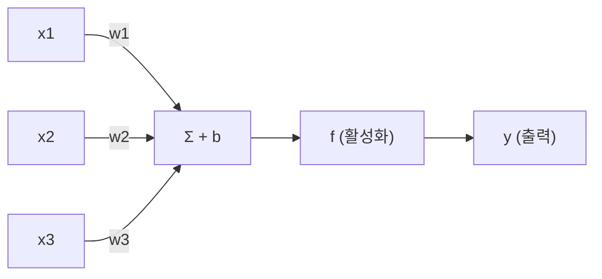
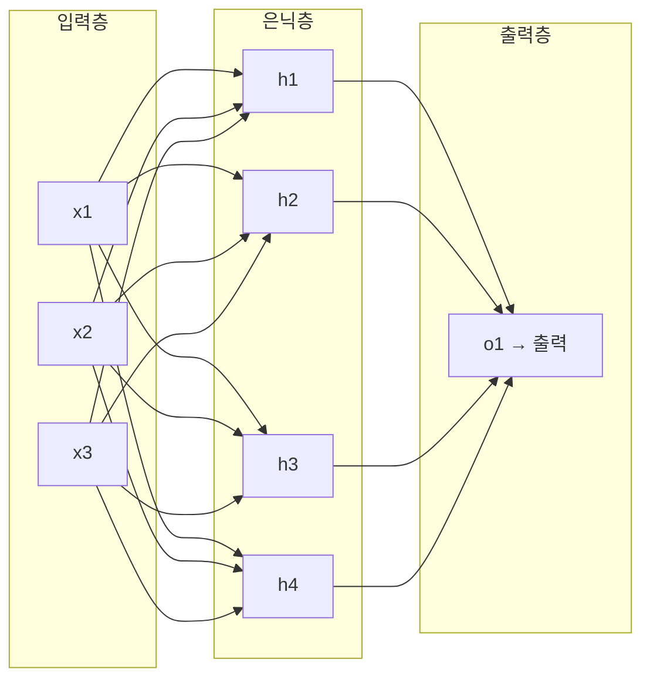

# 퍼셉트론에서 MLP까지 (From Perceptron to MLP)

## 왜 알아야 하는가 (Why This Matters for VLA)

신경망(Neural Network)은 딥러닝의 기본 단위이다. 하나의 뉴런(퍼셉트론)이 어떻게 동작하는지 이해하면, 수십억 개의 파라미터를 가진 VLA 모델도 결국 같은 원리의 **확장**임을 알 수 있다.

VLA와의 연결 고리:
- VLA 내부의 Transformer는 결국 **MLP 블록을 반복적으로 쌓은 구조**이다
  - Transformer의 Feed-Forward Network(FFN) = 2층 MLP
  - Vision Encoder(ViT)의 각 블록 안에도 MLP가 있다
  - Action Head(로봇 동작 출력)도 MLP로 구성된다
- MLP의 **hidden dimension(은닉 차원)**이 모델의 용량을 결정한다
  - 예: Llama 2-7B의 FFN 은닉 차원 = 11,008
  - OpenVLA의 Action Head도 MLP 레이어를 통해 연속 동작을 출력한다
- "깊이(depth)가 왜 중요한가"를 이해해야 Transformer의 레이어 수 선택 이유를 알 수 있다

---

## 핵심 개념 (Core Concepts)

### 1. 퍼셉트론 (Perceptron) -- 신경망의 최소 단위

퍼셉트론은 **생물학적 뉴런**을 모방한 가장 단순한 모델이다.

```
생물학적 뉴런:
  여러 수상돌기(dendrite)로 신호를 받아들이고,
  세포체(soma)에서 합산한 후,
  임계값을 넘으면 축삭(axon)으로 신호를 내보낸다.

퍼셉트론:
  입력(x1, x2, ..., xn) × 가중치(w1, w2, ..., wn) → 합산 → 활성화 함수 → 출력

  수식:
  z = w1*x1 + w2*x2 + ... + wn*xn + b    (선형 결합)
  y = f(z)                                 (활성화 함수 적용)

  여기서 b는 편향(bias), f는 활성화 함수
```

**퍼셉트론의 구조 시각화**:


**퍼셉트론이 하는 일**: 입력 공간을 **하나의 직선(또는 초평면)으로 나누는 것**.

```
AND 게이트:              OR 게이트:             XOR 문제:
  x2                       x2                    x2
  1 | 0  1                 1 | 1  1              1 | 1  0
    |                        |                     |
  0 | 0  0                 0 | 0  1              0 | 0  1
    +------x1                +------x1             +------x1
    직선으로 분리 가능!      직선으로 분리 가능!    직선 하나로는 불가능!
```

핵심 한계: 단일 퍼셉트론은 **선형 분리 가능(linearly separable)**한 문제만 풀 수 있다. XOR처럼 직선 하나로 나눌 수 없는 문제는 풀지 못한다.

### 2. 다층 퍼셉트론 (MLP: Multi-Layer Perceptron)

XOR 문제를 해결하려면 **여러 층의 뉴런**을 쌓아야 한다. 이것이 MLP이다.



```
각 화살표 = 가중치(weight)
각 노드 = 가중합 + 활성화 함수
```

**MLP가 XOR을 푸는 원리**:
```
단일 퍼셉트론: 직선 1개       MLP: 직선 2개를 조합
  x2                           x2
  1 | 1  0                     1 | 1  0
    |       ← 직선 하나로        | \  / ← 두 직선의 교차
  0 | 0  1     불가능          0 | 0  1    영역으로 분리!
    +------x1                    +------x1

은닉층의 각 뉴런이 하나의 직선(결정 경계)을 만들고,
출력층이 이 결정 경계들을 조합한다.
```

### 3. 층의 구성 요소 (Components of a Layer)

MLP의 각 층은 다음 연산을 수행한다:

```
한 층의 연산:
  z = W @ x + b       (선형 변환: @ 는 행렬곱)
  a = f(z)            (비선형 활성화 함수)

W: 가중치 행렬 (shape: 출력 뉴런 수 × 입력 뉴런 수)
b: 편향 벡터 (shape: 출력 뉴런 수)
f: 활성화 함수 (ReLU, sigmoid 등)
```

**차원의 의미**:
```
예: 입력 차원 784 → 은닉 차원 256 → 출력 차원 10

입력층 (784):    MNIST 이미지 (28×28 = 784 픽셀)
은닉층 (256):    256개의 뉴런이 특징을 추출
출력층 (10):     0~9 숫자 분류

W1 shape: (256, 784)  → 파라미터 수: 256 × 784 = 200,704
b1 shape: (256,)      → 파라미터 수: 256
W2 shape: (10, 256)   → 파라미터 수: 10 × 256 = 2,560
b2 shape: (10,)       → 파라미터 수: 10
총 파라미터: 203,530개
```

### 4. 은닉 차원 (Hidden Dimension)과 모델 용량

은닉층의 **뉴런 수(hidden dimension)**는 모델이 표현할 수 있는 복잡도를 결정한다.

```
은닉 차원이 작을 때 (예: 4):
  단순한 패턴만 학습 가능 → 과소적합 위험

은닉 차원이 클 때 (예: 4096):
  복잡한 패턴도 학습 가능 → 과적합 위험 (정규화 필요)
  하지만 연산량과 메모리 증가

실제 모델의 은닉 차원:
  간단한 분류기:    64 ~ 512
  BERT-base:        768
  GPT-3:            12,288
  Llama 2-7B:       4,096 (모델 차원), FFN 은닉 11,008
  VLA 모델:         Backbone LLM의 차원을 그대로 사용
```

### 5. 보편 근사 정리 (Universal Approximation Theorem)

**하나의 은닉층**을 가진 MLP가 충분히 넓다면(뉴런이 충분히 많다면), **어떤 연속 함수든 근사할 수 있다**.

```
직관적 이해:

원래 함수 f(x):         MLP의 근사:
  |     /\               |     /\
  |    /  \              |    /  \
  |   /    \             |   /    \  ← 충분한 뉴런이 있으면
  |  /      \            |  /      \   계단을 잘게 쪼개어
  | /        \           | /        \  어떤 형태든 근사 가능
  +----------→x         +----------→x
  (임의의 함수)           (ReLU 뉴런들의 조합)

각 ReLU 뉴런은 "꺾인 직선" 하나를 만든다.
이런 꺾인 직선을 많이 합치면 어떤 곡선이든 근사할 수 있다.
```

**하지만 현실에서는**:
- 넓은 1층보다 **깊은 여러 층**이 더 효율적이다
- 같은 파라미터 수라면 깊은 네트워크가 더 복잡한 함수를 표현한다
- 이것이 "딥러닝(Deep Learning)"이라는 이름의 이유이다

### 6. 깊이가 왜 중요한가 (Why Depth Matters)

깊은 네트워크는 **계층적 특징(hierarchical features)**을 학습한다.

```
이미지 인식 예시:

1층: 엣지(edge) 검출        ─── / | \ ○
2층: 엣지 조합 → 텍스처/모양  ─── 눈, 코, 귀 모양
3층: 모양 조합 → 부분         ─── 얼굴, 몸통
4층: 부분 조합 → 전체         ─── "고양이"

각 층이 이전 층의 출력을 더 추상적인 특징으로 변환한다.
```

**VLA에서의 계층 구조**:
```
Vision Encoder (ViT):
  1~6층:  저수준 시각 특징 (엣지, 색상, 텍스처)
  7~18층: 중수준 시각 특징 (물체 부분, 공간 관계)
  19~24층: 고수준 의미 특징 ("빨간 컵이 테이블 위에 있다")

Language Model:
  앞쪽 층: 문법, 단어 의미
  뒤쪽 층: 문맥 이해, 추론

Action Head (MLP):
  시각 + 언어 특징 → 로봇 동작 (관절 각도, 그리퍼 열기/닫기)
```

### 7. MLP 설계의 실무 패턴

```
일반적인 MLP 설계 원칙:

1. 입력/출력 차원은 문제가 결정한다
   입력: 데이터 특성 수 (이미지 픽셀 수, 특성 벡터 크기 등)
   출력: 클래스 수 (분류) 또는 예측값 차원 (회귀)

2. 은닉층 차원은 보통 입력보다 크게, 출력보다 크게 설정
   입력(784) → 은닉(512) → 은닉(256) → 출력(10)
   "점점 좁아지는 깔때기" 형태가 흔하다

3. Transformer 내부 FFN의 전형적 패턴
   입력(d_model) → 확장(4 × d_model) → 출력(d_model)
   예: 768 → 3072 → 768
   "병목(bottleneck)"의 반대: 중간이 더 넓은 "역병목" 구조

4. VLA의 Action Head 예시
   결합된 특징(4096) → 은닉(1024) → 은닉(512) → 액션(7)
   7 = 6-DoF 포즈 + 그리퍼 (Fairino FR3 등 로봇 팔의 액션)
```

---

## 연습 주제 (Practice Topics)

스스로 생각해보고 답을 정리해 보자 (코드 작성 불필요):

1. **퍼셉트론 한계**: 단일 퍼셉트론으로 AND, OR, NOT 게이트를 구현할 수 있는데, XOR은 왜 불가능한가? 입력 공간에 점을 찍어 직선 하나로 분리할 수 있는지 직접 그려보라.

2. **파라미터 수 계산**: 입력 차원 100, 은닉층 [512, 256, 128], 출력 차원 10인 MLP의 총 파라미터 수를 계산하라. (각 층의 W와 b를 모두 포함)

3. **은닉 차원 트레이드오프**: 은닉 차원을 2배로 늘리면 파라미터 수는 대략 몇 배 증가하는가? 메모리와 연산량 측면에서 어떤 비용이 발생하는가?

4. **보편 근사 정리의 한계**: 이 정리가 "이론적으로 가능하다"는 것인데, 실제로 넓은 1층 MLP 대신 깊은 MLP를 사용하는 이유를 세 가지 이상 나열해보라.

5. **VLA 구조 추론**: Transformer의 FFN이 `d_model → 4*d_model → d_model` 구조라면, d_model=4096인 모델에서 FFN 하나의 파라미터 수는 얼마인가? 이런 FFN이 32층이면 총 FFN 파라미터는?

---

## 다음 노트 (Next Note)

퍼셉트론과 MLP의 구조를 배웠다. 하지만 핵심 요소 하나를 아직 깊이 다루지 않았다: **활성화 함수**. 활성화 함수가 없으면 아무리 깊이 쌓아도 하나의 선형 변환에 불과하다.

**다음**: [활성화 함수 (Activation Functions)](./02-activation-functions.md) - 신경망에 비선형성을 부여하는 핵심 요소. VLA에서 사용하는 최신 활성화 함수(GELU, SiLU)까지 다룬다.
