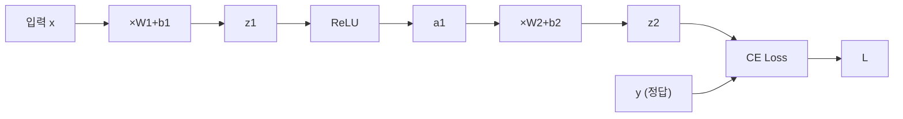
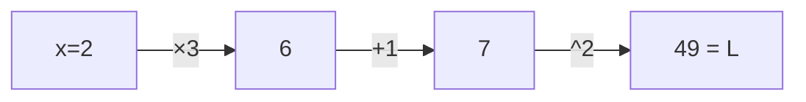
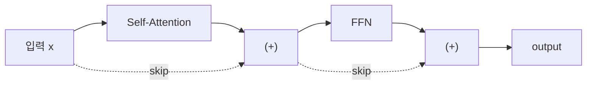

# 역전파 (Backpropagation)

## 왜 알아야 하는가 (Why This Matters for VLA)

역전파(Backpropagation)는 신경망 학습의 **핵심 알고리즘**이다. 손실(loss)로부터 출발하여, 네트워크의 모든 가중치가 손실에 얼마나 기여했는지를 **효율적으로** 계산한다. PyTorch의 `loss.backward()` 한 줄이 바로 역전파를 수행하는 것이다.

VLA와의 연결 고리:
- VLA 학습은 **수십억 개의 파라미터**에 대해 역전파를 수행한다
  - Llama 2-7B 기반 VLA: 70억 개 파라미터의 gradient를 매 step 계산
  - 이것이 가능한 이유가 역전파의 효율성이다
- PyTorch의 **autograd** 시스템이 역전파를 자동으로 수행한다
  - `loss.backward()` → 모든 파라미터의 gradient 계산
  - `optimizer.step()` → gradient를 사용하여 파라미터 업데이트
- 역전파의 원리를 모르면 **gradient 관련 버그**(gradient 폭발, gradient 소실, gradient가 None)를 디버깅할 수 없다
- Mixed precision training, gradient checkpointing 등 VLA 학습 최적화 기법도 역전파의 이해를 전제한다

---

## 핵심 개념 (Core Concepts)

### 1. 순전파 = 계산 그래프 구축 (Forward Pass as Computational Graph)

신경망의 순전파는 **입력에서 출력(손실)까지 계산하는 과정**이다. 이 과정에서 모든 연산이 계산 그래프(computational graph)로 기록된다.

2층 MLP의 순전파 예시:



```
순전파 방향: →→→→→→→ (왼쪽에서 오른쪽)
역전파 방향: ←←←←←←← (오른쪽에서 왼쪽)
```

**순전파에서 기록되는 것**:

각 노드에서 저장하는 정보:
1. 입력값 (역전파 시 gradient 계산에 필요)
2. 연산의 종류 (어떤 미분 공식을 사용할지)
3. 출력값

예: $z_1 = W_1 x + b_1$ 노드 → 입력: $W_1, x, b_1$ / 연산: 행렬곱 + 덧셈 / 출력: $z_1$

PyTorch에서는 이 모든 것이 자동으로 기록된다.

### 2. 역전파 = 체인룰 적용 (Backward Pass with Chain Rule)

역전파는 **출력(Loss)에서 시작하여 입력 방향으로** 각 파라미터의 gradient를 계산한다.

핵심 원리: **체인룰(Chain Rule)**

$$\frac{\partial L}{\partial W_1} = \frac{\partial L}{\partial z_2} \cdot \frac{\partial z_2}{\partial a_1} \cdot \frac{\partial a_1}{\partial z_1} \cdot \frac{\partial z_1}{\partial W_1}$$

각 항은 계산 그래프에서 인접한 노드 간의 "지역적 기울기(local gradient)"이다.

**구체적 예시: 2층 MLP의 역전파**

네트워크: $x \to z_1 = W_1 x + b_1 \to a_1 = \text{ReLU}(z_1) \to z_2 = W_2 a_1 + b_2 \to L = \text{Loss}(z_2, y)$

**Step 1**: 손실에서 시작

$$\frac{\partial L}{\partial L} = 1 \quad \text{(자기 자신에 대한 미분)}$$

**Step 2**: 손실 → $z_2$

$$\frac{\partial L}{\partial z_2} = \text{(손실 함수의 미분)} \quad \text{(예: Cross-Entropy + Softmax면 } \hat{y} - y \text{)}$$

**Step 3**: $z_2 \to W_2, b_2, a_1$

$$\begin{aligned}
\frac{\partial L}{\partial W_2} &= \frac{\partial L}{\partial z_2} \cdot a_1^T \quad \text{(행렬곱의 미분)} \\
\frac{\partial L}{\partial b_2} &= \frac{\partial L}{\partial z_2} \quad \text{(덧셈의 미분)} \\
\frac{\partial L}{\partial a_1} &= W_2^T \cdot \frac{\partial L}{\partial z_2} \quad \text{(행렬곱의 미분)}
\end{aligned}$$

**Step 4**: $a_1 \to z_1$

$$\frac{\partial L}{\partial z_1} = \frac{\partial L}{\partial a_1} \odot \text{ReLU}'(z_1) \quad \text{(원소별 곱)}$$

$$\text{ReLU}'(z_1) = \begin{cases} 1 & z_1 > 0 \\ 0 & z_1 \leq 0 \end{cases}$$

**Step 5**: $z_1 \to W_1, b_1$

$$\frac{\partial L}{\partial W_1} = \frac{\partial L}{\partial z_1} \cdot x^T, \quad \frac{\partial L}{\partial b_1} = \frac{\partial L}{\partial z_1}$$

### 3. 지역적 기울기 (Local Gradients)

역전파의 핵심 아이디어: 각 노드는 **자기 자신의 미분(지역적 기울기)**만 알면 된다. 그리고 뒤에서 전달된 기울기와 곱한다.

$$[\text{상류 gradient}] \times [\text{지역적 gradient}] = [\text{하류로 전달할 gradient}]$$

**예시: 덧셈 노드** — $c = a + b$

$$\frac{\partial c}{\partial a} = 1, \quad \frac{\partial c}{\partial b} = 1 \quad \to \text{gradient를 그대로 양쪽으로 전달}$$

**예시: 곱셈 노드** — $c = a \cdot b$

$$\frac{\partial c}{\partial a} = b, \quad \frac{\partial c}{\partial b} = a \quad \to \text{gradient에 상대방 값을 곱해서 전달}$$

**예시: ReLU 노드** — $c = \max(0, a)$

$$\frac{\partial c}{\partial a} = \begin{cases} 1 & a > 0 \\ 0 & a \leq 0 \end{cases} \quad \to a > 0\text{이면 그대로 전달, } a \leq 0\text{이면 차단}$$

**계산 그래프에서의 gradient 흐름 시각화**:

순전파:


역전파:

$$\begin{aligned}
\frac{\partial L}{\partial L} &= 1 \\
\frac{\partial L}{\partial 7} &= 2 \times 7 = 14 \quad \text{(} [z^2] \text{의 지역 gradient: } 2z \text{)} \\
\frac{\partial L}{\partial 6} &= 14 \times 1 = 14 \quad \text{([+1]의 지역 gradient: 1)} \\
\frac{\partial L}{\partial x} &= 14 \times 3 = 42 \quad \text{([×3]의 지역 gradient: 3)}
\end{aligned}$$

검증: $L = (3x+1)^2$, $\frac{\partial L}{\partial x} = 2(3x+1) \times 3 = 6(3 \times 2 + 1) = 6 \times 7 = 42$ ✓

### 4. 역전파의 효율성 (Why Backprop is Efficient)

왜 각 파라미터의 gradient를 개별적으로 계산하지 않고 역전파를 사용하는가?

**방법 1: 수치 미분 (Numerical Differentiation)**

각 파라미터 $w_i$에 대해:

$$\frac{\partial L}{\partial w_i} \approx \frac{L(w_i + \epsilon) - L(w_i - \epsilon)}{2\epsilon}$$

파라미터가 $N$개면: 순전파를 $2N$번 수행해야 함. Llama 2-7B: $N = 70$억 → $140$억 번의 순전파! → 불가능

**방법 2: 역전파 (Backpropagation)**

순전파 1번 + 역전파 1번 = 모든 파라미터의 gradient를 한 번에 계산

비용: 순전파의 약 2~3배 (역전파가 순전파보다 약간 더 비쌈) → 파라미터 수에 관계없이 단 2~3배!

**이것이 딥러닝을 실용적으로 만든 핵심 알고리즘이다.**

### 5. Gradient 흐름 패턴 (Gradient Flow Patterns)

각 연산이 gradient에 미치는 영향을 이해하면 네트워크 설계가 직관적이 된다.

**덧셈** ($a + b$): gradient를 양쪽에 "복사"하여 전달. 잔차 연결(Residual Connection)이 이 원리를 활용!

Residual Connection: $y = f(x) + x$

$$\frac{\partial L}{\partial x} = \frac{\partial L}{\partial y} \cdot \left(\frac{\partial f}{\partial x} + 1\right) \quad \leftarrow \text{이 } +1 \text{ 덕분에 gradient가 최소 1은 보장}$$

**곱셈** ($a \cdot b$): gradient에 상대방 값을 곱하여 전달. 값이 $0$이면 gradient도 $0$ (gradient 소실 위험). 값이 매우 크면 gradient도 매우 큼 (gradient 폭발 위험).

**행렬곱** ($Wx$):

$$\frac{\partial L}{\partial W} = \frac{\partial L}{\partial z} \cdot x^T, \quad \frac{\partial L}{\partial x} = W^T \cdot \frac{\partial L}{\partial z}$$

→ $W$의 크기가 gradient 크기에 직접 영향

**Transformer에서의 gradient 흐름**:


덧셈(+) = Residual Connection → gradient가 skip 경로를 통해 직접 전달 → 100층 이상의 Transformer도 안정적으로 학습 가능 → VLA의 깊은 네트워크 학습의 핵심 비결

### 6. PyTorch Autograd와의 연결

PyTorch는 역전파를 **자동으로** 수행한다. 그 메커니즘을 이해하자.

```
PyTorch autograd의 동작 원리:

1. 순전파 시: 연산이 수행될 때마다 계산 그래프를 자동 구축
   - requires_grad=True인 텐서가 관여하는 모든 연산을 기록
   - 각 텐서의 .grad_fn에 역전파 함수가 저장됨

2. loss.backward() 호출 시:
   - 계산 그래프를 거슬러 올라가며 체인룰 적용
   - 각 파라미터의 .grad에 gradient 누적

3. optimizer.step() 호출 시:
   - .grad 값을 사용하여 파라미터 업데이트
   - w = w - lr * w.grad (SGD의 경우)

4. optimizer.zero_grad() 호출 시:
   - .grad를 0으로 초기화
   - 이걸 안 하면 gradient가 누적되어 잘못된 업데이트!
```

**전형적인 학습 루프와 역전파의 관계**:
```
매 학습 step:

  1. y_hat = model(x)           ← 순전파 (계산 그래프 구축)
  2. loss = criterion(y_hat, y)  ← 손실 계산 (그래프의 마지막 노드)
  3. optimizer.zero_grad()       ← 이전 gradient 초기화
  4. loss.backward()             ← 역전파 (모든 gradient 계산)
  5. optimizer.step()            ← 파라미터 업데이트

이 5단계가 딥러닝 학습의 전부이다.
VLA든 GPT든 이 루프를 수십만 번 반복하는 것이다.
```

### 7. Gradient 관련 주의사항 (Common Pitfalls)

```
1. gradient 누적 문제:
   zero_grad()를 안 하면 이전 step의 gradient가 계속 더해짐
   → 올바르지 않은 방향으로 업데이트

2. in-place 연산 주의:
   a += b 같은 in-place 연산은 계산 그래프를 깨뜨릴 수 있음
   → a = a + b 처럼 새 텐서를 만들어야 안전

3. detach()와 no_grad():
   gradient 계산이 필요 없는 부분은 명시적으로 끊어야 함
   → 평가(evaluation) 시에는 torch.no_grad()로 감싸서 메모리 절약
   → VLA에서 frozen backbone의 gradient를 끊을 때 detach() 사용

4. gradient 폭발 (Exploding Gradients):
   gradient 값이 너무 커지면 NaN 발생
   → gradient clipping으로 해결: gradient의 크기를 max_norm으로 제한
   → VLA 학습에서 거의 필수적으로 사용됨
```

---

## 연습 주제 (Practice Topics)

스스로 생각해보고 답을 정리해 보자 (코드 작성 불필요):

1. **손으로 역전파**: 다음 계산 그래프에서 역전파를 수행하라.
   - $L = (2x + 3)^2$, $x=1$일 때 $\frac{\partial L}{\partial x}$를 계산하라.
   - 순전파: $x=1 \to 2x=2 \to 2x+3=5 \to (2x+3)^2=25$
   - 역전파: 각 노드의 지역적 기울기를 이용하여 거슬러 올라가라.

2. **ReLU의 gradient 흐름**: $z_1 = [-3, 2, -1, 5]$일 때 ReLU를 통과한 후의 gradient mask는 어떻게 되는가? (어떤 뉴런의 gradient가 살아남고 어떤 것이 차단되는가?)

3. **잔차 연결의 효과**: Residual Connection이 없는 10층 네트워크와 있는 10층 네트워크에서, gradient가 1층까지 도달하는 크기를 비교하라. (단순화를 위해 각 층의 미분값이 0.5라고 가정)

4. **수치 미분 vs 역전파**: 파라미터가 100만 개인 네트워크에서 수치 미분은 몇 번의 순전파가 필요한가? 역전파는 몇 번인가? Llama 2-7B(70억 파라미터)에서는?

5. **학습 루프 순서**: 만약 `loss.backward()` 전에 `optimizer.zero_grad()`를 호출하지 않으면 어떤 일이 발생하는가? 구체적인 시나리오를 들어 설명하라.

---
