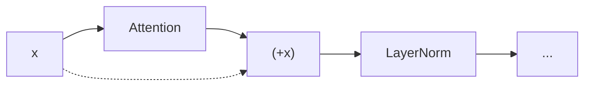
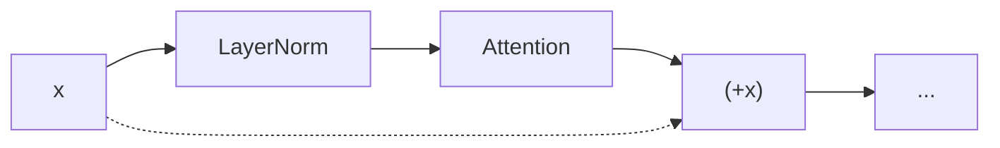

# 정규화와 드롭아웃 (Normalization and Dropout)

## 왜 알아야 하는가 (Why This Matters for VLA)

정규화(Normalization)는 깊은 네트워크의 학습을 **안정적이고 빠르게** 만드는 핵심 기법이다. Dropout과 가중치 초기화는 **과적합을 방지**하고 학습의 출발점을 적절하게 설정한다. 이 세 가지가 없으면 깊은 네트워크는 학습 자체가 불가능하다.

VLA와의 연결 고리:
- Transformer 블록은 **LayerNorm** 또는 **RMSNorm**을 매 블록마다 사용한다
  - GPT, BERT, ViT: LayerNorm
  - Llama 2, Llama 3: **RMSNorm** (더 효율적)
  - OpenVLA, pi-zero: Backbone에 따라 RMSNorm 사용
- VLA에서 Norm의 위치가 중요하다: **Pre-Norm** vs Post-Norm
  - 현대 모델 대부분: Pre-Norm (Llama 2, GPT-3 이후)
  - 학습 안정성에 직접적 영향
- VLA 파인튜닝 시 **Dropout 비율과 Weight Decay** 설정이 성능을 좌우한다
- 새로 추가하는 Action Head의 **가중치 초기화** 방법도 파인튜닝 성공에 영향을 준다

---

## 핵심 개념 (Core Concepts)

### 1. 왜 정규화가 필요한가 (Internal Covariate Shift)

깊은 네트워크에서 각 층의 입력 분포가 학습 중 계속 변한다. 이를 **내부 공변량 변화(Internal Covariate Shift)**라고 한다.

```
문제 상황:
  층 1의 출력 분포가 학습 중 변함
  → 층 2는 계속 변하는 입력에 적응해야 함
  → 층 3은 층 2의 변하는 출력에 적응해야 함
  → ... 깊어질수록 문제가 심각해짐

비유:
  매일 다른 규격의 부품이 들어오는 공장:
  → 공정마다 매번 조정해야 함 → 비효율적
  → "입고 검수" 단계에서 규격을 통일하면 효율적!

정규화 = "각 층의 입력을 일정한 분포로 맞춰주는 것"
```

### 2. BatchNorm (Batch Normalization)

**미니 배치 내에서** 각 특성(feature)의 평균을 0, 분산을 1로 정규화한다.

```
수식:
  mu_B = (1/m) * Sigma[x_i]              (배치 평균)
  sigma_B^2 = (1/m) * Sigma[(x_i - mu_B)^2]  (배치 분산)
  x_hat = (x - mu_B) / sqrt(sigma_B^2 + epsilon)  (정규화)
  y = gamma * x_hat + beta                 (스케일과 시프트)

m: 배치 크기
gamma, beta: 학습 가능한 파라미터 (모델이 스스로 최적의 분포를 학습)
```

**정규화 방향 시각화**:
```
BatchNorm: 배치(batch) 방향으로 정규화

입력 텐서 (Batch=4, Features=3):
  Feature →  f1   f2   f3
  Sample 1: [2.0, 5.0, 1.0]
  Sample 2: [4.0, 3.0, 2.0]     ← 이 열(feature)별로
  Sample 3: [3.0, 7.0, 3.0]       평균=0, 분산=1로 정규화
  Sample 4: [5.0, 1.0, 2.0]
             ↑↑↑
         이 방향으로 통계 계산
```

**gamma와 beta의 역할**:
```
정규화만 하면:
  모든 층의 입력이 평균=0, 분산=1로 고정
  → 네트워크의 표현력이 제한될 수 있음

gamma(스케일)과 beta(시프트):
  y = gamma * x_hat + beta
  → 모델이 "정규화를 원래대로 되돌리는 것"도 학습 가능
  → 최적의 분포를 스스로 찾을 수 있음
  → 극단적으로 gamma=sigma, beta=mu이면 원래 값과 같아짐
```

**장점과 한계**:
```
장점:
  - 학습 속도 향상 (더 큰 학습률 사용 가능)
  - 어느 정도의 정규화 효과 (과적합 감소)
  - gradient 흐름 개선

한계:
  - 배치 크기에 의존 (작은 배치에서 통계가 불안정)
  - 추론(inference) 시 배치 통계를 사용 불가 → 이동 평균 사용
  - 시퀀스 길이가 가변적인 NLP/Transformer에 부적합
  → 이 한계 때문에 Transformer에서는 LayerNorm 사용
```

### 3. LayerNorm (Layer Normalization)

**하나의 샘플 내에서** 모든 특성의 평균을 0, 분산을 1로 정규화한다.

```
수식:
  mu = (1/H) * Sigma[x_i]              (한 샘플의 모든 특성에 대한 평균)
  sigma^2 = (1/H) * Sigma[(x_i - mu)^2]  (한 샘플의 분산)
  x_hat = (x - mu) / sqrt(sigma^2 + epsilon)
  y = gamma * x_hat + beta

H: 특성(feature/hidden) 차원의 크기
```

**BatchNorm vs LayerNorm 차이**:
```
입력 텐서 (Batch=4, Features=3):

BatchNorm: 열(feature)별로 정규화 (배치 방향)
  Feature →  f1   f2   f3
  Sample 1: [2.0, 5.0, 1.0]
  Sample 2: [4.0, 3.0, 2.0]     ↕ 이 방향 (배치)
  Sample 3: [3.0, 7.0, 3.0]
  Sample 4: [5.0, 1.0, 2.0]

LayerNorm: 행(sample)별로 정규화 (특성 방향)
  Feature →  f1   f2   f3
  Sample 1: [2.0, 5.0, 1.0]  ←→ 이 방향 (특성)
  Sample 2: [4.0, 3.0, 2.0]  ←→
  Sample 3: [3.0, 7.0, 3.0]  ←→
  Sample 4: [5.0, 1.0, 2.0]  ←→
```

**Transformer에서 LayerNorm을 사용하는 이유**:
```
1. 배치 독립적: 각 샘플을 독립적으로 정규화
   → 배치 크기에 의존하지 않음
   → 추론 시에도 학습 시와 동일하게 작동

2. 시퀀스 길이 가변성 처리:
   NLP에서 문장 길이가 다름 → 패딩이 있음
   BatchNorm은 패딩 위치까지 통계에 포함하여 왜곡
   LayerNorm은 각 토큰의 특성 방향으로만 정규화 → 패딩 무관

3. Transformer 블록에서의 위치:
   Post-Norm (원래 Transformer):  x → Attention → Add → LayerNorm → FFN → Add → LayerNorm
   Pre-Norm (현대 표준):          x → LayerNorm → Attention → Add → LayerNorm → FFN → Add
```

**Pre-Norm vs Post-Norm**:
Post-Norm (2017 원래 Transformer):

- 학습이 불안정할 수 있음
- warmup이 중요

Pre-Norm (GPT-3, Llama 2, VLA):

- 학습이 더 안정적
- 잔차 경로가 정규화 없이 직접 연결 → gradient 흐름이 원활
- 현대 대규모 모델의 표준

### 4. RMSNorm (Root Mean Square Normalization)

LayerNorm에서 **평균 빼기(centering)를 제거**하고 분산만으로 정규화한다.

```
수식:
  RMS(x) = sqrt((1/H) * Sigma[x_i^2])
  x_hat = x / RMS(x)
  y = gamma * x_hat

LayerNorm과의 차이:
  LayerNorm: (x - mu) / sigma → 평균 빼기 + 분산 나누기 + beta(시프트)
  RMSNorm:   x / RMS(x)       → 분산 나누기만             + beta 없음
```

**RMSNorm이 Llama 2/VLA에서 선택된 이유**:
```
1. 계산 효율성:
   LayerNorm: 평균 계산 + 분산 계산 + 빼기 + 나누기 + 스케일 + 시프트
   RMSNorm:   RMS 계산 + 나누기 + 스케일
   → 연산량이 약 30~40% 감소

2. 성능:
   실험적으로 LayerNorm과 거의 동일한 성능
   "평균 빼기(centering)"는 불필요한 연산이었다는 발견

3. 사용 모델:
   - Llama 2, Llama 3
   - Mistral, Mixtral
   - OpenVLA, pi-zero (Llama backbone 사용 시)
   - T5 (원래 RMSNorm을 사용한 초기 모델 중 하나)
```

### 5. 정규화 기법 비교 총정리

```
기법        정규화 방향      배치 의존    주 용도            대표 모델
BatchNorm   배치(sample)    의존         CNN               ResNet, EfficientNet
LayerNorm   특성(feature)   독립         Transformer       GPT-2, BERT, ViT
RMSNorm     특성(feature)   독립         최신 Transformer   Llama 2/3, VLA
GroupNorm   채널 그룹       독립         소규모 배치 CNN     검출/분할 모델
InstanceNorm 채널별 개별     독립         스타일 변환         Neural Style Transfer

CNN을 배울 때:         → BatchNorm
Transformer를 배울 때:  → LayerNorm, RMSNorm
VLA를 배울 때:          → RMSNorm (Llama 기반)
```

### 6. Dropout

학습 시 **뉴런을 무작위로 꺼서** 과적합을 방지하는 기법.

```
동작 방식:
  학습 시: 각 뉴런을 확률 p로 0으로 설정 (나머지는 1/(1-p)로 스케일링)
  추론 시: 모든 뉴런을 사용 (Dropout 비활성화)

예시 (p=0.5):
  학습 시:
    원래: [0.5, 1.2, -0.3, 0.8, -1.0]
    마스크: [1,   0,    1,   0,    1]  (무작위)
    결과: [1.0, 0.0, -0.6, 0.0, -2.0]  (살아남은 것을 2배로 스케일)

  추론 시:
    그대로: [0.5, 1.2, -0.3, 0.8, -1.0]  (변경 없음)
```

**스케일링이 필요한 이유**:
```
학습 시 50%를 끄면, 출력의 기대값이 절반이 됨
추론 시 모두 사용하면, 출력의 기대값이 학습 시의 2배
→ 학습과 추론의 출력 스케일이 달라짐!

해결: 학습 시 살아남은 뉴런을 1/(1-p)로 스케일링
  → 학습 시 기대값 = (1-p) * (x/(1-p)) = x
  → 추론 시 기대값 = x
  → 스케일 일치!
```

**Dropout이 과적합을 방지하는 직관**:
```
1. 앙상블 효과:
   매 step마다 다른 뉴런 조합이 활성화 → 마치 여러 네트워크를 학습하는 효과
   추론 시에는 이들의 평균 → "앙상블" 효과

2. 공동 적응 방지 (Co-adaptation Prevention):
   특정 뉴런들이 함께만 작동하도록 의존하는 것을 방지
   → 각 뉴런이 독립적으로 유용한 특징을 학습하도록 유도

3. 일반적인 Dropout 비율:
   은닉층: p = 0.1 ~ 0.5
   입력층: p = 0.1 ~ 0.2 (보통 작게)
   Transformer: Attention과 FFN 뒤에 p = 0.1
   VLA 파인튜닝: p = 0.0 ~ 0.1 (사전학습된 모델에 과하면 성능 저하)
```

**Transformer에서 Dropout 위치**:
```
Transformer 블록:
  x → [LayerNorm] → [Attention] → [Dropout] → (+x) → [LayerNorm] → [FFN] → [Dropout] → (+x)
                                    ↑ 여기                                     ↑ 여기

Attention 내부에서도:
  Attention weights에 Dropout 적용 (Attention Dropout)
  → 모델이 특정 토큰에만 의존하는 것을 방지
```

### 7. 가중치 초기화 (Weight Initialization)

가중치의 **초기값**이 학습의 성패를 좌우한다. 모든 가중치를 0으로 초기화하면 모든 뉴런이 같은 gradient를 받아 같은 방향으로 업데이트 되어 학습이 되지 않는다.

```
잘못된 초기화의 문제:

모두 0:
  모든 뉴런의 출력이 동일 → gradient도 동일 → 모든 뉴런이 같아짐
  → "대칭 깨뜨리기(symmetry breaking)"가 불가능

너무 큰 값:
  활성화 값이 극단적 → sigmoid/tanh 포화 → gradient 소실
  → 학습이 매우 느리거나 발산

너무 작은 값:
  활성화 값이 0에 가까움 → 층을 거칠수록 0으로 수렴
  → 신호가 사라져서 학습 불가
```

#### Xavier (Glorot) 초기화

```
Sigmoid, Tanh와 함께 사용할 때 적합.

균등 분포:
  W ~ Uniform(-sqrt(6/(n_in + n_out)), +sqrt(6/(n_in + n_out)))

정규 분포:
  W ~ Normal(0, sqrt(2/(n_in + n_out)))

n_in: 입력 뉴런 수, n_out: 출력 뉴런 수

원리: 순전파와 역전파 모두에서 분산이 유지되도록 설계
```

#### Kaiming (He) 초기화

```
ReLU 계열 활성화 함수와 함께 사용할 때 적합.

정규 분포:
  W ~ Normal(0, sqrt(2/n_in))

균등 분포:
  W ~ Uniform(-sqrt(6/n_in), +sqrt(6/n_in))

n_in: 입력 뉴런 수

원리: ReLU가 음수를 차단하여 분산이 절반으로 줄어드는 것을 보상
     → Xavier에서 분자가 2에서 2로 유지, 분모에서 n_out이 제거됨
```

**초기화 선택 가이드**:
```
활성화 함수        → 추천 초기화
Sigmoid, Tanh     → Xavier (Glorot)
ReLU, LeakyReLU   → Kaiming (He)
GELU, SiLU        → 보통 Xavier 또는 커스텀 (모델별 다름)

Transformer/VLA에서:
  - 대부분 Xavier 기반 또는 모델별 커스텀 초기화
  - Llama 2: 정규 분포 초기화, 잔차 연결 전 레이어를 1/sqrt(2*n_layers)로 스케일링
  - 파인튜닝 시 새로 추가하는 레이어(Action Head 등): Xavier 또는 작은 값으로 초기화
```

### 8. 실무 조합 패턴 (Practical Combinations)

```
CNN 학습:
  Kaiming 초기화 + BatchNorm + Dropout(0.5) + Weight Decay

Transformer 사전학습:
  커스텀 초기화 + LayerNorm 또는 RMSNorm + Dropout(0.1) + AdamW

VLA 파인튜닝:
  사전학습 가중치 유지 + RMSNorm (frozen 또는 fine-tuned) + Dropout(0.0~0.1)
  + 새 레이어(Action Head)만 Xavier 초기화

주의: 사전학습된 모델을 파인튜닝할 때
  - 기존 Norm 레이어의 파라미터를 고정할지 학습할지 선택
  - Dropout을 너무 높이면 사전학습된 지식이 훼손될 수 있음
```

---

## 연습 주제 (Practice Topics)

스스로 생각해보고 답을 정리해 보자 (코드 작성 불필요):

1. **BatchNorm vs LayerNorm 계산**: 다음 텐서에 대해 BatchNorm과 LayerNorm을 각각 적용하라 (gamma=1, beta=0 가정).
   ```
   [[1, 3],
    [5, 7]]
   ```
   BatchNorm은 열별로, LayerNorm은 행별로 평균과 분산을 구한 후 정규화하라.

2. **RMSNorm 계산**: 위 텐서의 첫 번째 행 [1, 3]에 대해 RMSNorm을 계산하라. LayerNorm과 결과가 어떻게 다른가?

3. **Pre-Norm vs Post-Norm**: Pre-Norm이 학습 안정성에 유리한 이유를 "잔차 경로(skip connection)의 gradient 흐름" 관점에서 설명하라.

4. **Dropout 스케일링**: Dropout p=0.3일 때, 학습 시 살아남은 뉴런의 스케일링 계수는 얼마인가? 이 스케일링을 하지 않으면 추론 시 어떤 문제가 생기는가?

5. **초기화 실험**: 100개 입력, 100개 출력인 층에서 Xavier 초기화의 분산은 얼마인가? Kaiming 초기화의 분산은? ReLU를 사용할 때 왜 Kaiming이 더 적합한가?

6. **VLA 설계 추론**: Llama 2 기반 VLA를 파인튜닝할 때, 새로 추가하는 Action Head(MLP)의 가중치를 매우 큰 값으로 초기화하면 어떤 문제가 생기겠는가? (힌트: 사전학습된 backbone의 출력과의 관계)

---

## 다음 노트 (Next Note)

정규화, Dropout, 초기화까지 배웠다면 신경망의 핵심 구성 요소를 모두 갖추었다. 이제 이 구성 요소들을 **어떻게 조합하고 조율(tuning)**해야 최고의 성능을 얻을 수 있는지 배울 차례이다.

**다음**: [하이퍼파라미터 튜닝 (Hyperparameter Tuning)](./06-hyperparameter-tuning.md) - 학습률, 배치 크기, 아키텍처를 체계적으로 탐색하는 방법과 실전 팁.
