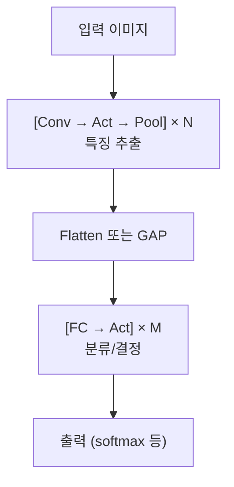

# CNN 아키텍처 (CNN Architecture)

## 왜 필요한가

합성곱 연산 하나만으로는 이미지를 이해할 수 없다. VLA 모델의 vision encoder는 합성곱 층, 활성화 함수, 풀링 층을 **체계적으로 쌓아** 구성된다. 이 조합 패턴을 이해해야 네트워크가 어떻게 점점 더 추상적인 특징을 추출하는지, 그리고 최종적으로 어떻게 분류나 행동 결정에 사용하는지를 파악할 수 있다.

---

## 핵심 개념

### 1. Pooling (Max Pooling, Average Pooling)

풀링은 feature map의 **공간적 크기를 줄이는** 연산이다.

- **Max Pooling**: 지정된 영역(예: 2x2) 내에서 최댓값만 취한다. 가장 강한 활성화만 남기므로 "이 영역에 이 패턴이 있는가?"에 대한 답을 보존한다.
- **Average Pooling**: 영역 내 평균값을 취한다. 전체적인 분포 정보를 보존한다. 네트워크 마지막에 Global Average Pooling(GAP)으로 자주 사용된다.
- 풀링의 효과:
  - 계산량 감소 (feature map 크기 축소)
  - 약간의 **이동 불변성(translation invariance)** 부여
  - 과적합(overfitting) 완화
- 풀링에는 학습 가능한 파라미터가 **없다**.

### 2. Conv → Activation → Pool 패턴

CNN의 가장 기본적인 빌딩 블록이다.

- **Convolution**: 패턴을 감지한다.
- **Activation**(보통 ReLU): 비선형성을 부여한다. 없으면 층을 아무리 쌓아도 선형 변환에 불과하다.
- **Pooling**: 공간 크기를 줄이고 중요한 정보만 남긴다.

이 패턴을 여러 번 반복하면:
- 초기 블록: 작은 receptive field → 저수준 특징 (엣지, 텍스처)
- 후기 블록: 넓은 receptive field → 고수준 특징 (물체 부분, 전체 형태)

현대 네트워크에서는 Batch Normalization이 Conv와 Activation 사이에 추가되는 경우가 많다: Conv → BatchNorm → Activation → Pool.

### 3. Flattening

합성곱 블록을 거친 출력은 3차원 텐서(높이 x 너비 x 채널)다. 이를 분류 등에 사용하려면 **1차원 벡터로 펼치는(flatten)** 과정이 필요하다.

- 예: 7 x 7 x 512 → 25,088 차원 벡터
- 이 벡터가 이후 Fully Connected 층의 입력이 된다.
- 현대 아키텍처에서는 flattening 대신 **Global Average Pooling**을 사용하여 각 채널을 하나의 값으로 요약하기도 한다 (예: 7 x 7 x 512 → 512).

### 4. Fully Connected Layers (FC Layers)

Flattening 이후에 오는 일반적인 신경망 층이다.

- 모든 입력 뉴런이 모든 출력 뉴런과 연결된다.
- 합성곱이 추출한 특징들을 **조합하여 최종 판단**을 내린다.
- 분류 문제에서는 마지막 FC 층의 출력 크기가 클래스 수와 같고, softmax를 거쳐 확률로 변환된다.
- FC 층은 파라미터가 매우 많다. 예: 25,088 → 4,096이면 약 1억 개의 파라미터.
- 이 때문에 현대 CNN에서는 FC 층을 최소화하거나 GAP으로 대체하는 추세다.

### 5. 출력 크기 계산 (Output Size Calculation)

각 층의 출력 크기를 예측할 수 있어야 네트워크를 설계하고 디버깅할 수 있다.

**합성곱 층 출력 크기:**

```
출력 크기 = (입력 크기 - 커널 크기 + 2 * 패딩) / 스트라이드 + 1
```

- 입력 32x32, 커널 5x5, 패딩 0, 스트라이드 1 → 출력 28x28
- 입력 32x32, 커널 3x3, 패딩 1, 스트라이드 1 → 출력 32x32 (same padding)
- 입력 32x32, 커널 3x3, 패딩 1, 스트라이드 2 → 출력 16x16

**풀링 층 출력 크기:**

```
출력 크기 = (입력 크기 - 풀 크기) / 스트라이드 + 1
```

- 일반적으로 2x2 풀링, 스트라이드 2 → 크기가 절반이 된다.

**전체 파라미터 수 계산:**
- Conv 층: (커널 높이 x 커널 너비 x 입력 채널 수 + 1(bias)) x 출력 채널 수
- FC 층: (입력 뉴런 수 + 1(bias)) x 출력 뉴런 수

### 전체 흐름 요약



VLA 모델에서는 이 구조의 "특징 추출" 부분만 사용하여 이미지를 벡터(또는 토큰 시퀀스)로 변환하고, 이후 언어 모델이 이 벡터를 처리하여 행동을 결정한다.

---

## 연습 주제

1. 입력 224x224x3에 대해 다음 네트워크의 각 층 출력 크기를 손으로 추적해 보라: Conv(3x3, 64, stride 1, same) → ReLU → MaxPool(2x2) → Conv(3x3, 128, stride 1, same) → ReLU → MaxPool(2x2).
2. 위 네트워크의 총 파라미터 수를 계산해 보라.
3. Global Average Pooling을 사용할 때와 Flatten + FC를 사용할 때의 파라미터 수 차이를 비교해 보라 (7x7x512 feature map 가정, 출력 1000 클래스).
4. Max Pooling과 stride 2 convolution이 feature map 크기를 줄이는 두 가지 다른 방법임을 설명해 보라. 각각의 장단점은?
5. 왜 합성곱 블록을 깊게 쌓을수록 채널 수를 늘리는 것이 일반적인지 생각해 보라.

---

## 다음 노트

[고전 네트워크와 ResNet (Classic Networks and ResNet)](./03-classic-nets-resnet.md) -- 이 패턴이 실제 역사적 아키텍처에서 어떻게 발전해 왔는지 살펴본다.
