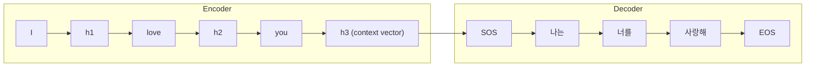

# Seq2Seq와 Encoder-Decoder 구조

## VLA 연결고리

VLA의 근본 구조는 Encoder-Decoder이다. 비전 인코더(vision encoder)가 이미지를 이해하고, 언어 모델이 텍스트 지시를 이해한 뒤, 디코더(decoder)가 로봇 행동 시퀀스를 생성한다. 이 패턴의 원형이 바로 Seq2Seq이다. Seq2Seq의 한계를 극복하기 위해 Attention이 등장했고, Attention을 극대화한 것이 Transformer이며, Transformer 위에 VLA가 만들어졌다. 이 노트는 그 역사적 연결의 중간 다리이다.

---

## 핵심 개념

### 1. Seq2Seq란?

**Sequence-to-Sequence**: 하나의 시퀀스를 입력받아 다른 시퀀스를 출력하는 구조이다.

| 입력 시퀀스 | 출력 시퀀스 | 응용 |
|------------|-----------|------|
| 영어 문장 | 한국어 문장 | 기계 번역 |
| 질문 | 답변 | 대화 시스템 |
| 음성 신호 | 텍스트 | 음성 인식 |
| 텍스트 지시 | 행동 시퀀스 | 로봇 제어 (VLA) |

핵심 문제: 입력과 출력의 **길이가 다를 수 있다**는 것이다. "I love you"(3단어)를 "나는 너를 사랑해"(3단어)로 번역할 수도 있지만, "I am a student"(4단어)를 "나는 학생이다"(2단어)로 번역할 수도 있다. 단순한 RNN으로는 이 가변 길이 문제를 다루기 어렵다.

### 2. Encoder-Decoder 구조

Seq2Seq는 두 개의 독립된 RNN(또는 LSTM/GRU)으로 구성된다.

**Encoder (인코더)**
- 입력 시퀀스를 한 토큰씩 순서대로 읽는다
- 마지막 시점의 hidden state에 입력 전체의 정보가 압축된다
- 이 최종 hidden state를 **context vector**라고 부른다

**Decoder (디코더)**
- context vector를 초기 hidden state로 받는다
- 시작 토큰(`<SOS>`)부터 한 토큰씩 출력을 생성한다
- 현재 출력한 토큰이 다음 시점의 입력이 된다
- 종료 토큰(`<EOS>`)을 출력하면 생성을 멈춘다

Encoder와 Decoder는 각각 다른 가중치를 가진 별개의 네트워크이다. 이 둘을 연결하는 유일한 통로가 context vector이다.

### 3. Bottleneck Problem (병목 문제)

Seq2Seq의 가장 큰 약점: **입력 시퀀스 전체를 하나의 고정 크기 벡터(context vector)에 압축**해야 한다.

짧은 문장은 괜찮지만, 긴 문장이나 복잡한 내용을 하나의 벡터에 담으려면 정보 손실이 불가피하다. 마치 100페이지 책의 내용을 한 줄 요약으로 압축한 뒤, 그 한 줄만 보고 번역하는 것과 같다.

이 문제를 해결하기 위해 등장한 것이 **Attention 메커니즘**이다. Attention은 디코더가 출력할 때마다 인코더의 **모든 시점의 hidden state**를 참조할 수 있게 한다. 한 줄 요약이 아니라 원본 책 전체를 필요할 때마다 들여다보는 것이다. 이 내용은 다음 폴더(attention-transformers)에서 다룬다.

### 4. Teacher Forcing

Decoder 학습 시 사용하는 기법이다.

**Teacher forcing 없이 (자유 실행, free running)**:
- 디코더가 이전에 자기가 출력한 토큰을 다음 입력으로 사용한다
- 초기 학습에서 디코더 출력이 엉터리이므로, 잘못된 입력이 연쇄적으로 나쁜 출력을 만든다 (error accumulation)

**Teacher forcing 사용**:
- 디코더의 이전 출력 대신 **정답(ground truth)**을 다음 입력으로 넣어준다
- 학습이 안정적이고 빠르다
- 단점: 학습 시에는 항상 정답을 보지만, 실제 사용(inference) 시에는 정답이 없다. 이 괴리를 **exposure bias**라고 한다

실무에서는 학습 초반에 teacher forcing을 많이 쓰고, 후반에 점점 줄여나가는 **scheduled sampling** 기법을 사용하기도 한다.

### 5. Seq2Seq에서 Transformer로

Seq2Seq의 핵심 한계를 정리하면:

1. **Bottleneck**: 하나의 context vector로는 부족하다 -> Attention으로 해결
2. **순차 처리**: RNN은 토큰을 하나씩 순서대로 처리해야 해서 병렬화가 불가능하다 -> Transformer의 self-attention으로 해결
3. **긴 거리 의존성**: LSTM도 매우 긴 시퀀스에서는 여전히 어렵다 -> Attention은 거리와 무관하게 직접 연결

Transformer는 RNN을 완전히 제거하고 Attention만으로 Encoder-Decoder를 구현했다. 하지만 **Encoder-Decoder라는 큰 틀**은 그대로 유지되었다. Seq2Seq의 구조적 사고방식은 현대 모델에서도 살아있다.

---

## 연습 주제

1. "나는 오늘 서울에서 부산까지 KTX를 타고 갔다"를 영어로 번역한다고 할 때, encoder와 decoder가 각각 처리하는 과정을 단계별로 서술하기
2. Context vector의 차원이 256일 때, 입력 문장이 5단어인 경우와 500단어인 경우의 정보 압축 비율 차이를 직관적으로 설명하기
3. Teacher forcing을 사용할 때와 사용하지 않을 때의 학습 초반 행동 차이를 비교하기
4. 로봇 제어를 Seq2Seq로 모델링한다면, encoder의 입력과 decoder의 출력은 각각 무엇이 될지 설계해 보기
5. Bottleneck problem이 없었다면 Attention이 등장했을까? 자신의 의견을 논리적으로 정리하기

---
