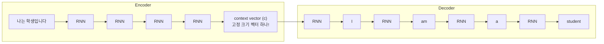

# 어텐션 메커니즘 (Attention Mechanism)

## 왜 알아야 하는가 (Why This Matters for VLA)

어텐션(Attention)은 현대 딥러닝의 **가장 중요한 단일 아이디어**이다. VLA(Vision-Language-Action) 모델은 처음부터 끝까지 어텐션으로 구동된다. 어텐션이 없었다면 Transformer도, LLM도, VLA도 존재하지 않는다.

VLA와의 연결 고리:
- VLA는 **세 종류의 정보를 동시에 처리**한다: 시각(Vision), 언어(Language), 동작(Action)
  - "빨간 컵을 집어라"라는 명령을 받으면, 로봇은 이미지 속 수많은 물체 중 **빨간 컵에 주목(attend)**해야 한다
  - 이 "주목"을 수학적으로 구현한 것이 어텐션 메커니즘이다
- VLA 내부의 모든 핵심 모듈이 어텐션을 사용한다:
  - Vision Encoder(ViT): 이미지 패치 간 Self-Attention
  - Language Model(Llama 2 등): 토큰 간 Self-Attention
  - Vision-Language 연결: Cross-Attention으로 이미지와 텍스트를 정렬
- 어텐션의 **기본 원리를 이해하지 못하면** 이후 모든 내용(Transformer, LLM, VLA)이 블랙박스가 된다
- 이 노트에서 다루는 Bahdanau Attention은 **모든 현대 어텐션의 시조**이다

---

## 핵심 개념 (Core Concepts)

### 1. Seq2Seq의 병목 문제 (The Bottleneck Problem)

어텐션이 등장하기 전, 시퀀스-투-시퀀스(Seq2Seq) 모델은 **인코더-디코더 구조**를 사용했다.



```
문제: 아무리 긴 입력 문장이라도 하나의 고정 크기 벡터(c)로 압축해야 한다!
```

**병목(bottleneck)의 직관적 이해**:
```
비유: 한 시간짜리 강의를 들은 후, 단 한 문장으로 요약해야 한다면?

짧은 강의 (5분): 한 문장으로 충분히 요약 가능
긴 강의 (1시간): 한 문장으로는 정보 손실이 심각함

마찬가지로:
짧은 문장 (5단어):  고정 벡터로 충분히 표현 가능
긴 문장 (50단어):  고정 벡터로는 앞부분 정보가 사라짐 → 번역 품질 급락
```

이 병목 문제가 심각했다. 문장이 20단어를 넘어가면 번역 품질이 급격히 떨어졌다.

### 2. Bahdanau Attention -- 병목의 해결 (2014)

Dzmitry Bahdanau가 제안한 혁신적 아이디어: **디코더가 매 출력 단계마다, 인코더의 모든 위치를 참조하도록 하자.**

```
핵심 아이디어:

기존: 인코더 전체 → [압축] → 고정 벡터 하나 → 디코더
개선: 인코더 전체 → [모든 위치 보관] → 디코더가 매 step마다 필요한 곳을 선택적으로 참조

비유:
  기존: 시험 전에 요약 노트 1장만 들고 입장
  개선: 교과서 전체를 펼쳐놓고 시험 (필요한 부분을 그때그때 찾아봄)
```

**Bahdanau Attention의 동작 과정**:
```
인코더가 각 위치의 hidden state를 모두 보관:
  h1("나는"), h2("학생"), h3("입니다")

디코더가 "I"를 생성할 때:
  1. 디코더의 현재 상태 s0와 모든 인코더 상태(h1, h2, h3)를 비교
  2. 유사도(score) 계산:
     e1 = score(s0, h1) = 높음  ("나는" → "I"와 관련 높음)
     e2 = score(s0, h2) = 낮음  ("학생" → "I"와 관련 낮음)
     e3 = score(s0, h3) = 낮음  ("입니다" → "I"와 관련 낮음)

  3. Softmax로 가중치(attention weight) 계산:
     alpha1 = 0.8,  alpha2 = 0.1,  alpha3 = 0.1
     (합 = 1.0, 확률 분포처럼 작동)

  4. 가중 합산(weighted sum)으로 context vector 생성:
     c = 0.8 * h1 + 0.1 * h2 + 0.1 * h3
     → "나는"에 집중한 context!

  5. c와 s0를 결합하여 "I"를 출력

디코더가 "student"를 생성할 때:
  같은 과정을 반복하되, 이번에는 h2("학생")에 높은 가중치가 부여됨
  alpha1 = 0.1,  alpha2 = 0.8,  alpha3 = 0.1
  → "학생"에 집중한 context!
```

### 3. 어텐션의 세 가지 핵심 단계

모든 어텐션 메커니즘은 세 단계로 구성된다. Bahdanau에서 Transformer까지, 이 구조는 변하지 않는다.

```
어텐션의 3단계:

Step 1: Score (유사도 계산)
  "현재 내가 주목할 곳은 어디인가?"
  → 디코더 상태와 인코더 각 위치의 유사도를 숫자로 계산

Step 2: Align (정렬/가중치)
  "각 위치에 얼마나 주목할 것인가?"
  → Score에 Softmax를 적용하여 확률 분포(가중치)로 변환
  → 모든 가중치의 합 = 1.0

Step 3: Attend (가중 합산)
  "주목한 결과를 하나로 합치자"
  → 가중치 * 인코더 상태 → 합산 → context vector
```

이 세 단계를 **수식**으로 표현하면:

$$e_i = \text{score}(s_t, h_i) \quad \cdots \text{Step 1: Score 계산}$$

$$\alpha_i = \text{softmax}(e_i) \quad \cdots \text{Step 2: 가중치 계산 (합 = 1)}$$

$$c_t = \sum_i \alpha_i \cdot h_i \quad \cdots \text{Step 3: 가중 합산}$$

- $s_t$: 디코더의 현재 hidden state (질문하는 쪽)
- $h_i$: 인코더의 $i$번째 hidden state (참조되는 쪽)
- $e_i$: $i$번째 위치의 score (원시 유사도)
- $\alpha_i$: $i$번째 위치의 attention weight (정규화된 유사도)
- $c_t$: context vector (주목한 결과)

### 4. Attention Weight as Alignment (정렬로서의 어텐션)

Bahdanau Attention이 학습한 attention weight를 시각화하면, **자동으로 단어 정렬(alignment)**을 학습한 것을 볼 수 있다.

```
프랑스어 → 영어 번역의 Attention Weight 시각화:

              Encoder (프랑스어)
              Le   chat  est  noir
Decoder  The  [0.9] [0.0] [0.0] [0.0]    ← "The"는 "Le"에 주목
(영어)   cat  [0.0] [0.9] [0.0] [0.0]    ← "cat"은 "chat"에 주목
         is   [0.0] [0.0] [0.8] [0.0]    ← "is"는 "est"에 주목
         black[0.0] [0.0] [0.0] [0.9]    ← "black"은 "noir"에 주목

→ 어텐션이 자동으로 단어 대응 관계(alignment)를 학습했다!
  누구도 "Le = The"라고 가르치지 않았는데, 데이터에서 스스로 학습.
```

**어순이 다른 언어에서도 작동한다**:
```
일본어 "猫は黒い" → 영어 "The cat is black"

              猫    は    黒い
        The  [0.1] [0.0] [0.0]    ← 관사, 약한 연결
        cat  [0.9] [0.0] [0.0]    ← "cat"은 "猫"에 주목
        is   [0.0] [0.8] [0.0]    ← "is"는 "は"에 주목
        black[0.0] [0.0] [0.9]    ← "black"은 "黒い"에 주목

→ 어순이 달라도 올바른 단어끼리 정렬!
```

이 정렬(alignment) 능력이 왜 VLA에 중요한가:
```
VLA에서의 정렬:

명령: "빨간 컵을 집어라"
이미지: [패치1: 테이블] [패치2: 빨간 컵] [패치3: 파란 그릇] [패치4: 배경]

어텐션이 자동으로 "빨간 컵" ↔ 패치2를 정렬!
→ 로봇이 어디를 봐야 하는지, 어떤 물체가 대상인지를 어텐션이 결정한다
```

### 5. Score 함수의 종류 (Types of Score Functions)

유사도를 계산하는 방법(score function)은 여러 가지가 있다. 역사적으로 발전해온 순서:

**1. Additive (Bahdanau, 2014)**:

$$\text{score}(s, h) = v^T \tanh(W_s s + W_h h)$$

→ 학습 가능한 파라미터($v, W_s, W_h$)가 포함된 작은 신경망. 장점: 유연하다, 단점: 느리다

**2. Dot-Product (Luong, 2015)**:

$$\text{score}(s, h) = s^T h$$

→ 단순한 내적(dot product). 장점: 매우 빠르다 (행렬곱으로 병렬 계산 가능). 단점: $s$와 $h$의 차원이 같아야 한다

**3. Scaled Dot-Product (Vaswani, 2017 -- Transformer!)**:

$$\text{score}(s, h) = \frac{s^T h}{\sqrt{d_k}}$$

→ Dot-Product에 스케일링 추가. Transformer의 표준 score 함수. VLA의 모든 어텐션이 이것을 사용

발전 방향: 복잡하고 느린 것 → 단순하고 빠른 것

### 6. 어텐션 이전 vs 이후: 패러다임 전환

```
어텐션 이전 (2014년 이전):
  - 고정 크기 벡터로 정보를 압축
  - 긴 시퀀스에서 정보 손실
  - 모든 입력 위치를 동등하게 취급

어텐션 이후 (2014년~):
  - 필요한 만큼 입력 전체를 참조
  - 긴 시퀀스에서도 정보 보존
  - 관련된 위치에 선택적으로 주목

이 패러다임 전환이 이끈 혁신의 연쇄:
  Bahdanau Attention (2014)
  → Self-Attention (2016~2017)
  → Transformer (2017)
  → BERT, GPT (2018)
  → GPT-3, Vision Transformer (2020)
  → ChatGPT, Llama (2022~2023)
  → VLA (2023~2024)

어텐션은 이 모든 혁신의 시작점이다.
```

---

## 연습 주제 (Practice Topics)

스스로 생각해보고 답을 정리해 보자 (코드 작성 불필요):

1. **병목 문제 체감**: 50단어짜리 한국어 문장을 하나 떠올린 후, 그 의미를 단 하나의 숫자 벡터(예: 512차원)로 표현해야 한다고 상상하라. 어떤 정보가 가장 먼저 손실될 것 같은가? (세부 사항? 어순? 감정?)

2. **Attention Weight 직접 계산**: 인코더 상태가 $h_1, h_2, h_3$이고, score가 각각 $e_1=2, e_2=5, e_3=1$이라면, softmax를 적용한 attention weight는 각각 얼마인가? 최종 context vector는 어떤 $h$에 가장 가까운가?

3. **정렬(Alignment) 추론**: "학생이 책을 읽는다"를 "The student reads a book"으로 번역할 때, 이상적인 attention weight 행렬을 직접 그려보라. 어순이 다른 부분(예: 목적어 위치)에 주목하라.

4. **VLA에서의 어텐션 역할**: 로봇에게 "파란 컵 옆에 있는 빨간 블록을 집어라"라고 명령했을 때, 어텐션이 어떤 단어와 어떤 이미지 영역을 연결해야 하는지 생각해보라. "옆에 있는"이라는 공간 관계는 어떻게 반영될 수 있을까?

5. **Score 함수 비교**: Additive score와 Dot-Product score 중, 왜 Transformer는 Dot-Product를 선택했을까? 힌트: 행렬곱의 병렬 처리 효율성을 생각해보라.

---

## 다음 노트 (Next Note)

Bahdanau Attention은 **디코더가 인코더를 참조**하는 Cross-Attention이다. 그런데 한 가지 질문이 떠오른다: "인코더 내부에서, 각 단어가 다른 단어들을 참조하면 어떨까?" 이것이 바로 **Self-Attention**이며, Transformer의 핵심이다.

**다음**: [Self-Attention과 Q/K/V](./02-self-attention-qkv.md) - Cross-Attention에서 Self-Attention으로의 도약. Query, Key, Value의 직관적 이해와 Scaled Dot-Product Attention 수식.
