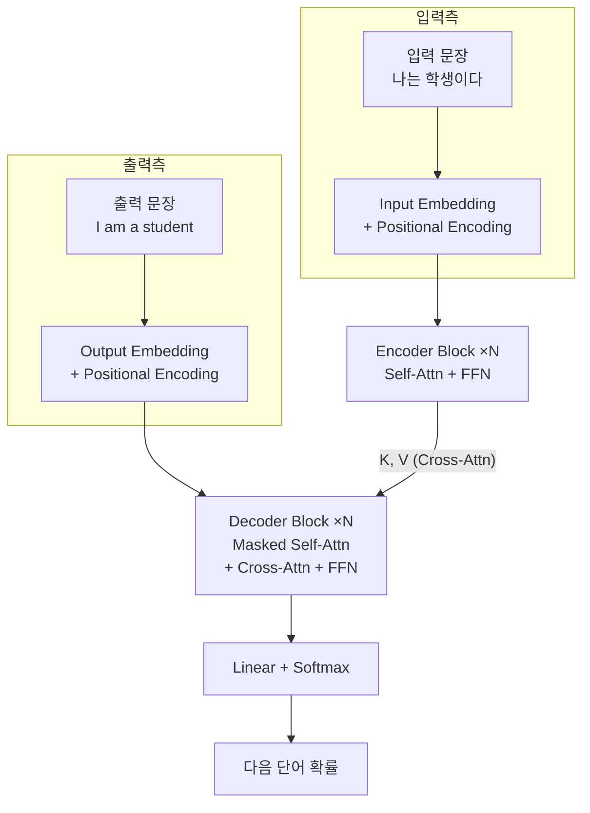
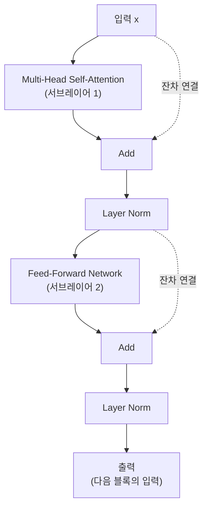
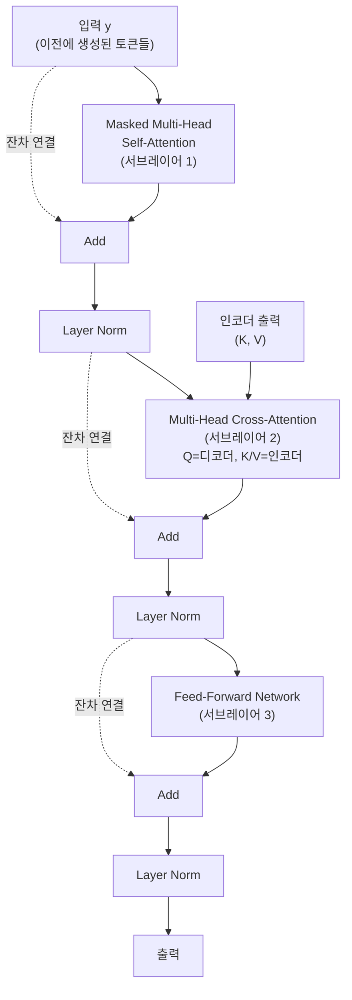
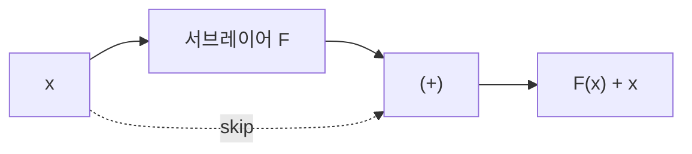

# Transformer 아키텍처 (Transformer Architecture)

## 왜 알아야 하는가 (Why This Matters for VLA)

Transformer는 **현대 AI의 기반 아키텍처**이다. GPT, Llama, ViT, CLIP, 그리고 VLA 모두 Transformer의 변형이다. 2017년 "Attention Is All You Need" 논문에서 제안된 이 구조는, RNN과 CNN 없이 오직 어텐션만으로 최고 성능을 달성하며 패러다임을 바꿨다.

VLA와의 연결 고리:
- VLA는 **Transformer의 조합**으로 구성된다:
  - Vision Encoder: ViT = Transformer Encoder (Self-Attention만 사용)
  - Language Model: Llama 2 = Transformer Decoder (Masked Self-Attention 사용)
  - Vision-Language 연결: Cross-Attention으로 시각과 언어를 융합
- 이 노트에서 다루는 모든 구성 요소가 VLA 안에 존재한다:
  - Encoder stack → ViT의 구조
  - Decoder stack → Llama 2의 구조
  - Masked Self-Attention → 언어 모델이 미래를 보지 못하게 하는 메커니즘
  - Cross-Attention → 이미지 정보를 언어 모델에 주입하는 통로
  - Residual Connection + Layer Norm → 깊은 네트워크의 안정적 학습
- Transformer 구조를 전체적으로 이해하면, VLA의 설계 선택이 **왜 그렇게 되었는지** 자연스럽게 이해된다

---

## 핵심 개념 (Core Concepts)

### 1. Transformer의 전체 구조 (Big Picture)

원래 Transformer는 **인코더-디코더** 구조로, 기계 번역을 위해 설계되었다.



**VLA에서의 사용 형태**:
```
원래 Transformer:      Encoder + Decoder (둘 다 사용)
BERT:                  Encoder만 사용 (양방향)
GPT / Llama:           Decoder만 사용 (단방향, 자기회귀)
ViT:                   Encoder만 사용 (이미지에 적용)
VLA (OpenVLA):         ViT (Encoder) + Llama (Decoder) + Cross-Attention

→ 원래 구조를 분리하여 목적에 맞게 사용하는 것이 현대 트렌드
→ 전체 구조를 알아야 각 변형을 이해할 수 있다
```

### 2. Encoder Block 상세 (Encoder Block in Detail)

인코더 블록 하나는 두 개의 서브레이어(sub-layer)로 구성된다.



```
이 블록을 N번 반복 (원래 논문: N=6, ViT-Large: N=24)
```

**각 구성 요소의 역할**:
```
Multi-Head Self-Attention:
  → 각 위치가 다른 모든 위치를 참조하여 문맥 정보를 수집
  → "이 단어와 관련 있는 다른 단어는 무엇인가?"

Feed-Forward Network (FFN):
  → 각 위치를 독립적으로 변환 (위치 간 상호작용 없음)
  → "수집한 문맥 정보를 바탕으로 표현을 업데이트"

Residual Connection (잔차 연결):
  → 입력을 출력에 더함 (skip connection)
  → gradient 흐름을 원활하게 하여 깊은 네트워크 학습 가능

Layer Normalization:
  → 각 층의 출력을 정규화
  → 학습 안정성 확보
```

### 3. Decoder Block 상세 (Decoder Block in Detail)

디코더 블록은 인코더보다 **서브레이어가 하나 더 많다**: Cross-Attention이 추가된다.



**세 서브레이어의 역할 정리**:
```
1. Masked Self-Attention:
   → 이미 생성된 토큰들끼리 서로 참조
   → "지금까지 내가 말한 것을 바탕으로..."
   → Masked = 미래 토큰을 볼 수 없음 (아래에서 상세 설명)

2. Cross-Attention:
   → 디코더가 인코더의 출력을 참조
   → "원본 문장에서 어디를 봐야 하나?"
   → Q = 디코더에서, K/V = 인코더에서

3. FFN:
   → 수집한 정보를 바탕으로 표현 업데이트
```

### 4. Masked Self-Attention (마스크 셀프 어텐션)

디코더에서 핵심적인 제약: **미래의 토큰을 볼 수 없다**.

```
왜 마스크가 필요한가?

학습 시 효율을 위해 전체 출력 시퀀스를 한 번에 입력한다.
하지만 실제 생성 시에는 토큰을 하나씩 순차적으로 만든다.

학습 시:
  입력: "I am a student"가 한 번에 들어옴

  만약 마스크가 없다면:
    "I"를 예측할 때 "am", "a", "student"를 이미 볼 수 있음
    → 정답을 미리 보고 답하는 것 = 학습이 안 됨!

  마스크를 적용하면:
    "I" 예측 시:        볼 수 있는 것 = [시작 토큰]만
    "am" 예측 시:       볼 수 있는 것 = [시작 토큰, I]
    "a" 예측 시:        볼 수 있는 것 = [시작 토큰, I, am]
    "student" 예측 시:  볼 수 있는 것 = [시작 토큰, I, am, a]
```

**마스크의 구현: 삼각 행렬**:
```
Attention Score 행렬에 마스크 적용:

           Key: I    am    a    student
Query:
  I       [0.5  -inf  -inf  -inf ]    ← "I"는 자기만 볼 수 있음
  am      [0.3   0.7  -inf  -inf ]    ← "am"은 I, am만
  a       [0.1   0.2   0.6  -inf ]    ← "a"는 I, am, a만
  student [0.2   0.1   0.3   0.8 ]    ← "student"는 전부

-inf → softmax 후 0이 됨 (e^(-inf) = 0)
→ 미래 위치의 attention weight가 완전히 0이 되어 정보가 전달되지 않음

이것을 Causal Mask(인과 마스크) 또는 Look-ahead Mask라고 부른다.
```

**VLA에서의 Masked Attention**:
```
VLA(Llama 2 기반)는 Decoder-only 구조:
  → 항상 Causal Mask를 사용
  → 이미지 패치 → 텍스트 명령 → 액션 토큰 순서로 입력

[패치1][패치2]...[패치N]["빨간"]["컵을"]["집어라"][액션1][액션2]...

액션 토큰 생성 시:
  → 이전의 이미지 패치와 텍스트 명령은 참조 가능
  → 아직 생성되지 않은 미래 액션 토큰은 참조 불가
  → 자기회귀적(autoregressive) 생성
```

### 5. Cross-Attention: 두 시퀀스의 연결

Cross-Attention은 **다른 시퀀스의 정보를 가져오는** 메커니즘이다.

```
Cross-Attention에서의 Q/K/V 출처:

Self-Attention:    Q, K, V 모두 같은 시퀀스에서
Cross-Attention:   Q = 현재 시퀀스(디코더), K/V = 다른 시퀀스(인코더)

원래 Transformer:
  Q = 디코더의 현재 표현
  K = 인코더의 출력
  V = 인코더의 출력
  → "디코더가 인코더에게 질문하고, 인코더가 답을 줌"

VLA에서의 Cross-Attention:
  Q = 언어 모델(Llama 2)의 현재 표현
  K = 비전 인코더(ViT)의 출력
  V = 비전 인코더(ViT)의 출력
  → "언어 모델이 이미지에서 필요한 시각 정보를 가져옴"
```

```
Cross-Attention의 직관적 이해:

Self-Attention = 혼잣말
  "내 문장 안에서 어떤 단어가 어떤 단어와 관련 있지?"

Cross-Attention = 대화
  디코더: "지금 'student'를 번역해야 하는데, 원문에서 어디를 봐야 해?"
  인코더: "'학생'에 해당하는 정보가 여기 있어!"
```

### 6. Residual Connection (잔차 연결)

Transformer가 수십, 수백 층을 쌓을 수 있는 핵심 비결이다.

```
잔차 연결의 원리:

일반 연결:      output = F(x)
잔차 연결:      output = F(x) + x     ← 입력을 그대로 더함!
```



**왜 잔차 연결이 필수적인가**:
```
잔차 연결이 없을 때 (깊은 네트워크의 문제):

  Layer 1: x → F1(x)
  Layer 2: F1(x) → F2(F1(x))
  ...
  Layer N: gradient가 N개의 층을 통과해야 함

  gradient = dL/dx = dL/dFN * dFN/dFN-1 * ... * dF2/dF1 * dF1/dx
  → N개의 항을 곱함
  → 각 항이 1보다 작으면: gradient 소실 (0.5^32 ≈ 0.0000000002)
  → 각 항이 1보다 크면: gradient 폭발

잔차 연결이 있을 때:

  output = F(x) + x
  d(output)/dx = dF/dx + 1    ← 항상 +1이 보장!

  → gradient가 skip connection을 통해 직접 흐를 수 있음
  → 32층을 쌓아도 gradient가 사라지지 않음
  → Transformer의 깊은 구조를 가능하게 하는 핵심
```

```
VLA에서의 잔차 연결:
  Llama 2-7B: 32개 Transformer Block, 각 블록마다 2개의 잔차 연결
  → 총 64개의 skip connection
  → 이것 없이는 32층 학습이 사실상 불가능
```

### 7. Layer Normalization

각 서브레이어의 출력을 **정규화**하여 학습을 안정화한다.

```
Layer Normalization (Layer Norm):

각 토큰의 벡터를 독립적으로 정규화:
  1. 평균(mean) 계산: mu = mean(x)
  2. 분산(variance) 계산: var = variance(x)
  3. 정규화: x_norm = (x - mu) / sqrt(var + epsilon)
  4. 스케일과 시프트: output = gamma * x_norm + beta
     (gamma, beta는 학습 가능한 파라미터)

왜 필요한가:
  - 층을 깊이 쌓으면 값의 분포가 불안정해짐
  - 어떤 층의 출력이 매우 크거나 매우 작아질 수 있음
  - Layer Norm이 값을 일정한 범위로 조정
  → 학습률(learning rate) 설정이 쉬워짐
  → 수렴 속도가 빨라짐
```

**Norm의 위치: Pre-Norm vs Post-Norm**:
```
Original Transformer (Post-Norm):
  x → [Attention] → [Add x] → [LayerNorm] → output

현대 모델 (Pre-Norm) -- Llama 2, VLA 포함:
  x → [LayerNorm] → [Attention] → [Add x] → output

Pre-Norm이 더 안정적:
  - Attention 입력이 항상 정규화된 상태
  - 깊은 네트워크에서 학습이 더 안정적
  - 현대의 거의 모든 대형 모델이 Pre-Norm 사용

Llama 2는 더 나아가 RMSNorm 사용 (Root Mean Square Norm):
  → Layer Norm에서 평균 빼기를 생략 (더 빠르고, 성능은 유사)
```

### 8. 전체 흐름 요약 (End-to-End Flow)

```
Original Transformer 전체 흐름:

[인코더 측]
입력 토큰 → Embedding → + Positional Encoding
  → Encoder Block 1: Self-Attention → Add&Norm → FFN → Add&Norm
  → Encoder Block 2: (같은 구조)
  → ...
  → Encoder Block N: (같은 구조)
  → 인코더 출력 (K, V로 사용)

[디코더 측]
출력 토큰(shifted) → Embedding → + Positional Encoding
  → Decoder Block 1: Masked Self-Attn → Add&Norm
                      → Cross-Attn(Q=디코더, K/V=인코더) → Add&Norm
                      → FFN → Add&Norm
  → Decoder Block 2: (같은 구조)
  → ...
  → Decoder Block N: (같은 구조)
  → Linear → Softmax → 다음 토큰 확률

[VLA에서의 변형]
Vision (ViT Encoder):
  이미지 패치 → Embedding → + Position
  → Encoder Block × 24: Self-Attn → FFN (이미지 패치끼리만)
  → 이미지 표현

Language + Action (Llama 2 Decoder):
  [이미지 표현] + [텍스트 토큰] + [액션 토큰]
  → Decoder Block × 32: Masked Self-Attn → FFN
  → 다음 액션 토큰 예측
```

---

## 연습 주제 (Practice Topics)

스스로 생각해보고 답을 정리해 보자 (코드 작성 불필요):

1. **구성 요소 매핑**: VLA의 각 부분(ViT, Llama 2, Action Head)이 원래 Transformer의 어떤 부분(Encoder, Decoder, Cross-Attention)에 대응하는지 정리해보라.

2. **Causal Mask 그리기**: 5개 토큰 ["A", "B", "C", "D", "E"]에 대한 Causal Mask 행렬(5x5)을 직접 그려보라. softmax 전에 적용되는 -inf 위치를 표시하라.

3. **잔차 연결의 수학**: 잔차 연결이 있는 3층 네트워크에서, gradient가 입력까지 도달하는 경로가 몇 개인지 세어보라. 잔차 연결 없이는 경로가 몇 개인가? (힌트: 각 층에서 skip할 수 있으므로 경로가 기하급수적으로 증가한다)

4. **Pre-Norm vs Post-Norm**: 두 방식의 차이를 그림으로 그려보고, Pre-Norm이 왜 더 안정적인지 직관적으로 설명해보라. (힌트: Attention에 들어가는 입력의 분포를 생각해보라)

5. **Cross-Attention의 역할**: VLA에서 Cross-Attention을 제거하면 어떤 일이 일어날지 생각해보라. 언어 모델이 이미지 정보를 전혀 받을 수 없다면, "빨간 컵을 집어라"라는 명령을 어떻게 처리할 수 있을까?

---
