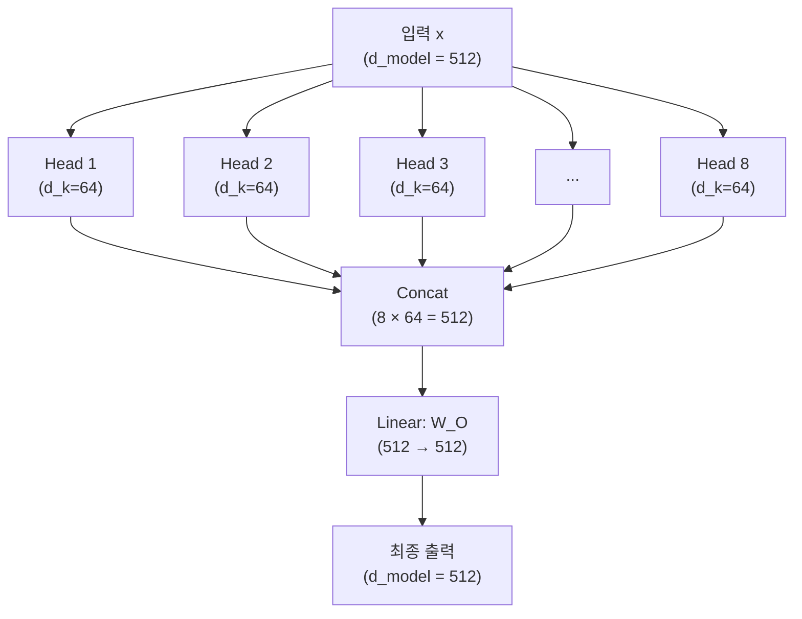
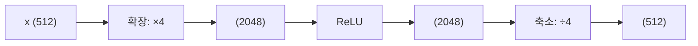
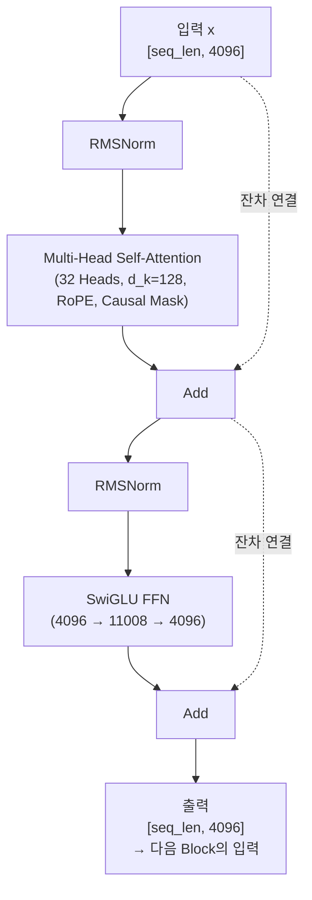

# Multi-Head Attention과 FFN (Multi-Head Attention & Feed-Forward Network)

## 왜 알아야 하는가 (Why This Matters for VLA)

Single-head Attention은 하나의 관점에서만 정보를 수집한다. 하지만 언어와 시각 정보는 다양한 관점에서 동시에 분석되어야 한다. Multi-Head Attention은 **여러 관점을 병렬로** 처리하며, FFN은 수집된 정보를 **비선형 변환**으로 처리한다. 이 두 구성 요소가 Transformer Block의 전부이다.

VLA와의 연결 고리:
- VLA의 Llama 2-7B는 **32개의 Attention Head**를 사용한다
  - 각 Head가 서로 다른 패턴을 학습: 문법 관계, 의미 유사성, 공간 위치 등
  - 한 Head는 "빨간"과 "컵"의 수식 관계에, 다른 Head는 이미지 패치와 단어의 대응에 주목
- FFN은 Transformer 파라미터의 **약 2/3**를 차지한다
  - Llama 2-7B의 FFN: 4096 → 11008 → 4096 (SwiGLU 구조)
  - FFN이 "지식 저장소" 역할을 한다는 연구 결과가 있음
  - VLA의 "상식"(물체를 잡으려면 위에서 접근해야 한다 등)이 FFN에 저장
- **SwiGLU**: Llama 2/VLA가 사용하는 최신 FFN 활성화 함수
  - 기존 ReLU FFN보다 성능이 우수하여 현대 LLM의 표준이 됨

---

## 핵심 개념 (Core Concepts)

### 1. 왜 Multi-Head인가: 하나의 Head로는 부족하다

Single-Head Attention은 모든 종류의 관계를 하나의 attention 패턴으로 표현해야 한다.

```
문장: "The animal didn't cross the street because it was too tired"

이 문장에서 "it"이 참조하는 것은 "animal"이다.
하지만 동시에:
  - "didn't cross"는 "too tired"와 인과 관계
  - "street"는 "cross"와 동사-목적어 관계
  - "animal"은 "tired"와 의미적 관계

Single-Head: 이 모든 관계를 하나의 attention 분포로 표현해야 함
  → 하나의 소프트맥스 분포는 하나의 "관점"만 표현 가능
  → 모든 관계를 동시에 포착하기 어려움

Multi-Head: 각 Head가 서로 다른 관계를 담당
  Head 1: 문법적 관계 (주어-동사)
  Head 2: 대명사 참조 ("it" → "animal")
  Head 3: 수식 관계 (형용사-명사)
  Head 4: 인과 관계 (because)
  ...
```

**VLA에서 Multi-Head의 역할**:
```
VLA 입력: [이미지 패치들] + ["빨간", "컵을", "집어라"]

Head 1: 색상 매칭 → "빨간"이라는 토큰이 빨간색 패치에 주목
Head 2: 물체 인식 → "컵"이라는 토큰이 컵 모양 패치에 주목
Head 3: 공간 관계 → "집어라"가 물체의 위치/방향에 주목
Head 4: 동작 계획 → 이전 액션 토큰이 현재 상태와의 관계에 주목
...

→ 각 Head가 전문가(specialist)처럼 다른 측면을 분석
→ 결합하면 풍부한 이해가 가능
```

### 2. Multi-Head Attention의 구조

핵심 아이디어: **하나의 큰 어텐션 대신, 여러 개의 작은 어텐션을 병렬로 수행**한다.



```
핵심:
  d_model = h × d_k  (512 = 8 × 64)
  h = Head 수
  d_k = 각 Head의 차원

→ 총 연산량은 Single-Head와 거의 동일!
  Single-Head: d_model × d_model = 512 × 512
  Multi-Head:  h × (d_model × d_k) = 8 × (512 × 64) = 8 × 32768 = 동일
```

**수식으로 정리**:
```
MultiHead(Q, K, V) = Concat(head_1, ..., head_h) @ W_O

where head_i = Attention(Q @ W_i^Q, K @ W_i^K, V @ W_i^V)

W_i^Q: (d_model, d_k)     각 Head의 Query 변환
W_i^K: (d_model, d_k)     각 Head의 Key 변환
W_i^V: (d_model, d_v)     각 Head의 Value 변환
W_O:   (h × d_v, d_model) 결합 후 출력 변환
```

### 3. VLA에서의 구체적 수치

```
Llama 2-7B (VLA의 백본):
  d_model = 4096
  h = 32 (Head 수)
  d_k = d_v = 4096 / 32 = 128 (Head당 차원)

  각 Head의 파라미터:
    W_Q: (4096, 128) → 524,288개
    W_K: (4096, 128) → 524,288개
    W_V: (4096, 128) → 524,288개

  32개 Head의 총 파라미터 (Q + K + V):
    3 × 32 × 524,288 = 50,331,648개 ≈ 5천만

  출력 변환 W_O: (4096, 4096) → 16,777,216개

  한 레이어의 Attention 파라미터 합계:
    약 6천7백만 개

  32개 레이어의 총 Attention 파라미터:
    약 21억 4천만 개

ViT-Large (VLA의 Vision Encoder):
  d_model = 1024
  h = 16
  d_k = d_v = 1024 / 16 = 64

Grouped Query Attention (GQA) -- Llama 2 70B:
  Key와 Value의 Head 수를 줄여 메모리 절약
  Q: 32 Heads, K/V: 8 Groups (4개의 Q Head가 1개의 K/V를 공유)
  → 추론 시 KV-cache 메모리 75% 절약
```

### 4. Head별로 다른 패턴을 학습한다

실제 학습된 모델에서 각 Head의 attention 패턴을 시각화하면, 놀라운 전문화가 관찰된다.

```
실제 관찰된 Head별 패턴:

Head A: "이전 토큰" 패턴
  → 각 토큰이 바로 직전 토큰에 주목
  → 바이그램(bigram) 관계 포착

Head B: "문장 시작" 패턴
  → 모든 토큰이 문장의 첫 번째 토큰에 주목
  → 전체 문맥의 요약 역할

Head C: "구문 관계" 패턴
  → 동사가 주어/목적어에 주목
  → 문법 구조 포착

Head D: "공참조(coreference)" 패턴
  → 대명사가 참조 대상에 주목
  → "it" → "the cat"

Head E: "드문 토큰" 패턴
  → 자주 나오지 않는 중요 키워드에 주목

각 Head는 학습 과정에서 자연스럽게 전문화된다.
사람이 지정하지 않아도, 다양한 관계를 분업하여 학습.
```

### 5. Feed-Forward Network (FFN): Transformer의 나머지 절반

Transformer Block = Self-Attention + FFN. FFN은 각 위치를 **독립적으로** 변환한다.

```
기본 FFN 구조 (원래 Transformer):

FFN(x) = ReLU(x @ W1 + b1) @ W2 + b2

  x:  (d_model,)     = 입력  (예: 512)
  W1: (d_model, d_ff) = 확장  (예: 512 → 2048)
  W2: (d_ff, d_model) = 축소  (예: 2048 → 512)

  d_ff = 4 × d_model 이 일반적 (512 → 2048 → 512)

시각화:



역할:
  Self-Attention: 위치 간 정보 교환 ("어디를 볼 것인가")
  FFN:            각 위치의 정보 처리 ("본 것을 어떻게 해석할 것인가")

비유:
  Self-Attention = 회의실에서 다른 사람들과 정보 교환
  FFN = 자기 책상에서 받은 정보를 정리하고 판단
```

**FFN의 파라미터 비중**:
```
하나의 Transformer Block:
  Self-Attention 파라미터: 4 × d_model^2  (Q, K, V, O)
  FFN 파라미터:            2 × d_model × d_ff = 2 × d_model × 4 × d_model = 8 × d_model^2

  비율: Attention : FFN = 4 : 8 = 1 : 2

→ FFN이 전체 파라미터의 약 2/3를 차지!
→ FFN이 "지식의 저장소" 역할을 한다는 가설의 근거
```

### 6. SwiGLU: Llama 2와 VLA의 FFN

Llama 2는 기존 ReLU FFN 대신 **SwiGLU**를 사용한다. 이것이 VLA의 FFN이기도 하다.

```
기존 FFN (ReLU):
  FFN(x) = ReLU(x @ W1) @ W2

SwiGLU FFN (Llama 2/VLA):
  FFN(x) = (SiLU(x @ W_gate) * (x @ W_up)) @ W_down

분해:
  1. Gate:  g = SiLU(x @ W_gate)   → 어떤 정보를 통과시킬지 결정
  2. Up:    u = x @ W_up            → 정보를 확장
  3. 곱셈:  g * u                   → 게이트로 필터링
  4. Down:  output = (g * u) @ W_down → 원래 차원으로 축소

SiLU(x) = x * sigmoid(x)  (Swish 함수라고도 부름)
```

```
SiLU vs ReLU:

ReLU(x):  x > 0이면 x, 아니면 0       (꺾인 직선)
SiLU(x):  x * sigmoid(x)               (부드러운 곡선)

ReLU: ──────┐
            │
            └──────  (x=0에서 꺾임, x<0은 완전 0)

SiLU: ─────╲
            ╲
         ~~~~╲~~~~   (x=0 근처에서 부드러움, x<0도 약간의 값)

SiLU의 장점:
  - 부드러운 함수 → gradient 흐름이 더 안정적
  - 음수 영역에서도 약간의 gradient → "dead neuron" 문제 완화
  - 실험적으로 대형 모델에서 ReLU보다 성능 우수
```

**GLU(Gated Linear Unit)의 핵심 아이디어**:
```
기존 FFN:     output = activate(xW1) @ W2
              → 활성화 함수가 직접 정보를 변환

GLU 계열:     output = (activate(xW_gate) * xW_up) @ W_down
              → 게이트(gate)가 정보 흐름을 제어

비유:
  기존: 모든 신호를 ReLU로 일괄 처리
  GLU:  "이 신호는 통과시키고, 저 신호는 차단" (선택적 필터링)

게이트 메커니즘은 LSTM에서 영감을 받았다.
→ "무엇을 기억하고 무엇을 잊을 것인가"를 학습
```

**Llama 2-7B의 SwiGLU 구체적 수치**:
```
d_model = 4096
d_ff = 11008  (정확히 4×가 아닌 이유: 효율적 하드웨어 연산을 위해 조정)

W_gate: (4096, 11008)  → 파라미터: 45,088,768
W_up:   (4096, 11008)  → 파라미터: 45,088,768
W_down: (11008, 4096)  → 파라미터: 45,088,768

한 레이어의 FFN 파라미터: 약 1억 3천 5백만 개
32개 레이어 총 FFN 파라미터: 약 43억 개

→ Llama 2-7B의 70억 파라미터 중 약 61%가 FFN!
→ SwiGLU는 W를 3개 사용하므로 기존 FFN(W 2개)보다 파라미터가 많지만
   같은 파라미터 수에서 성능이 더 좋아 d_ff를 약간 줄여 사용
```

### 7. 완전한 Transformer Block 조립

이제 모든 구성 요소를 합쳐 하나의 완전한 Transformer Block을 조립하자.



```
이 Block을 32번 반복 = Llama 2-7B
```

```
Transformer Block의 정보 흐름 요약:

1. RMSNorm → 입력 정규화 (안정적인 학습)
2. Multi-Head Self-Attention → 다른 위치의 정보 수집 (어디를 볼까?)
3. Residual + RMSNorm → 원래 정보 보존 + 정규화
4. SwiGLU FFN → 수집한 정보를 비선형 변환 (무엇을 의미하는가?)
5. Residual → 원래 정보 보존

→ "정보 교환(Attention) → 정보 처리(FFN)"의 반복
→ 층이 깊어질수록 점점 더 추상적이고 풍부한 표현
```

```
VLA의 전체 구조에서의 위치:

Vision Encoder (ViT-Large):
  Transformer Block × 24  (Self-Attention + FFN, 이미지 패치 대상)

Language + Action (Llama 2-7B):
  Transformer Block × 32  (Masked Self-Attention + SwiGLU FFN)
  [이미지 표현 | 텍스트 토큰 | 액션 토큰] 을 처리

총 56개의 Transformer Block이 VLA를 구성한다.
```

---

## 연습 주제 (Practice Topics)

스스로 생각해보고 답을 정리해 보자 (코드 작성 불필요):

1. **Head 수와 차원의 관계**: d_model=1024인 모델에서 Head 수를 8, 16, 32로 바꾸면 d_k는 각각 얼마인가? Head 수가 많을수록 장단점은 무엇인가? (힌트: d_k가 너무 작으면 각 Head의 표현력이 제한된다)

2. **FFN 파라미터 계산**: d_model=2048, d_ff=8192인 기존 ReLU FFN의 파라미터 수를 계산하라. 같은 d_model에서 SwiGLU FFN(W가 3개)의 파라미터 수는? SwiGLU가 d_ff를 약간 줄여 사용하는 이유를 생각해보라.

3. **Attention vs FFN 역할 구분**: Self-Attention은 "위치 간 정보 교환"이고 FFN은 "각 위치 독립 처리"라고 했다. 만약 FFN을 제거하면 어떤 일이 발생할지 생각해보라. 반대로 Attention을 제거하면? 둘 다 필요한 이유를 논리적으로 설명하라.

4. **SwiGLU의 게이트 메커니즘**: SwiGLU에서 gate 경로 SiLU(xW_gate)의 출력이 0에 가까운 뉴런은 무엇이 일어나는가? 1에 가까운 뉴런은? 이것이 "선택적 필터링"인 이유를 설명하라.

5. **VLA의 전체 파라미터 분포**: Llama 2-7B에서 Attention 파라미터(약 21억)와 FFN 파라미터(약 43억)의 비율을 구하라. 나머지 파라미터(Embedding 등)는 약 몇 억인지 추정해보라.

---

## 다음 노트 (Next Note)

Transformer의 모든 구성 요소를 이해했다. 이제 이것을 **실제로 구현하고 실행**하는 관점에서 정리할 차례이다. Padding Mask와 Causal Mask의 실제 구현, 추론 속도를 위한 KV-cache, 그리고 전체 아키텍처를 PyTorch 용어로 매핑한다.

**다음**: [Transformer 구현](./06-transformer-implementation.md) - PyTorch 관점에서의 전체 아키텍처 정리. 마스킹(Padding/Causal)의 실제 구현, 추론 최적화의 핵심 KV-cache, 그리고 학습과 추론의 차이.
