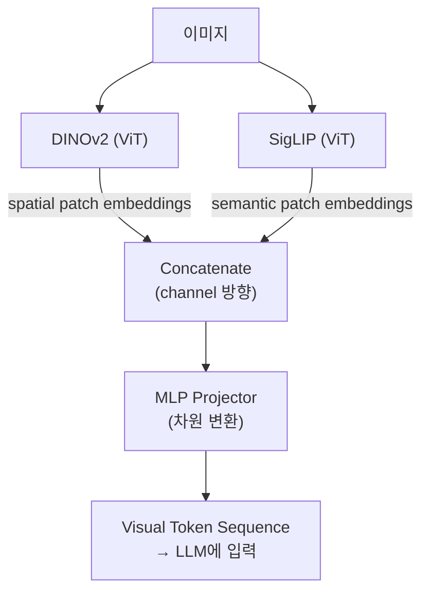

# Feature Extraction -- Patch Embeddings and Token Sequences

## VLA 연결고리

VLA 모델은 이미지를 **LLM이 처리할 수 있는 token sequence**로 변환해야 한다. 이 노트는 vision encoder가 이미지를 어떻게 patch embedding으로 만들고, 이를 어떻게 LLM의 입력 token으로 변환하는지를 다룬다. OpenVLA의 dual encoder(DINOv2 + SigLIP) 설계가 이 과정의 구체적 사례이다.

---

## 핵심 개념

### 1. Vision Encoder의 출력 -- Patch Embeddings

ViT 기반 vision encoder는 이미지를 다음과 같이 처리한다:

```
이미지 (H x W x 3)
  → patch 분할 (예: 16x16)
  → 각 patch를 embedding 벡터로 변환
  → Transformer Encoder 통과
  → 출력: N개의 patch embedding 벡터
```

예를 들어, 224x224 이미지를 16x16 patch로 나누면:
- Patch 수: 14 x 14 = 196개
- 각 patch embedding 차원: 768 (ViT-Base 기준)
- 최종 출력: **196 x 768** 크기의 feature map

이 출력에서 각 patch embedding은 원본 이미지의 특정 영역에 대한 정보를 담고 있다. **공간적 구조가 보존**된다는 점이 핵심이다.

### 2. Spatial Feature를 Token Sequence로

LLM은 1차원 token sequence를 입력으로 받는다. 2D 격자 형태의 patch embedding을 1D sequence로 변환해야 한다:

```
2D patch grid (14 x 14 = 196개)
  → flatten (1D sequence로 펼침)
  → 196개의 visual token sequence
```

이 visual token들은 텍스트 token과 concatenate되어 LLM에 입력된다. LLM 입장에서 보면, visual token도 텍스트 token과 동일한 형태의 "token"이다.

### 3. CLS Token vs. Patch Token

Feature를 추출하는 두 가지 전략:

- **CLS token만 사용**: 이미지 전체를 하나의 벡터로 요약. 분류(classification)에 적합
- **모든 patch token 사용**: 공간 정보가 보존됨. 물체 위치 파악이 필요한 task에 적합

VLA는 로봇 팔의 정밀한 동작을 위해 **공간 정보가 필수적**이므로, patch token 전체를 사용하는 방식을 택한다.

### 4. DINOv2 + SigLIP 결합 (OpenVLA 설계)

OpenVLA(정확히는 그 기반인 Prismatic VLM)는 두 vision encoder의 출력을 **결합(concatenate)**한다:

```
이미지 → DINOv2 encoder → 196개 patch embedding (spatial feature)
이미지 → SigLIP encoder → 196개 patch embedding (semantic feature)
```

결합 방식:

- 같은 위치의 patch embedding끼리 **channel 방향으로 concatenate**
- DINOv2 출력 차원 + SigLIP 출력 차원 = 결합된 차원
- 결과: 196개의 결합된 patch embedding

이렇게 하면 각 patch가 **spatial 정보(DINOv2)와 semantic 정보(SigLIP)를 동시에** 갖게 된다.

### 5. Projector의 역할

Vision encoder의 출력 차원과 LLM의 입력 차원은 다를 수 있다. 이를 맞추기 위해 **projector**를 사용한다:

```
결합된 patch embedding (vision 차원)
  → MLP projector
  → LLM 입력 차원에 맞는 visual token
```

Projector는 단순히 차원을 맞추는 것 이상으로, vision feature를 **LLM이 이해할 수 있는 공간으로 변환**하는 역할을 한다.

---

## 전체 흐름 요약



이것이 VLA의 "눈"이 작동하는 방식이다.

---

## 연습 주제

1. 384x384 이미지를 14x14 patch로 나누면 몇 개의 visual token이 생기는지 계산해 보라
2. DINOv2 출력이 768차원, SigLIP 출력이 768차원일 때, concatenate 후 차원은 얼마인지 계산해 보라
3. Spatial feature만 사용할 때와 semantic feature만 사용할 때 각각 어떤 한계가 있을지 생각해 보라
4. Projector가 단순 linear layer가 아닌 MLP(Multi-Layer Perceptron)인 이유를 추론해 보라
5. Visual token 수가 많아지면 LLM 처리에 어떤 영향이 있는지 (장점과 비용) 설명해 보라

---
