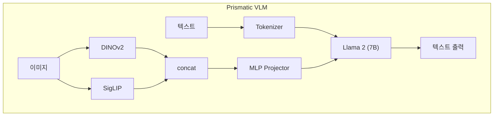

# Prismatic VLM -- OpenVLA의 기반 모델

## VLA 연결고리

Prismatic VLM은 **OpenVLA가 직접 기반으로 사용하는 모델**이다. OpenVLA는 Prismatic VLM의 아키텍처를 그대로 가져와서, 출력을 텍스트 대신 로봇 행동으로 바꾸고 로봇 데이터로 fine-tuning한 것이다. 이 노트를 이해하면 OpenVLA의 구조를 이해한 것이나 다름없다.

---

## 핵심 개념

### 1. Prismatic VLM의 핵심 질문

Prismatic VLM 논문은 체계적으로 VLM의 설계 선택을 탐구했다:

- 어떤 vision encoder가 최적인가?
- Projector는 어떤 구조가 좋은가?
- 어떤 LLM backbone이 효과적인가?
- 학습 데이터와 전략은?

이 체계적 분석을 통해 **최적의 조합**을 찾아낸 것이 Prismatic VLM이다.

### 2. Dual Vision Encoder -- DINOv2 + SigLIP

Prismatic VLM의 가장 핵심적인 설계 결정은 **두 개의 vision encoder를 결합**한 것이다:

```
이미지 → DINOv2 (ViT-L/14) → spatial feature (공간 정보)
이미지 → SigLIP (ViT-SO400M/14) → semantic feature (의미 정보)
              ↓
  같은 위치 patch끼리 concatenate
              ↓
  결합된 visual feature
```

**왜 dual encoder인가?**

- **DINOv2**: self-supervised 학습으로 얻은 풍부한 공간적 특징. 물체의 위치, 형태, 경계를 정밀하게 표현
- **SigLIP**: contrastive 학습으로 얻은 언어 정렬 특징. 물체의 의미, 카테고리, 속성을 텍스트와 연결
- **결합 효과**: 단일 encoder보다 일관되게 더 나은 성능. spatial + semantic이 상호 보완

이 조합은 실험적으로 검증된 결과이며, 단일 encoder (CLIP, SigLIP, DINOv2 각각)보다 우수했다.

### 3. MLP Projector

LLaVA는 단순 linear layer를 projector로 사용했지만, Prismatic VLM은 **2-layer MLP**를 사용한다:

```
결합된 visual feature
  → Linear layer + GELU activation
  → Linear layer
  → visual token (LLM 입력 차원)
```

**왜 MLP인가?**

- Linear layer 하나보다 **비선형 변환**이 추가되어 더 풍부한 매핑 가능
- 실험에서 MLP가 linear, Q-Former 등 다른 방식보다 효과적이었음
- 복잡도와 성능의 균형이 가장 좋은 지점

### 4. Llama 2 Backbone

Prismatic VLM은 **Llama 2 7B**를 LLM backbone으로 사용한다:

- 7B 파라미터 규모로, 충분한 reasoning 능력 보유
- Open-source로 활발한 생태계
- Instruction-tuned 버전 활용 가능

LLM이 하는 일:

```
[visual tokens (196개)] + [text tokens (질문/명령)]
              ↓
      Llama 2 (autoregressive generation)
              ↓
      답변 텍스트 생성 (VLM) 또는 행동 token 생성 (VLA)
```

### 5. 전체 아키텍처 요약



**OpenVLA는 이 구조에서:**
- 텍스트 출력을 **action token 출력**으로 변경
- 로봇 demonstration 데이터로 **fine-tuning**
- 나머지 구조는 동일

### 6. Prismatic VLM이 VLA에 이상적인 이유

- **Dual encoder**: 로봇에게 필수적인 spatial awareness + semantic understanding
- **MLP projector**: 효율적이면서도 충분한 표현력
- **Llama 2**: 언어 명령 이해와 추론을 위한 강력한 기반
- **Open-source**: 연구 및 확장이 자유로움
- **체계적 검증**: 각 설계 선택이 실험으로 뒷받침됨

---

## 연습 주제

1. DINOv2 + SigLIP dual encoder가 단일 CLIP encoder보다 우수한 이유를 spatial과 semantic 관점에서 설명해 보라
2. MLP projector가 linear projector보다 좋지만, 더 복잡한 구조(예: 여러 층의 deep network)가 꼭 더 좋지는 않은 이유를 추론해 보라
3. Prismatic VLM의 전체 아키텍처를 보고, 각 구성 요소가 어떤 정보를 처리하는지 자신의 말로 설명해 보라
4. "Prismatic VLM의 텍스트 출력을 action token으로 바꾸면 VLA가 된다"는 말의 의미를 구체적으로 설명해 보라
5. 로봇 조작 task에서 spatial feature와 semantic feature가 각각 어떤 역할을 하는지 예시를 들어 설명해 보라

---
