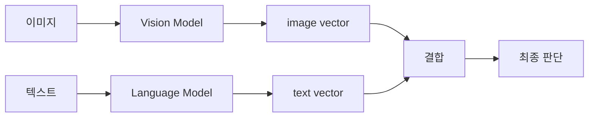

# Multimodal Fusion -- 여러 모달리티를 결합하는 방법

## VLA 연결고리

VLA는 이미지(vision), 텍스트(language), 행동(action)이라는 **세 가지 모달리티**를 다룬다. 이들을 어떻게 결합(fusion)하느냐가 모델 성능을 좌우한다. OpenVLA는 "모든 것을 token으로 변환하여 하나의 sequence에 넣는" **unified token sequence** 방식을 사용하며, 이는 multimodal fusion의 가장 최신 패러다임이다.

---

## 핵심 개념

### 1. Multimodal Fusion이란

서로 다른 종류(modality)의 정보를 하나의 모델에서 통합 처리하는 것이다:

- **Vision + Language**: 이미지와 텍스트를 함께 이해
- **Vision + Language + Action**: 위에 로봇 행동까지 추가 (VLA)
- **Audio + Vision + Language**: 소리, 이미지, 텍스트 통합 (예: 비디오 이해)

핵심 질문: **서로 다른 형태의 정보를 어느 시점에, 어떤 방식으로 합칠 것인가?**

### 2. Early Fusion (초기 결합)

입력 단계에서 바로 결합한다:

```
이미지 feature + 텍스트 feature → concatenate → 하나의 모델에 입력
```

**특징:**

- 가장 처음부터 모달리티 간 상호작용 가능
- 모든 layer에서 cross-modal interaction 발생
- 계산 비용이 높을 수 있음

**VLA에서의 예**: visual token과 text token을 하나의 sequence로 합쳐 LLM에 입력하는 방식. OpenVLA가 이 방식을 사용한다.

### 3. Late Fusion (후기 결합)

각 모달리티를 독립적으로 처리한 후, 마지막 단계에서 결합한다:



**특징:**

- 각 모달리티가 독립적으로 충분히 처리됨
- 모달리티 간 상호작용이 제한적
- 구현이 간단하고 각 모델을 독립적으로 사전학습 가능

**예**: CLIP이 late fusion에 가깝다. Image encoder와 text encoder가 독립적으로 작동하고, 최종 출력끼리 유사도를 비교한다.

### 4. Cross-Attention Fusion (교차 주의 결합)

한 모달리티가 다른 모달리티에 **attention**하는 방식:

```
Visual feature를 Key, Value로 사용
Text feature를 Query로 사용
  → Cross-Attention → 텍스트가 이미지의 관련 부분에 집중
```

**특징:**

- 모달리티 간의 정밀한 상호작용 가능
- 한 모달리티가 다른 모달리티의 어떤 부분이 중요한지 선택적으로 참조
- Transformer decoder에서 자연스럽게 사용되는 구조

**예**: Flamingo 모델은 LLM의 각 layer에 cross-attention을 삽입하여 visual feature를 참조한다.

### 5. MLP Projector 방식

LLaVA와 Prismatic VLM이 사용하는 방식으로, cross-attention보다 단순하다:

```
Visual feature → MLP → visual token (LLM 차원)
              ↓
visual token + text token → LLM의 self-attention이 알아서 fusion
```

**핵심 통찰**: 별도의 cross-attention 모듈 없이도, LLM의 self-attention이 visual token과 text token 사이의 관계를 **자동으로 학습**한다. MLP는 단지 차원을 맞춰주는 역할이다.

### 6. Q-Former 방식

BLIP-2에서 사용된 방식:

```
Learnable query tokens → Q-Former (cross-attention) → visual feature에서 핵심 정보 추출
              ↓
추출된 정보 → LLM에 입력
```

- 고정된 수의 query token으로 visual information을 **압축**
- Visual token 수를 줄여 LLM의 부담을 경감
- 하지만 정보 손실 가능성과 학습 복잡도 증가

### 7. Unified Token Sequence 패러다임

현재 VLM/VLA의 주류 패러다임:

```
모든 모달리티를 token으로 변환:
  - 이미지 → vision encoder + projector → visual tokens
  - 텍스트 → tokenizer → text tokens
  - 행동 → action tokenizer → action tokens (VLA만)
              ↓
  [visual tokens] [text tokens] [action tokens]
  → 하나의 autoregressive Transformer로 처리
```

**장점:**

- 구조가 단순하고 확장 가능
- LLM의 강력한 sequence modeling 능력을 그대로 활용
- 새로운 모달리티 추가가 쉬움 (새 tokenizer만 추가)
- 사전학습된 LLM의 지식을 최대한 활용

**OpenVLA가 바로 이 패러다임을 따른다.**

---

## Fusion 방식 비교 요약

| 방식 | 결합 시점 | 상호작용 | 복잡도 | 대표 모델 |
|------|----------|---------|--------|----------|
| Early Fusion | 입력 단계 | 풍부 | 높음 | ViLT |
| Late Fusion | 출력 단계 | 제한적 | 낮음 | CLIP |
| Cross-Attention | 중간 layer | 정밀 | 중간 | Flamingo |
| MLP Projector | 입력 직전 | self-attention 위임 | 낮음 | LLaVA, Prismatic, **OpenVLA** |
| Q-Former | 입력 직전 | 압축 추출 | 중간 | BLIP-2 |

---

## 연습 주제

1. Early fusion과 late fusion의 장단점을 각각 정리하고, 로봇 task에는 어느 것이 더 적합한지 추론해 보라
2. MLP projector 방식이 cross-attention보다 단순한데도 효과적인 이유를 "LLM의 self-attention" 관점에서 설명해 보라
3. Q-Former 방식이 visual token 수를 줄이는 것이 장점이자 단점이 되는 이유를 설명해 보라
4. "모든 것을 token으로 통일"하는 unified token sequence 패러다임이 왜 VLA에 자연스러운 선택인지 설명해 보라
5. 새로운 모달리티(예: 촉각 센서 데이터)를 VLA에 추가하려면 unified token 패러다임에서 무엇이 필요한지 생각해 보라

---

## 다음 노트

[강화학습과 모방학습 -- RL & Imitation Learning](../13-rl-imitation/)
