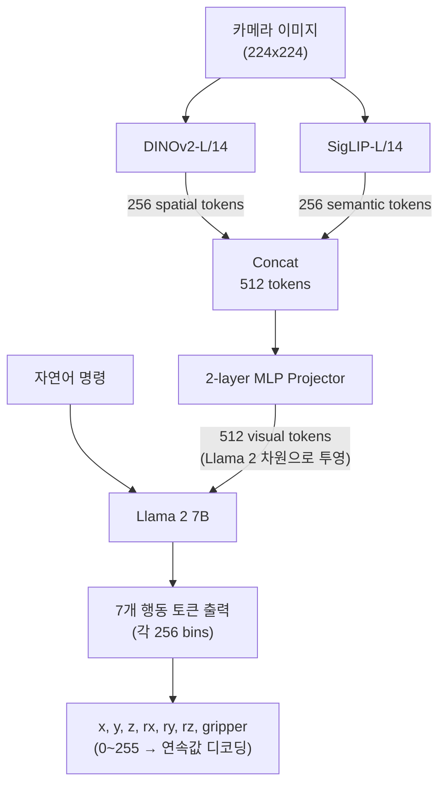
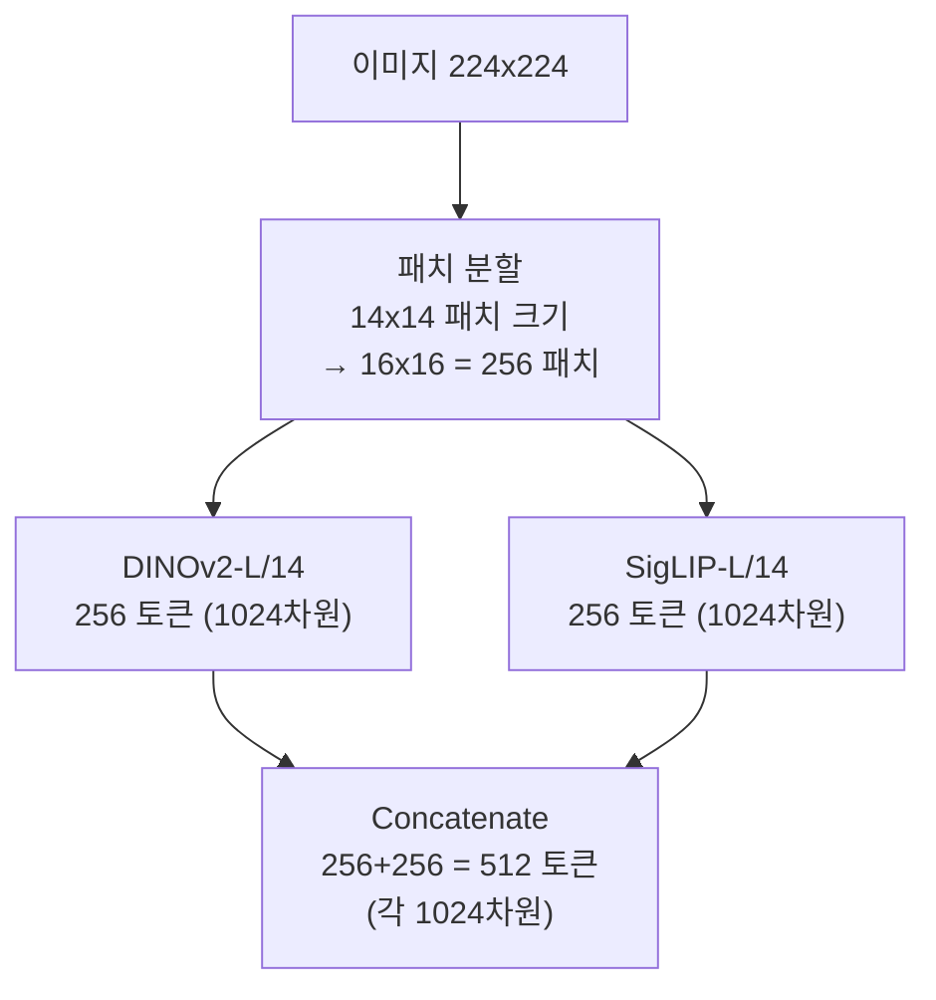
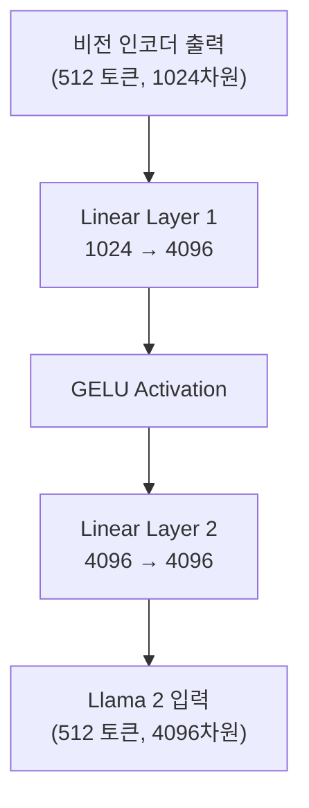

# OpenVLA 아키텍처 (OpenVLA Architecture)

## VLA와의 연결

**OpenVLA는 최초의 오픈소스 범용 VLA 모델이다.** RT-2가 제시한 "VLM 파인튜닝으로 로봇 행동 생성" 아이디어를 누구나 재현할 수 있게 만들었다. 7B 파라미터에 Open X-Embodiment 데이터셋 970K 궤적으로 학습되었으며, 그 아키텍처는 이후 SmolVLA, pi-0-FAST 등 후속 모델의 설계 기준이 되었다. 이전 노트에서 배운 DINOv2(Part 11), SigLIP(Part 12), Llama 2(Part 10), LoRA(Part 10)가 모두 OpenVLA 내부에서 작동한다.

---

## 핵심 개념

### 1. OpenVLA 전체 파이프라인



### 2. 이중 비전 인코더: DINOv2 + SigLIP

OpenVLA가 두 개의 비전 인코더를 사용하는 이유:

```
DINOv2 (Data-efficient Image Transformer v2):
  - 자기지도 학습(self-supervised)으로 사전학습
  - 공간적 특징(spatial features)에 강함
  - "물체가 이미지의 어디에 있는가?"
  - 질감, 형태, 경계를 잘 포착
  - 로봇이 물체를 "정확히 잡으려면" 공간 정보가 필수

SigLIP (Sigmoid Loss for Language-Image Pre-training):
  - CLIP 계열, 이미지-텍스트 대조학습
  - 의미적 특징(semantic features)에 강함
  - "이 물체가 무엇인가?"
  - 언어와의 정렬(alignment)이 잘 됨
  - 로봇이 "빨간 컵"을 이해하려면 의미 정보가 필수

두 인코더의 상보성:
  DINOv2: "테이블 왼쪽 위, 원형 물체, 빨간 색"
  SigLIP:  "빨간 컵, 음료 용기, 잡을 수 있는 물체"
  결합:    "테이블 왼쪽 위에 있는 빨간 컵" → 정확한 행동 생성 가능
```

각 인코더의 처리:



### 3. MLP Projector: 비전과 언어의 다리



Projector의 역할:
- 비전 인코더의 표현 공간과 언어 모델의 표현 공간은 다르다
- Projector가 "번역기" 역할: 시각 정보를 언어 모델이 이해할 수 있는 형태로 변환
- 2-layer MLP는 가장 단순한 형태의 Projector (복잡한 Cross-Attention 대신 선택)
- LLaVA에서 처음 제안된 아이디어를 그대로 채택

### 4. Llama 2 7B 백본

```
OpenVLA 내부의 Llama 2 7B:

시퀀스 구성:
  [visual tokens (512)] + [language tokens (~20-30)] + [action tokens (7)]

  구체적 예시:
  [v1][v2]...[v512]["In"]["What"]["action"]["should"]...["cup"]["?"][a1][a2]...[a7]

Llama 2의 역할:
  1. 시각 토큰에서 장면 이해 (이미지 해석)
  2. 언어 토큰에서 명령 이해 (task 파악)
  3. 두 정보를 결합하여 행동 토큰 생성 (action prediction)

자기회귀 생성:
  a1 = argmax P(token | v1...v512, l1...lN)
  a2 = argmax P(token | v1...v512, l1...lN, a1)
  ...
  a7 = argmax P(token | v1...v512, l1...lN, a1...a6)
```

### 5. 행동 토큰화: 256 Bins

```
연속적 행동 값 → 이산 토큰으로 변환:

예시: x축 이동 범위 [-1.0, +1.0]

  연속값:    -1.0  -0.5   0.0   0.5   1.0
  bin 인덱스:  0    64    128   192   255

  변환 공식:
  bin_index = round((value - min) / (max - min) * 255)

  역변환:
  value = min + (bin_index / 255) * (max - min)

어휘 확장:
  원래 Llama 2 어휘: 32,000 토큰 (일반 텍스트용)
  추가된 행동 어휘:   256 토큰 (bin 0 ~ bin 255)
  총 어휘:           32,256 토큰

  새로운 256 토큰의 임베딩은 파인튜닝 시 학습됨

7 action dimensions:
  [x, y, z, rx, ry, rz, gripper]
  각각 256 bins → 7개 토큰으로 한 타임스텝의 행동 표현
  해상도: 연속값 범위 / 256 ≈ 약 0.4% 해상도
```

### 6. 입력 형식 (Prompt Format)

```
OpenVLA의 표준 입력 형식:

이미지: [카메라로 촬영한 현재 장면]

텍스트 프롬프트:
  "In: What action should the robot take to {instruction}?"

구체적 예시들:
  "In: What action should the robot take to pick up the red cup?"
  "In: What action should the robot take to open the drawer?"
  "In: What action should the robot take to place the apple on the plate?"

왜 이 형식인가:
  - VLM 사전학습 시 사용된 Q&A 형식과 유사
  - "In:"은 입력을 명시하는 접두사
  - 자연어 명령을 일관된 형식으로 감싸기
  - 이 형식을 변경하면 성능이 하락할 수 있음 (학습 시 이 형식 사용)
```

### 7. 학습 세부사항

```
사전학습 기반: Prismatic VLM (DINOv2 + SigLIP + Llama 2 7B)
  - 먼저 VLM으로 이미지-텍스트 학습
  - 그 다음 로봇 행동 데이터로 파인튜닝

학습 데이터: Open X-Embodiment
  - 970K 로봇 궤적 (trajectories)
  - 22종의 로봇
  - 다양한 환경과 task

학습 설정:
  - Full fine-tuning (전체 파라미터 업데이트)
  - 학습률: 2e-5 (Llama 2 사전학습보다 훨씬 작음)
  - Batch size: 2048
  - GPU: 64x A100 (80GB)
  - 학습 시간: 약 14일

손실 함수:
  - Cross-Entropy Loss (다음 행동 토큰 예측)
  - 일반 언어 모델 학습과 동일한 Loss!
  - VLM의 텍스트 생성 능력을 행동 생성으로 전환
```

### 8. OpenVLA의 성능과 한계

```
성능:
  - Open X-Embodiment 벤치마크에서 RT-2-X와 동등하거나 우수
  - WidowX 로봇에서 단일 task 파인튜닝 시 90%+ 성공률
  - 7B 파라미터로 55B RT-2에 근접한 성능

한계:
  1. 이산 토큰의 한계
     - 256 bins = 약 0.4% 해상도
     - 정밀 조작(precision manipulation)에 부족할 수 있음
     - 연속적 궤적보다 불연속적 행동

  2. 제어 주파수
     - 7B 모델 → 추론 속도 제한 (약 5-10Hz)
     - 민첩한 행동(dexterous manipulation)에 부족

  3. 단일 이미지 입력
     - 시간 정보(temporal context) 없음
     - 움직이는 물체 추적에 불리

  4. 메모리 요구
     - 7B 모델 → 최소 16GB GPU 메모리 (FP16)
     - 엣지 디바이스 배포 어려움

이 한계들이 후속 연구를 촉발:
  이산 → 연속:    pi-0 (Flow Matching)
  느린 → 빠른:    Helix (200Hz System 1)
  큰 → 작은:      SmolVLA (450M)
  단일 → 시계열:  GR00T N1 (다중 프레임)
```

### 9. OpenVLA v2 (2025)

```
OpenVLA v2 개선점:

1. 파인튜닝 효율
   - LoRA 지원: 전체 모델 대신 소수 파라미터만 업데이트
   - 단일 GPU에서 파인튜닝 가능

2. Action Chunking
   - 한 번에 여러 타임스텝의 행동을 예측
   - 더 부드러운 궤적 생성

3. 다중 이미지 지원
   - 시간 컨텍스트를 위한 여러 프레임 입력

4. 연속 행동 헤드
   - 이산 토큰 외에 연속 출력 옵션 추가
```

---

## 연습 주제 (코드 없이 생각해보기)

1. **토큰 수 계산**: OpenVLA에서 한 번의 추론 시 전체 시퀀스 길이를 계산하라. 시각 토큰 512 + 언어 토큰 약 25 + 행동 토큰 7 = ? Llama 2의 컨텍스트 길이 4096과 비교하면 여유가 있는가?

2. **이중 인코더의 필요성**: DINOv2만 사용하거나 SigLIP만 사용할 때 각각 어떤 상황에서 실패할 수 있는지 구체적 예를 들어 설명하라. "투명한 유리컵을 집어라"라는 명령에서 각 인코더의 역할은?

3. **256 bins vs 512 bins**: 행동 해상도를 256에서 512 bins으로 높이면 어떤 장단점이 있는가? 어휘 크기, 학습 데이터 요구량, 정밀도 측면에서 분석하라.

4. **Projector 설계**: 2-layer MLP 대신 Cross-Attention을 Projector로 사용하면 어떤 차이가 있을까? (힌트: LLaVA vs Flamingo의 설계 차이를 떠올려보라)

5. **파인튜닝 전략**: OpenVLA를 새로운 로봇에 적용할 때, 전체 파인튜닝 vs LoRA 파인튜닝의 장단점을 비교하라. 데이터가 100개 에피소드뿐이라면 어떤 전략이 더 적절한가?

6. **손실 함수의 의미**: OpenVLA의 Cross-Entropy Loss가 일반 언어 모델의 다음 단어 예측과 완전히 같은 형태라는 것은 무엇을 의미하는가? "로봇 행동 예측 = 다음 토큰 예측"이라는 통합이 가능한 근본 이유는?

---

## 다음 노트

**다음**: [pi-zero 계열](./04-pi-zero-family.md) - OpenVLA의 이산 토큰 방식 대신 **Flow Matching**을 사용하여 연속적이고 부드러운 행동을 생성하는 pi-0. 50Hz 제어, 7개 로봇 플랫폼, 그리고 RL로 자기 개선하는 pi-star-0.6까지.
