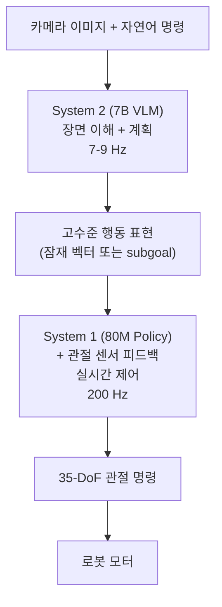

# Dual-System 아키텍처: Helix & GR00T N1

## VLA와의 연결

**Dual-System 아키텍처는 2025년 VLA의 핵심 패러다임이다.** pi-0나 OpenVLA 같은 단일 모델은 추론과 제어를 하나의 신경망이 담당하지만, 실제 로봇(특히 휴머노이드)은 "느린 고수준 추론"과 "빠른 저수준 제어"를 동시에 요구한다. Daniel Kahneman의 "Thinking, Fast and Slow"에서 영감을 받아, Helix(Figure AI)와 GR00T N1(NVIDIA)은 System 2(느린 추론)와 System 1(빠른 제어)을 분리하는 아키텍처를 독립적으로 제안했다.

---

## 핵심 개념

### 1. 왜 Dual-System이 필요한가

```
단일 모델의 딜레마:

대형 VLM (예: 7B 파라미터):
  장점: 강력한 추론, 복잡한 명령 이해
  단점: 느린 추론 속도 (~5-10Hz)

소형 정책 (예: 80M 파라미터):
  장점: 빠른 제어 속도 (200Hz+)
  단점: 복잡한 추론 불가

현실의 요구:
  "테이블 위의 물컵을 잡아서 사람에게 건네줘"
  - "물컵 인식" → 느려도 됨 (1초에 1번이면 충분)
  - "팔을 뻗어 잡기" → 빨라야 함 (0.005초마다 관절 제어)
  - 두 요구를 하나의 모델로 동시에 충족하기 어려움

인간의 비유 (Kahneman):
  System 2: 체스 수를 생각한다 (느리지만 깊은 사고)
  System 1: 날아오는 공을 잡는다 (빠른 반사)
  → 두 시스템이 협력하여 복잡한 행동 수행
```

### 2. Helix (Figure AI, 2025.02)

#### Figure AI 소개

```
Figure AI:
  설립: 2022년
  자금: $675M Series B
  제품: Figure 01/02 휴머노이드 로봇
  특징: 35-DoF (자유도) 전신 휴머노이드
  목표: 범용 휴머노이드 로봇으로 노동 자동화

Figure 02 사양:
  - 35 자유도 (팔, 손, 다리, 허리)
  - 12개 손가락 (dexterous manipulation)
  - 카메라, IMU 등 다중 센서
  - 온보드 컴퓨팅 (GPU 탑재)
```

#### Helix 아키텍처 상세

```
Helix Dual-System:

System 2 ("느린 사고"):
  모델:     7B VLM (Vision-Language Model)
  주파수:   7-9 Hz (초당 7-9번 추론)
  입력:     카메라 이미지 + 자연어 명령
  출력:     고수준 행동 계획 (high-level action plan)
  역할:     장면 이해, 명령 해석, 전략 수립
  예시:     "컵이 테이블 왼쪽에 있다. 왼팔을 뻗어야 한다."

          ↓ (고수준 계획을 System 1에 전달)

System 1 ("빠른 반사"):
  모델:     80M 파라미터 경량 정책
  주파수:   200 Hz (초당 200번 제어)
  입력:     System 2의 고수준 계획 + 관절 센서 데이터
  출력:     35-DoF 관절 토크/위치 명령
  역할:     실시간 모터 제어, 균형 유지, 충돌 회피
  예시:     "왼팔 관절 1: +2.3도, 관절 2: -1.1도, ..."

비유:
  System 2 = 감독 (전략을 지시)
  System 1 = 선수 (실시간으로 몸을 움직임)
```

#### 정보 흐름



### 3. GR00T N1 (NVIDIA, 2025.03)

#### NVIDIA의 로봇 AI 생태계

```
NVIDIA의 로봇 스택:

하드웨어:
  Jetson Thor   - 로봇용 컴퓨팅 플랫폼
  GPU 서버      - 학습/대규모 추론용

시뮬레이션:
  Isaac Sim     - 물리 기반 로봇 시뮬레이션
  Isaac Lab     - 로봇 학습 환경
  Cosmos        - 세계 모델 (World Model)

모델:
  GR00T N1      - VLA 파운데이션 모델
  GR00T N1.6    - 개선 버전 (CES 2026)

전체 파이프라인:
  Isaac Sim에서 시뮬레이션 → GR00T N1 학습 → Jetson Thor에서 배포
```

#### GR00T N1 아키텍처

```
GR00T N1 Dual-System:

System 2 ("고수준 추론"):
  모델:     Eagle-2 VLM
  역할:     시각 이해, 언어 명령 해석
  입력:     다중 카메라 이미지 + 자연어 명령
  출력:     고수준 행동 의도 (latent representation)

          ↓ (잠재 표현 전달)

System 1 ("저수준 제어"):
  모델:     Diffusion Transformer
  역할:     구체적 행동 궤적 생성
  입력:     System 2의 잠재 표현 + 로봇 상태
  출력:     연속적 행동 궤적 (action trajectory)
  특징:     Diffusion Process로 부드러운 궤적 생성

Helix와의 차이:
  Helix System 1:  경량 MLP 정책 (200Hz 직접 제어)
  GR00T System 1:  Diffusion Transformer (궤적 생성)
  → 두 접근 모두 유효, 트레이드오프가 다름
```

### 4. Helix vs GR00T N1 비교

```
              Helix (Figure AI)       GR00T N1 (NVIDIA)
─────────────────────────────────────────────────────────
시기          2025.02                  2025.03
대상 로봇     Figure 02 (휴머노이드)   범용 (다양한 로봇)
System 2      7B VLM                  Eagle-2 VLM
System 2 Hz   7-9 Hz                  가변적
System 1      80M 경량 정책            Diffusion Transformer
System 1 Hz   200 Hz                  가변적
행동 생성     직접 관절 명령           궤적 생성 (Diffusion)
DoF           35 (전신 휴머노이드)     로봇마다 다름
공개 수준     논문 + 데모              논문 + API
생태계        Figure 로봇 전용         NVIDIA Isaac 연동

공통점:
  1. Dual-System 구조 (느린 추론 + 빠른 제어)
  2. 사전학습 VLM 활용
  3. 자연어 명령 이해
  4. 2025년 거의 동시에 발표 → 패러다임의 수렴
```

### 5. 왜 두 회사가 독립적으로 같은 아키텍처에 도달했는가

```
수렴 진화(Convergent Evolution)의 이유:

1. 물리적 제약
   로봇의 안전한 동작에는 100Hz+ 제어가 필수
   → VLM (수십 Hz) 만으로는 불가능
   → 빠른 제어 루프가 반드시 필요

2. VLM 성능의 성숙
   2024-2025년 VLM이 충분히 강력해짐
   → 고수준 추론을 VLM에 위임하는 것이 합리적
   → System 2로서의 역할이 명확해짐

3. 인간 신경과학의 영감
   Kahneman의 Dual Process Theory는 이미 널리 알려짐
   → 로봇 AI 연구자들이 같은 프레임워크를 적용

4. 규모의 문제
   35-DoF 휴머노이드의 전체 동작을 하나의 모델로 제어하기에는
   → 문제가 너무 복잡
   → 분할 정복(divide and conquer)이 자연스러운 해법

5. 실용적 이유
   System 1은 작고 빠르므로 온보드 배포 가능
   System 2는 서버에서 실행할 수도 있음 (edge-cloud hybrid)
```

### 6. GR00T N1.6 (CES 2026)

```
GR00T N1.6 (2026.01, CES 2026 발표):

N1 대비 개선점:
  1. 더 빠른 추론 속도
     - 최적화된 TensorRT 추론
     - Jetson Thor에서 실시간 동작

  2. 확장된 로봇 지원
     - 더 다양한 로봇 형태(form factor) 지원
     - 휴머노이드, 팔 로봇, 이동 로봇

  3. 시뮬레이션 통합 강화
     - Isaac Sim → 실제 로봇 전이(sim-to-real) 개선
     - Cosmos 세계 모델과의 연동

  4. 커뮤니티 생태계
     - 파트너 로봇 회사들과의 협업 확대
     - 사전학습 모델 + 파인튜닝 레시피 제공

NVIDIA의 전략:
  "하드웨어 + 시뮬레이션 + AI 모델"을 통합 제공
  → GPU를 팔고, 시뮬레이션 라이선스를 팔고, 모델도 제공
  → 로봇 AI의 "NVIDIA 생태계" 구축
```

### 7. Dual-System의 도전과 미래

```
현재 도전 과제:

1. 시스템 간 통신 (Inter-System Communication)
   System 2 → System 1으로 전달하는 "고수준 계획"의 형태는?
   - 잠재 벡터(latent vector)?
   - 언어적 subgoal?
   - 중간 행동 궤적?
   → 아직 표준이 없음, 활발한 연구 중

2. 학습의 분리 vs 통합
   두 시스템을 별도로 학습? end-to-end로 학습?
   별도 학습: 각 시스템 최적화 용이, 전체 최적 보장 어려움
   통합 학습: 전체 최적 가능, 학습 난이도 높음

3. 실패 처리 (Failure Recovery)
   System 2가 잘못된 계획을 내리면?
   System 1이 물리적 제약을 위반하면?
   → 시스템 간 피드백 루프가 필요

미래 방향:
  - 3개 이상의 계층 (hierarchical policy)
  - System 2의 세계 모델(World Model) 통합
  - 다중 로봇 협업을 위한 분산 Dual-System
```

---

## 연습 주제 (코드 없이 생각해보기)

1. **주파수 계산**: System 2가 9Hz, System 1이 200Hz로 작동할 때, System 2가 한 번 추론하는 동안 System 1은 몇 번 행동을 생성하는가? 이 비율이 의미하는 바는?

2. **인간 비유 확장**: 요리할 때의 인간 행동을 System 1/System 2로 분류하라. "레시피를 읽고 다음 단계를 결정"은 어느 시스템인가? "칼로 양파를 썰기"는 어느 시스템인가? 요리 중 기름이 튀었을 때의 반응은?

3. **35-DoF의 복잡성**: 35개 자유도의 휴머노이드를 하나의 모델로 제어할 때, 행동 공간의 크기를 계산하라. 각 자유도가 256 bins이라면 가능한 행동 조합은 256^35이다. 이 숫자가 왜 단일 모델에 부담이 되는지 설명하라.

4. **시스템 간 인터페이스**: System 2가 "컵을 집어라"라는 결정을 System 1에 전달할 때, "자연어 문장"으로 전달하는 것과 "잠재 벡터"로 전달하는 것의 장단점을 비교하라.

5. **에지-클라우드 하이브리드**: System 2를 클라우드 서버에서, System 1을 로봇 온보드에서 실행하는 방식의 장단점은? 네트워크 지연시간이 50ms일 때 System 2의 실효 주파수는?

6. **수렴 진화의 교훈**: Figure AI(스타트업)와 NVIDIA(대기업)가 같은 아키텍처에 독립적으로 도달한 것은 이것이 "자연스러운 해법"임을 시사한다. 다른 분야에서 비슷한 수렴 진화의 예를 생각해보라. (예: 자율주행의 perception-planning-control 분리)

---

## 다음 노트

**다음**: [SmolVLA](./06-smolvla-democratization.md) - 7B 이상의 대형 VLA는 대기업만 운영할 수 있다. Hugging Face의 SmolVLA(450M)는 소비자 GPU와 MacBook에서도 실행 가능한 VLA로, VLA 연구의 민주화를 이끈다. LeRobot 커뮤니티의 3290+ 파인튜닝 모델 생태계까지.
