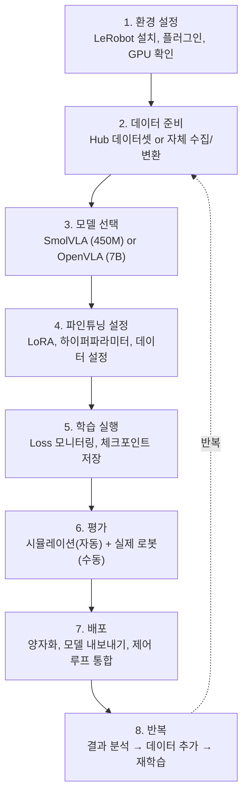

# LeRobot으로 VLA 파인튜닝 (Fine-tuning with LeRobot)

## VLA와의 연결

**LeRobot은 VLA를 실제로 학습하고 배포하기 위한 오픈소스 프레임워크이다.** 지금까지 VLA의 이론과 아키텍처를 학습했다면, 이 노트에서는 실제 파인튜닝 파이프라인을 다룬다. Part 10(LLM)에서 배운 LoRA/PEFT 파인튜닝, Part 5(PyTorch)에서 배운 학습 루프, Part 6(신경망)에서 배운 하이퍼파라미터 튜닝이 모두 여기에 적용된다. LeRobot v0.4.3은 SmolVLA와 OpenVLA 파인튜닝을 모두 지원하며, Hugging Face 생태계와 완전히 통합된다.

---

## 핵심 개념

### 1. LeRobot 프레임워크 개요

```
LeRobot (Hugging Face):

목적:   로봇 AI 학습/추론/배포를 위한 통합 프레임워크
버전:   v0.4.3 (2025년 안정 버전)
라이선스: Apache 2.0 (오픈소스)
언어:   Python (PyTorch 기반)

핵심 기능:
  1. 데이터 수집 및 관리
  2. 모델 학습 (사전학습, 파인튜닝)
  3. 모델 평가
  4. 실제 로봇 배포 (inference)
  5. Hugging Face Hub 통합

지원 모델:
  - SmolVLA (450M, Flow Matching)
  - OpenVLA (7B, 이산 토큰)
  - ACT (Action Chunking Transformer)
  - Diffusion Policy
  - 플러그인으로 추가 가능

지원 로봇:
  - SO-100 (저가 로봇 팔)
  - Koch v1.1
  - Fairino FR3
  - WidowX
  - ALOHA (양팔)
  - 플러그인으로 추가 가능
```

### 2. LeRobot 플러그인 시스템

```
LeRobot v0.4.3의 플러그인 아키텍처:

기존 (v0.3 이전):
  모든 모델, 로봇 드라이버가 core에 포함
  → 의존성 폭발, 설치 어려움

v0.4.3 (플러그인 시스템):
  core: 최소 기능만 포함 (데이터, 학습 루프, 평가)
  plugin: 모델, 로봇 별로 별도 설치

  구조:
  lerobot/
  ├── core/         (핵심: 데이터 로딩, 학습 루프, 평가)
  ├── plugins/
  │   ├── smolvla/  (SmolVLA 모델)
  │   ├── openvla/  (OpenVLA 모델)
  │   ├── act/      (ACT 모델)
  │   ├── fairino/  (Fairino 로봇 드라이버)
  │   ├── so100/    (SO-100 로봇 드라이버)
  │   └── ...
  └── configs/      (설정 파일)

장점:
  1. 필요한 것만 설치 → 설치 시간/공간 절약
  2. 새 모델/로봇 추가가 용이
  3. 커뮤니티 기여가 쉬움
  4. 의존성 충돌 최소화
```

### 3. 데이터 준비 과정

```
파인튜닝을 위한 데이터 준비:

방법 1: 기존 LeRobot 데이터셋 사용
  Hugging Face Hub에서 데이터셋 검색
  예: lerobot/aloha_sim_transfer_cube_human
  → 별도 처리 없이 바로 사용 가능

방법 2: 자체 데이터 변환
  수집한 데이터 → LeRobot 형식으로 변환

  필요한 정보:
    1. 이미지 시퀀스 (각 타임스텝)
    2. 로봇 상태 (관절 각도/위치)
    3. 행동 (관절 목표값 또는 delta)
    4. 에피소드 경계 (시작/종료)
    5. 메타데이터 (fps, 로봇 타입, task 설명)

  변환 후 구조:
    my_dataset/
    ├── data/
    │   └── chunk-000/
    │       ├── episode_000000.parquet
    │       └── ...
    ├── videos/
    │   └── observation.image/
    │       └── ...
    └── meta/
        ├── info.json
        └── stats.json  ← 정규화에 필수!

  stats.json 내용:
    각 행동 차원의 평균(mean), 표준편차(std)
    각 관측 차원의 평균, 표준편차
    → 학습/추론 시 정규화/역정규화에 사용

방법 3: LeRobot으로 직접 수집
  LeRobot의 텔레오퍼레이션 기능 사용
  → 수집과 동시에 LeRobot 형식으로 저장
  → 가장 간단한 방법
```

### 4. LoRA 파인튜닝 (핵심 레시피)

```
LoRA 파인튜닝이란 (Part 10 복습):

전체 파인튜닝 (Full Fine-tuning):
  모든 파라미터를 업데이트
  7B 모델 → 7B 파라미터 모두 학습
  필요: 대용량 GPU, 많은 데이터

LoRA (Low-Rank Adaptation):
  원래 가중치는 고정(frozen)
  소수의 저차원 행렬만 추가하여 학습
  학습 파라미터: 전체의 1-5%
  필요: 일반 GPU, 적은 데이터로도 가능

VLA 파인튜닝에서 LoRA의 장점:
  1. 사전학습 지식 보존
     VLM의 세상 지식을 파괴하지 않음
     → 일반화 능력 유지

  2. 과적합 방지
     적은 데이터(50-200 에피소드)에서
     전체 파인튜닝은 과적합 위험 높음
     LoRA는 자연스러운 정규화 효과

  3. 메모리 효율
     SmolVLA LoRA: RTX 3090 (24GB)에서 가능
     OpenVLA LoRA: RTX 4090 (24GB)에서 가능 (양자화 필요)

  4. 빠른 학습
     SmolVLA LoRA: 수 시간
     OpenVLA LoRA: 반나절~하루
```

#### 파인튜닝 설정 예시

```
SmolVLA LoRA 파인튜닝 설정:

모델 설정:
  base_model: smolvla-base
  lora_rank: 32            (LoRA의 저차원 차수)
  lora_alpha: 64           (스케일링 팩터)
  lora_target_modules:     (LoRA를 적용할 레이어)
    - q_proj, v_proj       (Attention의 Q, V)
    - gate_proj, up_proj   (FFN)

학습 설정:
  learning_rate: 1e-4      (LoRA는 일반 LR보다 높게)
  batch_size: 8
  num_epochs: 50           (작은 데이터셋은 에폭 수를 높게)
  warmup_steps: 100
  weight_decay: 0.01
  gradient_accumulation: 4

데이터 설정:
  dataset: my_custom_dataset
  image_size: 224
  action_chunk_size: 16
  fps: 30
  delta_timestamps:        (과거/미래 프레임 범위)
    observation: [-0.1, 0.0]     (과거 100ms ~ 현재)
    action: [0.0, 0.033, ..., 0.5]  (현재 ~ 미래 500ms)

하드웨어:
  GPU: RTX 3090 (24GB)
  학습 시간: 약 2-4시간 (100 에피소드 기준)
```

### 5. 양자화 추론 (Quantized Inference)

```
파인튜닝된 모델의 효율적 추론:

FP32 → FP16 → INT8 → INT4:
  정밀도를 낮추어 메모리와 속도 개선

SmolVLA 양자화:
  FP16:  ~900MB, 추론 ~15Hz
  INT8:  ~450MB, 추론 ~20Hz
  INT4:  ~225MB, 추론 ~25Hz (품질 약간 하락)

OpenVLA 양자화:
  FP16:  ~14GB, 추론 ~5Hz
  INT8:  ~7GB,  추론 ~8Hz
  INT4:  ~3.5GB, 추론 ~12Hz

양자화 시 주의사항:
  1. 행동 출력 정밀도 확인
     양자화로 행동 값이 미세하게 변할 수 있음
     → 로봇 동작의 부드러움에 영향

  2. 보정(Calibration) 데이터
     양자화 보정에 학습 데이터의 일부를 사용
     → 양자화 오류 최소화

  3. 레이어별 양자화
     중요한 레이어(Action Head)는 FP16 유지
     덜 중요한 레이어(초기 임베딩)는 INT4
     → 혼합 정밀도(Mixed Precision) 양자화
```

### 6. 학습 모니터링

```
파인튜닝 중 모니터링할 지표:

1. Training Loss
   → 시간에 따라 감소해야 함
   → 너무 빨리 0에 가까워지면 과적합 의심

2. Validation Loss
   → Training Loss와 함께 감소해야 함
   → Training은 감소하는데 Validation이 증가 → 과적합!

3. Action MSE (Mean Squared Error)
   → 예측 행동과 실제 행동의 차이
   → 절대값으로 행동 품질을 직접 판단

4. Gradient Norm
   → 학습 안정성 지표
   → 급격히 증가하면 학습 불안정

로깅 도구:
  - Weights & Biases (W&B): LeRobot 기본 지원
  - TensorBoard: PyTorch 기본 지원
  - 콘솔 출력: 기본적인 Loss 출력

과적합 방지 전략:
  1. LoRA rank를 낮춤 (32 → 16)
  2. Dropout 추가 (0.05 ~ 0.1)
  3. 데이터 증강 (이미지 augmentation)
  4. 조기 종료 (Early Stopping)
  5. Weight Decay 증가 (0.01 → 0.05)
```

### 7. Task Success Rate 평가

```
VLA 평가의 핵심: Task Success Rate (task 성공률)

Loss만으로는 부족한 이유:
  - Loss가 낮아도 실제 task를 실패할 수 있음
  - 행동 오류가 특정 순간에 집중되면 전체 실패
  - 로봇 평가는 "성공 아니면 실패" (binary)

평가 프로토콜:
  1. 평가 환경 설정
     - 물체 초기 위치를 고정된 N개 배치로 설정
     - 각 배치에서 K회 시도 (예: 10개 배치 × 3회 = 30회)

  2. 성공 기준 정의
     예: "컵 집기"
     - 컵이 테이블에서 5cm 이상 들어올려짐
     - 10초 이내 완료
     - 컵을 떨어뜨리지 않음

  3. 성공률 계산
     Success Rate = 성공 횟수 / 총 시도 횟수
     예: 24/30 = 80%

  4. 통계적 유의성
     최소 20-30회 시도로 평가
     신뢰 구간(confidence interval) 보고
     예: 80% ± 8% (95% CI)

시뮬레이션 vs 실제 로봇 평가:
  시뮬레이션: 자동화 가능, 수백 번 평가, 재현 가능
  실제 로봇: 수동 리셋 필요, 시간 소요, 환경 변동
  → 시뮬레이션에서 먼저 검증, 그 후 실제 로봇에서 확인
```

### 8. 파인튜닝 워크플로우 요약



### 9. 흔한 문제와 해결 방법

```
파인튜닝 시 흔한 문제:

문제 1: Loss가 줄지 않는다
  원인: 학습률이 너무 낮거나, 데이터 형식 오류
  해결: LR을 10배 높여보기, 데이터 시각화로 확인

문제 2: Loss는 줄지만 성공률이 낮다
  원인: 평가 환경이 학습과 다르거나, 행동 정규화 오류
  해결: 학습/평가 환경 동일하게, stats.json 확인

문제 3: 학습 초반에 발산(divergence)
  원인: 학습률이 너무 높음
  해결: LR 10배 낮추기, warmup 스텝 늘리기

문제 4: 과적합 (학습 Loss < 0.01, 평가 실패)
  원인: 데이터 부족, 모델 용량 과대
  해결: 데이터 증강, LoRA rank 낮추기, Dropout 추가

문제 5: 로봇이 불안정하게 떨린다
  원인: 행동 예측의 노이즈, 제어 주파수 문제
  해결: Action Chunk 크기 늘리기, Exponential Moving Average 적용

문제 6: GPU 메모리 부족
  원인: 배치 크기 과대, 모델 크기 과대
  해결: 배치 줄이기, gradient accumulation, 양자화 적용
```

---

## 연습 주제 (코드 없이 생각해보기)

1. **LoRA rank 선택**: LoRA rank가 8, 32, 128일 때 각각 학습 파라미터 수가 어떻게 변하는가? (전체 파라미터의 몇 %인지) rank가 높을수록 좋은가? 과적합과의 관계는?

2. **하이퍼파라미터 우선순위**: 파인튜닝에서 가장 먼저 튜닝해야 할 하이퍼파라미터를 순서대로 나열하라. (힌트: learning rate > batch size > ... 등) 각각이 성능에 미치는 영향의 크기는?

3. **평가 설계**: "컵을 집어서 선반에 놓기" task의 성공 기준을 구체적으로 설계하라. 부분 성공(partial success)은 어떻게 처리해야 하는가? (예: 컵을 들었지만 선반에 못 놓음)

4. **양자화의 한계**: INT4 양자화가 행동 출력에 미치는 영향을 분석하라. 정밀 조작 task에서 양자화가 특히 문제가 되는 이유는? Action Head만 FP16을 유지하는 혼합 정밀도 전략의 효과는?

5. **데이터 효율성**: 사전학습된 SmolVLA를 LoRA로 파인튜닝할 때 50 에피소드로 의미있는 성능이 나오는 이유를 설명하라. 사전학습 없이 처음부터 학습하면 50 에피소드로 가능할까?

6. **반복 개선 전략**: 첫 번째 파인튜닝에서 60% 성공률을 달성했다. 80%로 올리기 위해 어떤 전략을 사용할 수 있는가? (데이터 추가, 하이퍼파라미터 조정, 모델 변경, 데이터 증강 중 우선순위는?)

---
